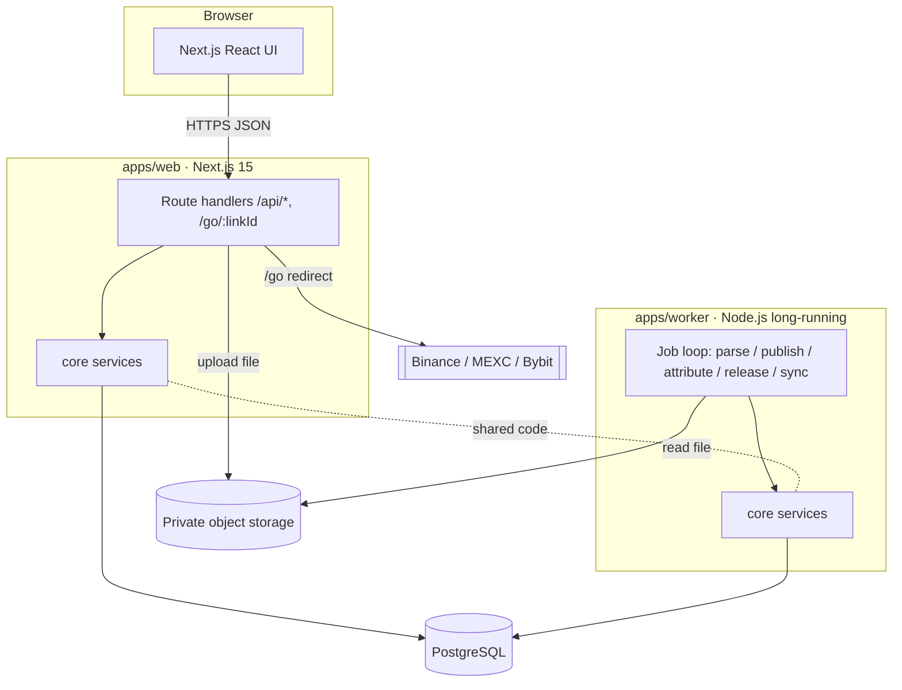
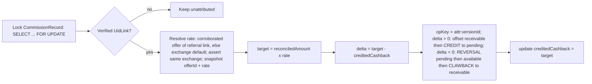
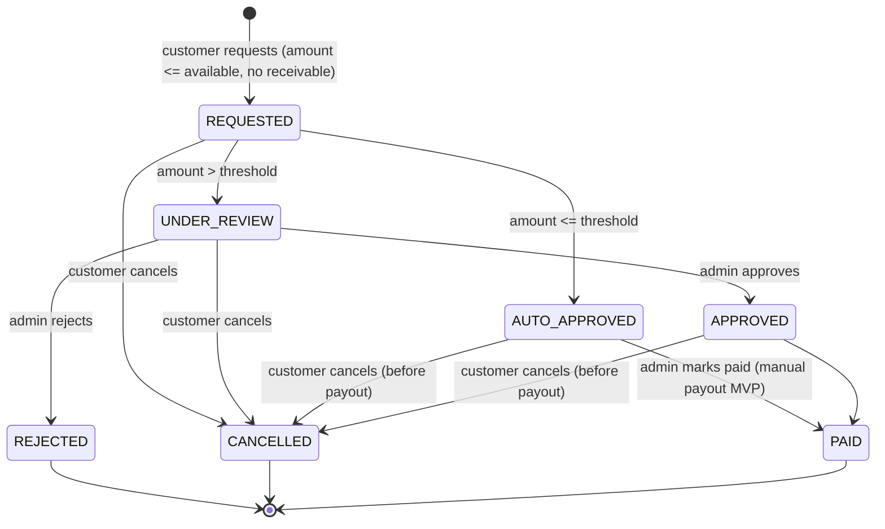

# Design — Cashback Affiliate Platform

- **Status:** Draft v0.5
- **Last updated:** 2026-09-15
- **Based on:** `.kiro/specs/cashback-platform/requirements.md` (Draft v0.4), `architecture.html` v0.4 (context only)
- **Audience:** implementers and AI coding agents (Kiro / Claude / Codex)

> This document turns the requirements into a concrete technical design: component
> boundaries, data model, flows, and cross-cutting concerns. Nothing here is implemented
> yet. Items marked **[PENDING]** map to open decisions in the requirements and must be
> confirmed before their dependent code is built. Per spec governance, `requirements.md`
> and `design.md` are the source of truth; `architecture.html` is background context only.
>
> **Reference convention:** `Req N.M` cites an EARS acceptance criterion in
> `requirements.md`. `Open decision #N` cites a numbered row in `requirements.md` →
> "Open decisions" (a stakeholder answer), NOT Requirement N.

## Overview

The platform is a TypeScript monorepo with two runtime apps sharing a PostgreSQL
database:

- **`apps/web`** — Next.js 15 (App Router). Serves the public site, customer area, and
  admin area. Contains all HTTP route handlers (`/api/*`, `/go/:linkId`).
- **`apps/worker`** — long-running Node.js process. Parses reports, attributes
  commission, releases holds, and runs (future) scheduled sync jobs.

Shared logic lives in packages so web and worker never diverge:

- **`packages/core`** — services: normalization, cashback engine, attribution, wallet,
  validation. No HTTP, no React.
- **`packages/db`** — Prisma schema, migrations, generated client, repository helpers.
- **`packages/contracts`** — zod schemas + TypeScript types for API request/response and
  report row shapes. No secrets. Safe to import from the browser bundle.

The browser never touches the database or `core`/`db` directly; it only calls `/api/*`.

## Architecture

### System context



### Technology & key decisions

| Concern | Decision | Rationale |
|---------|----------|-----------|
| Language | TypeScript everywhere | Single toolchain, shared types. |
| Web | Next.js 15 App Router | SSR public pages + colocated API routes. |
| Worker | Node.js long-running process | Long jobs off the request path (Req 12). |
| Monorepo | pnpm workspaces + Turborepo | Shared packages, cached builds. |
| DB | PostgreSQL + Prisma | Relational integrity, migrations, job queue. |
| Job queue | PostgreSQL `SKIP LOCKED` | No Redis at launch scale (Req 12.6). |
| Validation | zod in `packages/contracts` | One schema for API + parser boundaries. |
| Money | `Decimal` (Prisma `Decimal`/numeric); API returns strings | No float error (Req 7.4). |
| Auth | **[PENDING]** provider (open decision #13); interim email+password | Abstracted behind an auth port; see Components/Auth. |
| Styling (public site) | Tailwind CSS v4 + shadcn/ui (Radix primitives), copied into `src/components/ui` | Free/open-source component kit; replaces hand-rolled CSS for the public marketing pages (home, exchanges, guides) with a light, blue/teal "friendly-professional" theme. Admin screens intentionally stay on plain utility classes (out of scope for this refresh). |
| Hosting | Local/SIT + Railway prod, dual-track | Verify local, push, deploy (Req 6.5). |
| Language / i18n | Single locale registry + message catalogs + locale-segment routing | English is the only enabled locale; enabling another is a registry + catalog change, not a routing change (Req 4). |

### Repository layout

```
apps/
  web/
    src/app/
      (public)/                 # home, /exchanges, /exchanges/[slug], /guides
      [locale]/                 # same public pages under a non-default locale prefix
      (customer)/               # /me/wallet, /me/uids, /me/withdrawals
      (admin)/                  # /admin/... (guarded)
      api/                      # route handlers -> core services
      go/[linkId]/route.ts      # redirect + click tracking
    src/components/            # public-site components (public-pages.tsx) + ui/ (shadcn primitives)
    src/lib/utils.ts           # `cn()` class-merge helper (shadcn convention)
    components.json            # shadcn/ui CLI config (style, aliases, Tailwind entry)
    postcss.config.mjs         # @tailwindcss/postcss plugin
    src/i18n/                   # locale registry + message catalogs (en only)
    src/middleware.ts           # resolves request locale from the registry
  worker/
    src/index.ts                # boot + job loop
    src/jobs/                   # parse / publish / attribute / releaseHolds / sync
    src/adapters/               # per-exchange report parsers
packages/
  contracts/                    # zod schemas + types (no secrets)
  core/                         # services, cashback engine, normalization
  db/                           # prisma schema + migrations + repositories
infra/
  docker-compose.yml            # local Postgres + storage (SIT)
  railway/                      # railway service config
architecture.html
.kiro/specs/cashback-platform/  # this spec
```

Turborepo pipeline: `build`, `lint`, `typecheck`, `test`, `db:migrate`, `dev`.
Dependency rule (enforced by lint/boundaries): `web` and `worker` may import
`core`, `db`, `contracts`; browser code may import only `contracts`.

### Key flows

#### Report import → publish (Req 6)

```mermaid
sequenceDiagram
  participant A as Admin (web)
  participant API as web /api/admin/imports
  participant S as Object storage
  participant DB as PostgreSQL
  participant W as Worker

  A->>API: POST report + metadata
  API->>API: authz + file type/size check
  API->>S: store original file (private)
  API->>DB: create ImportBatch + PARSE job
  API-->>A: 202 { batchId }
  W->>DB: claim PARSE job (SKIP LOCKED)
  W->>S: read file
  W->>DB: write StagingRow (normalized + flags)
  W->>DB: batch.status = PREVIEW
  A->>API: GET /imports/:id (poll ~5s)
  API-->>A: counts (new/dup/error/conflict) + totals
  A->>API: POST /imports/:id/commit
  API->>DB: create PUBLISH job
  W->>DB: claim PUBLISH job
  W->>DB: per row -> upsert CommissionRecord identity (exchangeId, dedupKey)
  W->>DB: upsert CommissionVersion (unique commissionId+batchId); recompute reconciledAmount (latest supersedes)
  W->>DB: enqueue ATTRIBUTE job; batch.status = PUBLISHED
```

Versioned publish (Req 6.7, 7.8): a commission has a **stable identity**
(`exchangeId, dedupKey`) and one **version per import occurrence** (`CommissionVersion`,
unique per `(commissionId, batchId)`). Re-committing the same batch — or two publish
workers racing on the same batch — upserts the same version and changes no
`reconciledAmount` (idempotent). A corrected report adds a new version that supersedes the
prior one; the identity's `reconciledAmount` is recomputed (default rule: **latest version
supersedes**) and only the delta flows to cashback. Prior versions are retained for audit.
(`dedupKey` composition is **[PENDING]** — Open decision #11, finalized against a real
sample.)

#### UID linking & verification (Req 5)
1. Customer submits (exchange, UID) → `UidLink(PENDING_VERIFICATION)`.
2. On each publish, the `ATTRIBUTE` job checks pending links: if the UID appears in a
   published commission for that exchange and there is no other `VERIFIED` owner, set
   `VERIFIED`. If a `VERIFIED` owner already exists, store the second request as
   `REJECTED` and set `flaggedForReview` for admin.
3. Uniqueness of ownership is enforced at the DB level by a **partial unique index** on
   `(exchangeId, uid) WHERE status = 'VERIFIED'`, so a second pending/rejected claim can
   still be stored (it is not blocked by a full unique constraint).
4. Only `VERIFIED` links receive attribution.

#### Attribution → cashback → wallet (Req 7, 8)



Cashback is **delta-based and concurrency-safe**: the ATTRIBUTE job locks the
`CommissionRecord` row (`SELECT ... FOR UPDATE`) before reading `creditedCashback` and
computing `delta = target − creditedCashback`. Every resulting `WalletEntry` carries a
unique `opKey` (e.g., `attr:{commissionVersionId}`), so a retried or racing worker cannot
insert a duplicate CREDIT/REVERSAL — the unique constraint rejects the second write. A
separate `RELEASE_HOLDS` job periodically moves cleared CREDITs `pending → available`
(Req 8.3).

**Reversal policy (Req 8.4, 8.7)** — when `delta < 0` (a downward correction):
1. reduce `pending` by `min(|delta|, pending)`;
2. reduce `available` by `min(remaining, available)`;
3. any still-uncovered remainder (cashback already `withdrawn`/settled) increases the
   wallet `receivable` via a `CLAWBACK` entry.
`pending`, `available`, `reserved` never go negative. While `receivable > 0`, new
withdrawals are blocked, and a later positive `delta` first offsets `receivable` before
crediting `pending`.

#### Withdrawal (Req 9)



Reserved-balance model with full audit:
- **REQUESTED** (only if `receivable = 0`) → `WITHDRAWAL_RESERVE` entry:
  `available -= amount`, `reserved += amount` (Req 9.1, 9.3, 9.10).
- **REJECTED / CANCELLED** → `WITHDRAWAL_RELEASE` entry: `reserved -= amount`,
  `available += amount` (Req 9.6, 9.9). Cancel is customer-initiated and allowed only
  before `PAID`.
- **PAID** → `WITHDRAWAL_SETTLE` entry: `reserved -= amount`, `withdrawn += amount`
  (Req 9.5).
- Every transition writes a `WithdrawalEvent` (fromStatus, toStatus, actor, time,
  note/reference) (Req 9.8). Only `available` is withdrawable (Req 9.7).

### Job queue design (Postgres)

- Claim (correct PostgreSQL clause order):
  ```sql
  SELECT * FROM "Job"
  WHERE state = 'PENDING' AND "runAfter" <= now()
  ORDER BY "runAfter"
  LIMIT 1
  FOR UPDATE SKIP LOCKED;
  ```
  then set `state='CLAIMED'`, `leaseUntil=now()+lease`.
- Heartbeat updates `heartbeatAt`/`leaseUntil` while running.
- Reaper: jobs whose `leaseUntil < now()` return to `PENDING` (crash recovery, Req 12.3).
- Commit path re-verifies the worker still holds the lease before writing results.
- Job types: `PARSE`, `PUBLISH`, `ATTRIBUTE`, `RELEASE_HOLDS`, `SYNC` (disabled).
- `RELEASE_HOLDS` enqueued by a lightweight scheduler tick (worker interval).

### Environments & deployment (Req 6.5)

| Aspect | Local / SIT | Production |
|--------|-------------|------------|
| Orchestration | Docker Compose | Railway services |
| Postgres | compose container | Railway Postgres plugin |
| Storage | compose (e.g. MinIO) or local dir | Railway volume / S3-compatible |
| Web | `pnpm --filter web dev` | Railway web service |
| Worker | `pnpm --filter worker dev` | Railway worker service (always-on) |

Dual-track from Phase 0: a minimal Railway skeleton (web + worker + Postgres, build,
migrate, health check) is stood up early alongside local/SIT, so both tracks stay green.
Production hardening (observability, backup/restore, scaling) lands in Phase 3. Flow:
build+test locally → migrations → push to Git → deploy to Railway. Migrations run once
per deploy; builds reproducible.

Env vars (proposed): `DATABASE_URL`, `APP_URL`, `IMPORT_STORAGE_*`, `WORKER_POLL_SECONDS`,
`SYNC_INTERVAL_MINUTES` (sync disabled), `HOLDING_PERIOD_HOURS`,
`WITHDRAWAL_AUTO_APPROVE_THRESHOLD`, `JOB_LEASE_SECONDS`, plus auth provider vars
**[PENDING]**.

## Components and Interfaces

### apps/web
- **Public routes** (SSR): read published content via `core` read services; return
  `Cache-Control: public` where safe. Never call exchange APIs on render (Req 1, 11).
- **`/go/[linkId]` route handler:** look up active link, then record the click via a
  **reliable best-effort** mechanism — the Next.js post-response hook (`after()` /
  platform `waitUntil`) or a short-timeout awaited insert — and return 302. The click
  insert must not be an unawaited/dropped promise (which can be lost on process exit);
  recording failure still returns the redirect. Unknown/inactive link → safe fallback,
  no open redirect (Req 2.1, 2.2, 2.3, 2.4).
- **Customer API** (`/api/me/*`): session-guarded; scopes every query to the session's
  customer id; never trusts client-sent UID/account id (Req 3.3).
- **Admin API** (`/api/admin/*`): admin-guarded; `Cache-Control: private, no-store`.
- Route handlers are thin: validate with `contracts` zod schema → call `core` service →
  map result to response. No business logic in handlers.
- **Exchange logo assets (static, in-repo):** logo files live at
  `apps/web/public/exchange-logos/<slug>.png` and are served by Next.js from `public/` at
  the site root. `Exchange.logoUrl` holds only the root-relative path to one of those files
  (e.g. `/exchange-logos/binance.png`); the app never renders a logo from a third-party
  host, so public pages carry no external image dependency. Offer tiles render the logo
  when `logoUrl` is set and keep the existing generated colour placeholder when it is
  `null`. Assets are baked into the build image, so adding or replacing a logo is a repo
  change plus deploy, not a runtime upload (Req 1.1, 1.2).

### apps/worker
- Boot connects to Postgres, starts a poll loop (~10s) that claims one job via
  `FOR UPDATE SKIP LOCKED`, sets `leaseUntil` and heartbeats while running.
- Job handlers are pure `core` calls; the worker only owns scheduling/lease/retry.
- Retry: transient errors → exponential backoff + jitter, capped attempts; config/auth
  errors → mark FAILED, surface, no infinite retry (Req 12.5).
- A stale worker must re-check lease ownership before committing (Req 12.3).

### packages/core services
- `contentService` — read/write exchanges, offers, links (incl. link↔offer binding and
  exchange default rate), guides.
- `clickService` — record click (best-effort), aggregate analytics.
- `importService` — create batch, enqueue parse, preview, commit (enqueue publish).
- `parserRegistry` — resolve adapter by (exchange, reportType, format).
- `commissionService` — upsert commission identity + version (unique per commission+batch),
  recompute reconciled amount.
- `attributionService` — lock the commission (`FOR UPDATE`), map commission → UidLink →
  customer, resolve + snapshot rate (system-corroborated, same exchange).
- `cashbackEngine` — compute target cashback, apply signed delta (credit/reversal/clawback,
  receivable offset) with a unique op key, release holds.
- `walletService` — balances (pending/available/reserved/withdrawn/receivable), typed
  entries, reservations.
- `withdrawalService` — request/reserve (blocked while receivable > 0), threshold decision,
  approve/reject/settle, customer cancel, events.
- `uidLinkService` — link request, verification against published commissions.
- All services take a transaction/context object so they compose atomically.

### API contracts (shape summary)

All requests/responses validated by zod schemas in `packages/contracts`. Money is a
decimal string with an `asset`. Errors use a consistent envelope
`{ error: { code, message, details? } }`.

| Endpoint | Method | Auth | Notes |
|----------|--------|------|-------|
| `/api/exchanges` | GET | public | published exchanges + offers |
| `/go/:linkId` | GET | public | 302 redirect; records click (best-effort) |
| `/api/auth/*` | POST | public→session | register/login/logout (interim) **[PENDING provider]** |
| `/api/me/wallet` | GET | customer | balances (incl. reserved, receivable) + as-of + history |
| `/api/me/uids` | GET/POST | customer | list / submit link request |
| `/api/me/withdrawals` | GET/POST | customer | history / request |
| `/api/me/withdrawals/:id/cancel` | POST | customer | cancel a not-yet-paid withdrawal |
| `/api/admin/imports` | POST | admin | 202 + batchId |
| `/api/admin/imports/:id` | GET | admin | status/preview/errors |
| `/api/admin/imports/:id/commit` | POST | admin | idempotent |
| `/api/admin/accounts/:id/activity` | GET | admin | per UID/account, paginated |
| `/api/admin/analytics` | GET | admin | click metrics |
| `/api/admin/sync-status` | GET | admin | last success, as-of; no secrets |
| `/api/admin/withdrawals/:id/decision` | POST | admin | approve/reject/mark-paid |

### Auth (abstraction for [PENDING] open decision #13)
- Define an `AuthPort` in `core` with `getSession(req)`, `requireCustomer`,
  `requireAdmin`. Route handlers depend on the port, not a concrete provider.
- **Interim implementation (until a provider is chosen):** email + password with
  server sessions. Credentials are stored as a `passwordHash` on `Customer` /
  `AdminAccount`; sessions live in a `Session` table (principal type, subject id, hashed
  token, expiry). These fields are **interim** and are replaced (dropped/migrated) if a
  managed provider (Auth0/Clerk/Supabase) is adopted; the rest of the design is unaffected
  because everything depends on `AuthPort`.
- Admin and customer sessions are distinct principals (Req 3.4).

### Language & i18n (Req 4)
- **English is the only enabled locale.** No other language is served (Req 4.1).
- `apps/web/src/i18n/index.ts` is the **single locale registry**: `locales`, `Locale`,
  the message catalogs map, `isLocale`, and `localePath`. It currently holds `en` only.
  `middleware.ts`, `<html lang>`, navigation links, and the `app/[locale]/...` route group
  all derive from that registry — nothing hard-codes a locale code — so enabling a locale
  means adding a catalog and one registry entry, with no route restructuring (Req 4.3).
- The default locale is served unprefixed. `app/[locale]/...` renders the same shared
  public page components for a non-default enabled locale; a prefixed segment that is not
  an enabled locale (and the default-locale prefix, which would duplicate the unprefixed
  route) returns 404 (Req 4.5). While `en` is the only entry, this group is inert by
  design and is the seam kept for Req 4.3 — not dead legacy.
- Message catalogs are typed against the default catalog (`Messages`), so a new locale
  cannot ship with missing keys (Req 4.2).
- Content models store localized fields in an `i18n` JSON keyed by locale; public reads
  resolve the requested locale and fall back to `en` when a value is missing (Req 4.4).
  Extra locale keys already present in stored content are simply never resolved.
- Admin content forms author only enabled locales — English fields alone today (Req 10.5).
- `contracts` keeps locale keys generic (`^[a-z]{2}(-[A-Z]{2})?$`) and requires `en`
  content, so enabling a locale needs no schema change.

### Cashback engine details
- **Rate resolution** (Req 7.3): precedence (1) the `cashbackRate` of the offer bound to
  the UID's referral link **only when that link is corroborated by system-verified report
  data** (e.g., a referral code / sub-ID present in the report), else (2)
  `Exchange.defaultCashbackRate`. A customer-supplied link/offer is never trusted for rate
  selection. The engine asserts `UidLink.exchangeId = ReferralLink.exchangeId =
  Offer.exchangeId`; on mismatch it falls back to the exchange default. The resolved
  `offerId` and `cashbackRate` are **snapshotted** onto the `CommissionRecord` at
  attribution time, so later offer/exchange rate edits do not change already-credited
  cashback.
- **Concurrency & idempotency**: attribution locks the `CommissionRecord` with
  `SELECT ... FOR UPDATE`; each wallet movement gets a unique `opKey`
  (`attr:{commissionVersionId}`), so retries/racing workers cannot double-apply.
- Computation uses decimal arithmetic only; no floating point. `cashbackRate` is
  `Decimal(6,4)`.
- **Delta application**: `target = reconciledAmount × rate`; `delta = target −
  creditedCashback`. `delta > 0` → offset any `receivable` first, then `CREDIT` the
  remainder to `pending` with `availableAt = now + holdingPeriod`. `delta < 0` → reduce
  `pending`, then `available`, then record the uncovered remainder as `receivable` via a
  `CLAWBACK` entry (Req 8.4, 8.7). `creditedCashback` is updated to `target` in the same
  transaction.
- Every wallet movement references its source (`sourceRef`) for audit (Req 7.7, 8.6).
- Holding period is a config value (`HOLDING_PERIOD_HOURS`, **[PENDING]** default).

## Data Models

Prisma schema is indicative, not final; refine when a real report sample arrives
(**[PENDING]** dedup key, Open decision #11). Money fields are `Decimal`. UID is
`String`. Timestamps stored UTC.

```prisma
// ---------- Content ----------
model Exchange {
  id                  String   @id @default(cuid())
  slug                String   @unique
  name                String
  status              PublishStatus @default(DRAFT)
  defaultCashbackRate Decimal? @db.Decimal(6,4) // fallback when offer has no rate
  logoUrl             String?  // root-relative path to a repo-committed logo asset,
                               // e.g. "/exchange-logos/binance.png"; never an external URL
  offers              Offer[]
  links               ReferralLink[]
  guides              Guide[]
  i18n                Json?    // localized name/description
  createdAt           DateTime @default(now())
  updatedAt           DateTime @updatedAt
}

model Offer {
  id           String   @id @default(cuid())
  exchangeId   String
  exchange     Exchange @relation(fields: [exchangeId], references: [id])
  status       PublishStatus @default(DRAFT)
  cashbackRate Decimal  @db.Decimal(6,4) // e.g. 0.4000 = 40% of commission
  conditions   Json?
  verifiedAt   DateTime?
  i18n         Json?
  links        ReferralLink[]
}

model ReferralLink {
  id          String   @id @default(cuid())
  exchangeId  String
  exchange    Exchange @relation(fields: [exchangeId], references: [id])
  offerId     String?
  offer       Offer?   @relation(fields: [offerId], references: [id])
  destination String
  active      Boolean  @default(true)
  clicks      ClickEvent[]
  uidLinks    UidLink[]
}

model Guide {
  id         String @id @default(cuid())
  slug       String @unique
  exchangeId String?
  exchange   Exchange? @relation(fields: [exchangeId], references: [id])
  status     PublishStatus @default(DRAFT)
  i18n       Json?  // localized title/content
}

model ClickEvent {
  id        String   @id @default(cuid())
  linkId    String
  link      ReferralLink @relation(fields: [linkId], references: [id])
  createdAt DateTime @default(now())
  @@index([linkId, createdAt])
}

// ---------- Identity & sessions (interim auth) ----------
model AdminAccount {
  id           String @id @default(cuid())
  email        String @unique
  passwordHash String? // interim auth; replaced if a managed provider is chosen
}

model Customer {
  id           String   @id @default(cuid())
  email        String   @unique
  passwordHash String?  // interim auth; replaced if a managed provider is chosen
  locale       String   @default("en")
  uidLinks     UidLink[]
  wallets      Wallet[]
  createdAt    DateTime @default(now())
}

model Session {
  id            String   @id @default(cuid())
  principalType PrincipalType
  subjectId     String   // Customer.id or AdminAccount.id
  tokenHash     String   @unique
  expiresAt     DateTime
  createdAt     DateTime @default(now())
  @@index([principalType, subjectId])
}

model UidLink {
  id               String   @id @default(cuid())
  customerId       String
  customer         Customer @relation(fields: [customerId], references: [id])
  exchangeId       String
  uid              String
  referralLinkId   String?
  referralLink     ReferralLink? @relation(fields: [referralLinkId], references: [id])
  status           UidLinkStatus @default(PENDING_VERIFICATION)
  flaggedForReview Boolean @default(false)
  verifiedAt       DateTime?
  // NOTE: a full @@unique([exchangeId, uid]) would block storing a second (rejected)
  // claim. Ownership uniqueness is enforced by a PARTIAL unique index added in the
  // migration:  CREATE UNIQUE INDEX uidlink_verified_owner
  //   ON "UidLink" ("exchangeId","uid") WHERE status = 'VERIFIED';
  @@index([exchangeId, uid])
  @@index([customerId])
}

// ---------- Import & commission (versioned) ----------
model ImportBatch {
  id          String   @id @default(cuid())
  exchangeId  String
  rootAccount String
  reportType  ReportType
  periodStart DateTime
  periodEnd   DateTime
  sourceTz    String
  fileRef     String   // private storage key
  status      BatchStatus @default(UPLOADED)
  totals      Json?
  createdAt   DateTime @default(now())
  rows        StagingRow[]
  versions    CommissionVersion[]
}

model StagingRow {
  id         String @id @default(cuid())
  batchId    String
  batch      ImportBatch @relation(fields: [batchId], references: [id])
  raw        Json
  normalized Json?
  flags      Json?   // { duplicate, error, unmappedUid, conflict }
}

model CommissionRecord {
  id                   String   @id @default(cuid())
  exchangeId           String
  uid                  String
  asset                String
  dedupKey             String   // [PENDING] composition per adapter (Open decision #11)
  periodStart          DateTime
  periodEnd            DateTime
  reconciledAmount     Decimal  @db.Decimal(30,10) @default(0) // current authoritative amount
  activeVersionId      String?  @unique
  activeVersion        CommissionVersion? @relation("active_version", fields: [activeVersionId], references: [id])
  attributedCustomerId String?
  offerId              String?  // snapshot resolved at attribution
  cashbackRate         Decimal? @db.Decimal(6,4) // snapshot resolved at attribution
  creditedCashback     Decimal  @db.Decimal(30,10) @default(0) // cashback already applied to wallet
  createdAt            DateTime @default(now())
  updatedAt            DateTime @updatedAt
  versions             CommissionVersion[] @relation("record_versions")
  @@unique([exchangeId, dedupKey]) // stable identity (idempotent publish)
  @@index([exchangeId, uid])
}

model CommissionVersion {
  id           String   @id @default(cuid())
  commissionId String
  commission   CommissionRecord @relation("record_versions", fields: [commissionId], references: [id])
  batchId      String
  batch        ImportBatch @relation(fields: [batchId], references: [id])
  amount       Decimal  @db.Decimal(30,10)
  superseded   Boolean  @default(false)
  importedAt   DateTime @default(now())
  activeFor    CommissionRecord? @relation("active_version")
  @@unique([commissionId, batchId]) // idempotent commit; no double-insert under concurrency
  @@index([commissionId, importedAt])
}

// ---------- Wallet & payout ----------
model Wallet {
  id         String @id @default(cuid())
  customerId String
  customer   Customer @relation(fields: [customerId], references: [id])
  asset      String
  pending    Decimal @db.Decimal(30,10) @default(0)
  available  Decimal @db.Decimal(30,10) @default(0)
  reserved   Decimal @db.Decimal(30,10) @default(0)
  withdrawn  Decimal @db.Decimal(30,10) @default(0)
  receivable Decimal @db.Decimal(30,10) @default(0) // uncovered clawback owed by customer
  entries    WalletEntry[]
  @@unique([customerId, asset])
}

model WalletEntry {
  id        String   @id @default(cuid())
  walletId  String
  wallet    Wallet   @relation(fields: [walletId], references: [id])
  type      WalletEntryType
  amount    Decimal  @db.Decimal(30,10)
  sourceRef String?  // commissionRecord id or withdrawal id
  opKey     String?  @unique // idempotency key, e.g. attr:{commissionVersionId} or wd:{withdrawalId}:{transition}
  availableAt DateTime? // when a CREDIT becomes available (holding period)
  createdAt DateTime @default(now())
  @@index([walletId, createdAt])
}

model Withdrawal {
  id          String   @id @default(cuid())
  customerId  String
  asset       String
  amount      Decimal  @db.Decimal(30,10)
  network     String
  address     String
  status      WithdrawalStatus @default(REQUESTED)
  payoutRef   String?
  createdAt   DateTime @default(now())
  updatedAt   DateTime @updatedAt
  events      WithdrawalEvent[]
  @@index([status])
}

model WithdrawalEvent {
  id           String   @id @default(cuid())
  withdrawalId String
  withdrawal   Withdrawal @relation(fields: [withdrawalId], references: [id])
  fromStatus   WithdrawalStatus?
  toStatus     WithdrawalStatus
  actorType    ActorType
  actorId      String?  // admin id when actorType = ADMIN, customer id when CUSTOMER
  note         String?
  reference    String?  // payout reference when settled
  createdAt    DateTime @default(now())
  @@index([withdrawalId, createdAt])
}

// ---------- Jobs ----------
model Job {
  id          String   @id @default(cuid())
  type        JobType
  payload     Json
  state       JobState @default(PENDING)
  attempts    Int      @default(0)
  runAfter    DateTime @default(now())
  leaseUntil  DateTime?
  heartbeatAt DateTime?
  lastError   String?
  createdAt   DateTime @default(now())
  @@index([state, runAfter])
}
```

Enums:
`PublishStatus{DRAFT,PUBLISHED}`,
`PrincipalType{CUSTOMER,ADMIN}`,
`UidLinkStatus{PENDING_VERIFICATION,VERIFIED,REJECTED}`,
`ReportType{TRANSACTION,AGGREGATE}`,
`BatchStatus{UPLOADED,PARSING,PREVIEW,COMMITTING,PUBLISHED,FAILED}`,
`WalletEntryType{CREDIT,HOLD_RELEASE,WITHDRAWAL_RESERVE,WITHDRAWAL_RELEASE,WITHDRAWAL_SETTLE,ADJUSTMENT,REVERSAL,CLAWBACK}`,
`WithdrawalStatus{REQUESTED,AUTO_APPROVED,UNDER_REVIEW,APPROVED,PAID,REJECTED,CANCELLED}`,
`ActorType{CUSTOMER,ADMIN,SYSTEM}`,
`JobType{PARSE,PUBLISH,ATTRIBUTE,RELEASE_HOLDS,SYNC}`,
`JobState{PENDING,CLAIMED,DONE,FAILED}`.

## Correctness Properties

Invariants the implementation and tests must uphold.

### Property 1: Idempotent versioned publish
Re-committing the same batch (or two publish workers racing on it) upserts the same
`CommissionVersion` (unique `(commissionId, batchId)`) and does not change any
`reconciledAmount`; overlapping/duplicate imports never inflate totals. Commission
identity is `@@unique([exchangeId, dedupKey])`.
**Validates: Requirements 6.9, 7.5, 7.6, 7.8**

### Property 2: Cashback equals reconciled target (delta-correct, concurrency-safe)
For each commission identity, `creditedCashback` equals `reconciledAmount × snapshotRate`
after attribution. Attribution locks the record (`SELECT ... FOR UPDATE`) and each wallet
movement carries a unique `opKey`, so concurrent or retried runs apply no duplicate
CREDIT/REVERSAL.
**Validates: Requirements 7.6, 7.8, 8.2**

### Property 3: Single UID owner
A given (exchange, UID) is `VERIFIED` for at most one customer, enforced by a partial
unique index on `status = VERIFIED`; a conflicting claim is stored `REJECTED` and flagged.
**Validates: Requirements 5.3**

### Property 4: No unverified attribution
Only `VERIFIED` UID links receive cashback.
**Validates: Requirements 5.4, 7.1, 7.2**

### Property 5: Balance conservation & non-negativity
For each wallet+asset, `pending`, `available`, `reserved` never go negative and
`receivable >= 0`; every bucket equals the signed sum of its `WalletEntry` movements.
**Validates: Requirements 8.1, 8.4, 8.7, 9.3**

### Property 6: Only-available is withdrawable
A withdrawal amount is `<= available` at request time (and only when `receivable = 0`) and
is moved into `reserved` so it cannot be double-requested.
**Validates: Requirements 9.1, 9.3, 9.7, 9.10**

### Property 7: Atomic batches
A failed publish leaves no partially-published data readable by the dashboard.
**Validates: Requirements 6.8**

### Property 8: Lease safety
A job result is only committed by the worker currently holding the lease; reclaimed jobs
do not double-write.
**Validates: Requirements 12.2, 12.3**

### Property 9: No double-count on overlap
Overlapping report periods are reconciled (latest version supersedes) before totals are
computed.
**Validates: Requirements 7.5, 7.8**

### Property 10: Withdrawal auditability
Every withdrawal status transition (including customer cancel) is persisted as a
`WithdrawalEvent` (from/to status, actor, time, reference).
**Validates: Requirements 9.8, 9.9**

### Property 11: Rate-snapshot immutability
Credited cashback uses the `offerId`/`cashbackRate` snapshotted at attribution; later
offer/exchange rate edits do not retroactively change it.
**Validates: Requirements 7.3**

### Property 12: Reversal coverage
A downward correction reduces `pending` then `available`; any uncovered remainder is
recorded as `receivable`, new withdrawals are blocked while `receivable > 0`, and later
credits offset it before increasing `pending`.
**Validates: Requirements 8.4, 8.7, 9.10**

### Property 13: Rate source integrity
The snapshot rate derives only from a system-corroborated referral link/offer with a
matching exchange; a customer-supplied link/offer never raises the rate, and mismatches
fall back to the exchange default.
**Validates: Requirements 7.3**

## Error Handling
- API: consistent error envelope; 4xx for validation/authz, 202 for accepted imports,
  5xx only for unexpected server faults.
- Redirect: never fails to a broken state; unknown/inactive link → safe fallback, no
  open redirect; click recording is best-effort and never faults the redirect.
- Worker: transient → retry w/ backoff+jitter (capped); permanent (config/auth) → FAILED
  + surfaced in sync-status; batch failures never leave partial published data (Req 6.8).
- Money: reject any operation that would make `pending`/`available`/`reserved` negative;
  uncovered reversals become `receivable` (never a negative balance).
- Withdrawal: reject a request while `receivable > 0`; reject a cancel once `PAID`.
- Deferred sync: two consecutive failures or job timeout → alert; keep last successful
  data labeled stale (Req 13.5).

## Testing Strategy

Keep testing light (project preference): a thin smoke layer plus targeted checks on the
most critical money/concurrency invariants, not an exhaustive suite.

- **Smoke:** app boots; public browse → get link → redirect records a click; admin login;
  seed import runs.
- **Critical invariant checks (targeted integration/concurrency):**
  - Two customers verifying the same UID → exactly one ends `VERIFIED`, the other
    `REJECTED`/flagged (Property 3).
  - ATTRIBUTE re-run, and two ATTRIBUTE workers racing the same commission → no duplicate
    credit (Properties 2, 8; `FOR UPDATE` + unique `opKey`).
  - Publish failing mid-transaction → no partially-published data (Property 7).
  - Two concurrent withdrawals against the same balance → they cannot both reserve it
    (Property 6).
  - Downward correction after cashback was withdrawn → uncovered remainder becomes
    `receivable`, new withdrawal blocked, next credit offsets it (Property 12).
  - Customer cancel of a not-yet-paid withdrawal → reserved released, event recorded
    (Property 10).
- Run these on local/SIT before deploying to Railway; broaden coverage later only if the
  money logic grows.

## Security (Req 6.2)
- Server-side authorization on every non-public route; customer scope derived from
  session only.
- Private report files in a private bucket; only web (write) and worker (read) have
  credentials.
- Secrets in env/secret store; never in client bundles; no public-prefixed secret vars.
- Interim credentials: store only a password hash; session tokens stored hashed with an
  expiry.
- Postgres reachable only from web/worker services (Railway private networking / local
  compose network).
- Financial state changes are append-only auditable (WalletEntry, WithdrawalEvent).
- **Exposure note:** admin and customer APIs MUST require auth before shipping; public
  endpoints are limited to content reads and the redirect.

## Requirements mapping

| Requirement | Design sections |
|-------------|-----------------|
| R1 Public discovery | Components/apps/web, API contracts |
| R2 Redirect/tracking | Components/apps/web (best-effort click), Key flows, API contracts |
| R3 Customer auth | Components/apps/web, Auth (interim + Session) |
| R4 Language/i18n | Components/Language & i18n |
| R5 UID linking | Key flows (UID), Data Models (partial unique) |
| R6 Import pipeline | Key flows (import), Data Models (versioned), Job queue |
| R7 Attribution/cashback | Key flows (attribution), Cashback engine (rate trust + delta + concurrency) |
| R8 Wallet | Key flows (attribution), Cashback engine, Data Models (reserved + receivable) |
| R9 Withdrawal | Key flows (withdrawal + cancel), Data Models (WithdrawalEvent) |
| R10 Admin content | Components/apps/web, core services |
| R11 Admin analytics | Components/apps/web, API contracts |
| R12 Worker/jobs | Components/apps/worker, Job queue |
| R13 Deferred sync | Job queue, Environments & deployment |
| NFR security | Security |
| NFR deploy | Environments & deployment |

## Open design decisions

> `Open decision #N` = row #N in `requirements.md` → "Open decisions" (stakeholder
> answers), not Requirement N.

- **[PENDING]** dedup key composition per adapter (Open decision #11) — needs real sample.
- **[PENDING]** auth provider (Open decision #13) — abstracted via AuthPort; interim
  email+password + Session ships until a provider is chosen (Components/Auth).
- **[PENDING]** customer UID-detail visibility (Open decision #12) — baseline own-data-only.
- **[PENDING]** compliance/KYC for payouts (Open decision #19) — payout identity kept isolated.
- **[PENDING]** default values: cashback rate, holding period, auto-approve threshold,
  supported assets/networks. (Rate *resolution rule* is decided; only default *values*
  remain.)
- **[PENDING]** admin-managed exchange logos (upload/edit from the admin UI). MVP keeps
  logos as repo-committed static assets and populates `Exchange.logoUrl` from the seed
  script only; the admin content form does not expose the field. An exchange created purely
  through the admin UI therefore has `logoUrl = null` and renders the colour placeholder
  until a file and path are added in the repo. Req 10.4 (exchanges/offers/links as data,
  no code change) still holds for those records; only the logo asset needs a repo change.
  Revisit when runtime upload (volume or object storage) is in scope.
- **Decided:** reversal-after-release policy = reduce pending → available → record
  `receivable` (clawback), block new withdrawals while `receivable > 0`, offset future
  credits (Req 8.7). Revisit if business prefers correction-only-before-holding.

## Changelog

| Ngày | File | Thay đổi | Lý do | Loại |
|------|------|----------|-------|------|
| 2026-09-15 | design.md | Tạo design ban đầu cho cashback-platform | Chuyển requirements thành thiết kế kỹ thuật | added |
| 2026-09-15 | design.md | Chuẩn hoá heading theo spec + Correctness Properties + Changelog | Đạt chuẩn định dạng spec/governance | updated |
| 2026-09-15 | design.md | Rút gọn Testing Strategy | Không viết test dài dòng | updated |
| 2026-09-15 | design.md | UID partial-unique; reserved + WithdrawalEvent; rate snapshot; CommissionVersion + delta; best-effort click; Open decision #N; Property 10/11 + concurrency tests | Khắc phục review round 1 | updated |
| 2026-09-15 | design.md | Reversal policy + receivable/CLAWBACK (Property 12); CommissionVersion unique + activeVersion FK; interim credential + Session + PrincipalType; attribution FOR UPDATE + WalletEntry.opKey; withdrawal cancel + CANCELLED; rate source trust + same-exchange (Property 13); Guide.exchange relation; sửa thứ tự SQL claim job | Khắc phục review round 2 (#1–#7) | updated |
| 2026-09-15 | design.md | Đổi mục "i18n" thành "Language & i18n": English là locale duy nhất được enable, `src/i18n/index.ts` là locale registry duy nhất (middleware/`<html lang>`/nav/`app/[locale]` đều suy ra từ đó), locale prefix không hợp lệ → 404, admin chỉ author locale đang enable; xoá ví dụ `/vi/...`; cập nhật bảng technology + repo layout + requirements mapping | Đồng bộ với quyết định English-only ở requirements Req 4 (v0.4) | updated |
| 2026-09-15 | design.md | Thêm dòng "Styling (public site)": Tailwind CSS v4 + shadcn/ui (Radix), copy component vào `src/components/ui`; cập nhật repo layout với `components.json`, `postcss.config.mjs`, `src/lib/utils.ts` | Thay CSS thủ công bằng component kit có sẵn cho trang public (home/exchanges/guides); theme light blue/teal thân thiện-chuyên nghiệp; admin giữ nguyên đơn giản, không đổi | added |
| 2026-09-16 | design.md | Thêm `Exchange.logoUrl String?` vào Data Models | Hiển thị logo thật của sàn trên offer tile thay cho placeholder màu | added |
| 2026-09-16 | design.md | Siết `logoUrl` thành đường dẫn root-relative tới asset trong repo (`apps/web/public/exchange-logos/<slug>.png`), bỏ phương án URL ngoài; thêm mục "Exchange logo assets" trong Components/apps/web; thêm Open decision về admin-managed logo | Chốt lưu ảnh local trong repo thay vì hot-link ảnh online; admin không sửa logo qua form nên `logoUrl` chỉ do seed set | updated |
