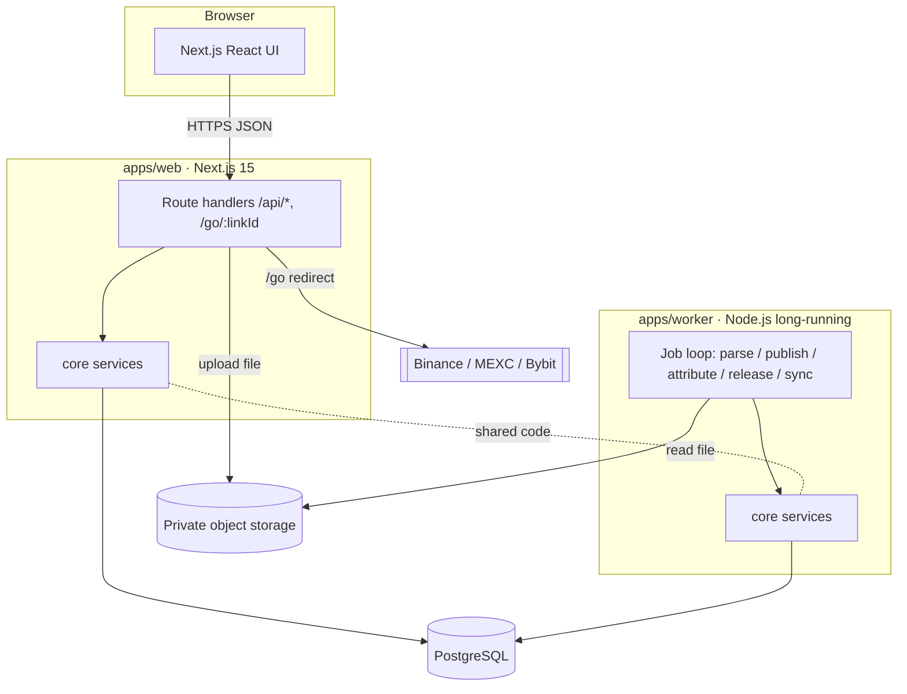
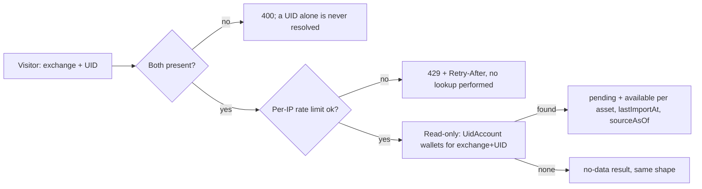
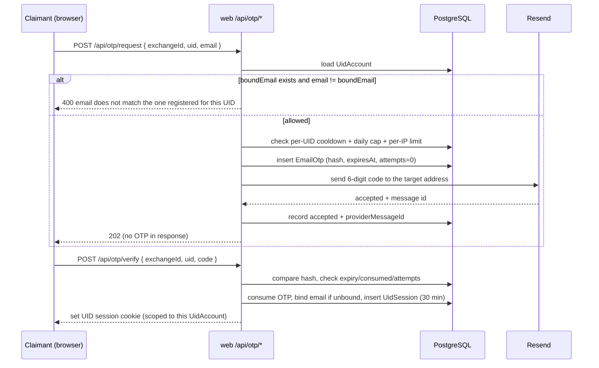
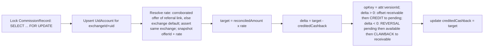
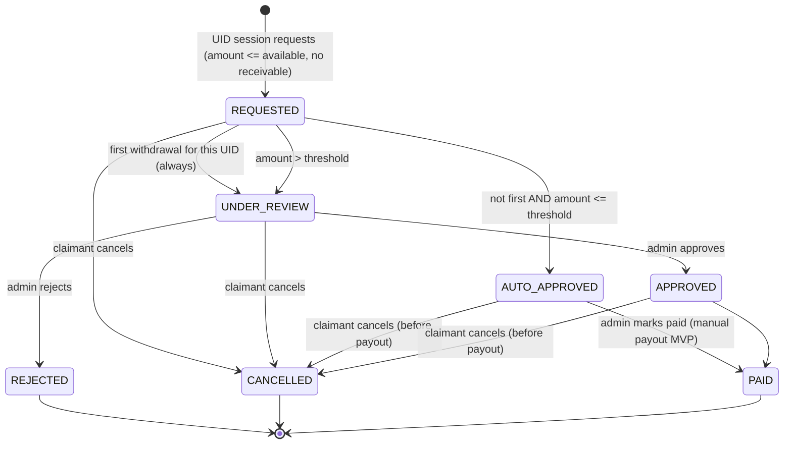

# Design — Cashback Affiliate Platform

- **Status:** Draft v0.7 (UID-first: no customer accounts; email OTP + UID session)
- **Last updated:** 2026-09-16
- **Based on:** `.kiro/specs/cashback-platform/requirements.md` (Draft v0.6), `architecture.html` v0.4 (context only)
- **Audience:** implementers and AI coding agents (Kiro / Claude / Codex)

> This document turns the requirements into a concrete technical design: component
> boundaries, data model, flows, and cross-cutting concerns. Nothing here is implemented
> yet. Items marked **[PENDING]** map to open decisions in the requirements and must be
> confirmed before their dependent code is built. Per spec governance, `requirements.md`
> and `design.md` are the source of truth; `architecture.html` is background context only.
>
> **Reference convention:** `Req N.M` cites an EARS acceptance criterion in
> `requirements.md`. `Open decision #N` cites a numbered row in `requirements.md` →
> "Open decisions" (a stakeholder answer), NOT Requirement N.

## Overview

The platform is a TypeScript monorepo with two runtime apps sharing a PostgreSQL
database:

- **`apps/web`** — Next.js 15 (App Router). Serves the public site, the UID-session area
  (lookup/OTP/withdraw), and admin area. Contains all HTTP route handlers (`/api/*`,
  `/go/:linkId`).
- **`apps/worker`** — long-running Node.js process. Parses reports, attributes
  commission, releases holds, and runs (future) scheduled sync jobs.

Shared logic lives in packages so web and worker never diverge:

- **`packages/core`** — services: normalization, cashback engine, attribution, wallet,
  validation. No HTTP, no React.
- **`packages/db`** — Prisma schema, migrations, generated client, repository helpers.
- **`packages/contracts`** — zod schemas + TypeScript types for API request/response and
  report row shapes. No secrets. Safe to import from the browser bundle.

The browser never touches the database or `core`/`db` directly; it only calls `/api/*`.

## Architecture

### System context



### Technology & key decisions

| Concern | Decision | Rationale |
|---------|----------|-----------|
| Language | TypeScript everywhere | Single toolchain, shared types. |
| Web | Next.js 15 App Router | SSR public pages + colocated API routes. |
| Worker | Node.js long-running process | Long jobs off the request path (Req 12). |
| Monorepo | pnpm workspaces + Turborepo | Shared packages, cached builds. |
| DB | PostgreSQL + Prisma | Relational integrity, migrations, job queue. |
| Job queue | PostgreSQL `SKIP LOCKED` | No Redis at launch scale (Req 12.6). |
| Validation | zod in `packages/contracts` | One schema for API + parser boundaries. |
| Money | `Decimal` (Prisma `Decimal`/numeric); API returns strings | No float error (Req 7.4). |
| Auth | **[PENDING]** provider (open decision #13); interim email+password | Abstracted behind an auth port; see Components/Auth. |
| Styling (public site) | Tailwind CSS v4 + shadcn/ui (Radix primitives), copied into `src/components/ui` | Free/open-source component kit; replaces hand-rolled CSS for the public marketing pages (home, exchanges, guides) with a light, blue/teal "friendly-professional" theme. Admin screens intentionally stay on plain utility classes (out of scope for this refresh). |
| Hosting | Local/SIT + Railway prod, dual-track | Verify local, push, deploy (Req 6.5). |
| Language / i18n | Single locale registry + message catalogs + locale-segment routing | English is the only enabled locale; enabling another is a registry + catalog change, not a routing change (Req 4). |

### Repository layout

```
apps/
  web/
    src/app/
      (public)/                 # home, /exchanges, /exchanges/[slug], /guides
      [locale]/                 # same public pages under a non-default locale prefix
      (uid)/                    # /uid/wallet, /uid/withdrawals (UidSession-guarded)
      (admin)/                  # /admin/... (guarded)
      api/                      # route handlers -> core services
      go/[linkId]/route.ts      # redirect + click tracking
    src/components/            # public-site components (public-pages.tsx) + ui/ (shadcn primitives)
    src/lib/utils.ts           # `cn()` class-merge helper (shadcn convention)
    components.json            # shadcn/ui CLI config (style, aliases, Tailwind entry)
    postcss.config.mjs         # @tailwindcss/postcss plugin
    src/i18n/                   # locale registry + message catalogs (en only)
    src/middleware.ts           # resolves request locale from the registry
  worker/
    src/index.ts                # boot + job loop
    src/jobs/                   # parse / publish / attribute / releaseHolds / sync
    src/adapters/               # per-exchange report parsers
packages/
  contracts/                    # zod schemas + types (no secrets)
  core/                         # services, cashback engine, normalization
  db/                           # prisma schema + migrations + repositories
infra/
  docker-compose.yml            # local Postgres + storage (SIT)
  railway/                      # railway service config
architecture.html
.kiro/specs/cashback-platform/  # this spec
```

Turborepo pipeline: `build`, `lint`, `typecheck`, `test`, `db:migrate`, `dev`.
Dependency rule (enforced by lint/boundaries): `web` and `worker` may import
`core`, `db`, `contracts`; browser code may import only `contracts`.

### Key flows

#### Report import → publish (Req 6)

```mermaid
sequenceDiagram
  participant A as Admin (web)
  participant API as web /api/admin/imports
  participant S as Object storage
  participant DB as PostgreSQL
  participant W as Worker

  A->>API: POST report + metadata
  API->>API: authz + file type/size check
  API->>S: store original file (private)
  API->>DB: create ImportBatch + PARSE job
  API-->>A: 202 { batchId }
  W->>DB: claim PARSE job (SKIP LOCKED)
  W->>S: read file
  W->>DB: write StagingRow (normalized + flags)
  W->>DB: batch.status = PREVIEW
  A->>API: GET /imports/:id (poll ~5s)
  API-->>A: counts (new/dup/error/conflict) + totals
  A->>API: POST /imports/:id/commit
  API->>DB: create PUBLISH job
  W->>DB: claim PUBLISH job
  W->>DB: per row -> upsert CommissionRecord identity (exchangeId, dedupKey)
  W->>DB: upsert CommissionVersion (unique commissionId+batchId); recompute reconciledAmount (latest supersedes)
  W->>DB: enqueue ATTRIBUTE job; batch.status = PUBLISHED
```

Versioned publish (Req 6.7, 7.8): a commission has a **stable identity**
(`exchangeId, dedupKey`) and one **version per import occurrence** (`CommissionVersion`,
unique per `(commissionId, batchId)`). Re-committing the same batch — or two publish
workers racing on the same batch — upserts the same version and changes no
`reconciledAmount` (idempotent). A corrected report adds a new version that supersedes the
prior one; the identity's `reconciledAmount` is recomputed (default rule: **latest version
supersedes**) and only the delta flows to cashback. Prior versions are retained for audit.
(`dedupKey` composition is **[PENDING]** — Open decision #11, finalized against a real
sample.)

#### Cashback lookup by exchange + UID (Req 14)



- **Exchange is mandatory.** The lookup key is the pair; the same UID string on two
  exchanges is two different subjects (Req 14.1). A request missing either half is rejected
  before any query runs.
- **Amounts are returned** (`pending`, `available` per asset) plus freshness timestamps.
  This is the accepted-risk decision recorded in requirements: it makes per-UID value
  visible to anyone who can guess a UID.
- **Withheld even so:** bound email (in any form, including masked), payout addresses,
  withdrawal records, wallet movement history, and the `reserved`/`withdrawn`/`receivable`
  buckets (Req 14.3). Those require a UID session.
- **Read-only.** No writes to `UidAccount`, `Wallet`, `EmailOtp`, or `UidSession` (Req 14.5),
  so a lookup can never squat or claim a UID. `UidAccount` rows are created only by the
  ATTRIBUTE job (Req 5.3).
- **Rate limited per IP** in Postgres (`RateLimitCounter`), not in process memory: Railway
  may run more than one web instance, and an in-memory counter would reset on every deploy.
  Redis stays out per Req 12.6.
- "No data" uses the same response shape whether the UID is unknown or known-with-zero
  (Req 14.6), and is distinguishable from a real zero balance via an explicit flag rather
  than by inference from the numbers.

#### UID accounts (Req 5)
1. A `UidAccount` is the unit of cashback ownership, unique per `(exchangeId, uid)`.
2. The `ATTRIBUTE` job creates the `UidAccount` on demand when a published commission
   references a UID that has no account yet (Req 5.3), then credits its wallet. No claimant
   action, email, or session is needed for cashback to accrue (Req 7.2).
3. UID is an opaque string, always scoped by exchange (Req 5.2).
4. Ownership is **not** established here. It is asserted only at withdrawal, by binding an
   email via OTP (Req 15). Until then a `UidAccount` has `boundEmail = null` and simply
   holds a balance.
5. Because there is no ownership proof, the effective rule is first-claimant-wins — see
   requirements "Accepted risk". The design compensates only with rate limits, mandatory
   admin review of first withdrawals, OTP limits, and the holding period.

#### Email OTP binding & UID session (Req 15)



- **Send target rule (Req 15.2):** if a bound email exists, the OTP goes only to it. A
  mismatched submission is rejected *without* sending anything to the submitted address, and
  the error never reveals the bound address — otherwise the endpoint becomes an oracle for
  discovering which email owns a UID.
- **OTP storage:** hash only, never the plaintext, never logged, never in a response
  (Req 15.8). Single-use with a short TTL (proposed 5 min) and a wrong-attempt cap (proposed
  5) after which the OTP is invalidated (Req 15.4–15.5). 6 digits is only ~10⁶ codes, so the
  attempt cap — not the TTL — is what makes guessing infeasible.
- **Quota protection (Req 15.6–15.7, 16.4):** per-UID cooldown + daily send cap, plus an
  independent per-IP limit. Resend's free plan allows 100 sends/day, so an unmetered resend
  button would let one actor exhaust the daily quota and block real withdrawals.
- **UID session:** hashed token stored server-side, 30-minute expiry, scoped to exactly one
  `UidAccount`. Every withdrawal/history action derives the UID account **from the session**,
  never from a request parameter (Req 15.10). Presenting a session against a different UID
  is rejected (Req 15.11).
- **Binding is not authorisation:** a bound email lets you request a withdrawal; the first
  withdrawal per UID still goes to admin review regardless of amount (Req 9.5, 15.9).

#### Bybit MVP implementation (2026-09-16)
- Normalized Bybit CSV v1 is the first adapter. Native export mapping and XLSX remain
  pending a real sample. UTC, explicit per-currency commissions, strict headers and
  bounded rows; transaction IDs fall back to aggregate period identities when absent.
- New originals are stored privately in `ImportBatch.originalFile` (bounded BYTEA)
  rather than container-local disk, so web and worker share durable input. Object
  storage remains the longer-term storage design. See `apps/web/docs/bybit-cashback.md`.
- Publish, UID ownership and ledger mutations use a transaction-scoped Postgres
  advisory lock for the low-volume MVP. Jobs carry a unique per-claim `lockedBy`
  token; business changes and DONE commit atomically only while the lease is valid.
- `WalletEntry.remainingPending` prevents reversed credits from being released;
  immutable `balanceChanges` records the per-bucket deltas. Missing holding-period
  configuration keeps funds pending. Report freshness reflects applied ledger
  versions, not merely an uploaded or not-yet-attributed report.
- The private **Your cashback** panel precedes the home hero/grid and shares data
  with `/me/wallet`. It handles guests, unlinked UIDs, pending review/report, no data,
  real zero balances and service errors separately. Poll only while visible.

#### Attribution → cashback → wallet (Req 7, 8)



Cashback is **delta-based and concurrency-safe**: the ATTRIBUTE job locks the
`CommissionRecord` row (`SELECT ... FOR UPDATE`) before reading `creditedCashback` and
computing `delta = target − creditedCashback`. Every resulting `WalletEntry` carries a
unique `opKey` (e.g., `attr:{commissionVersionId}`), so a retried or racing worker cannot
insert a duplicate CREDIT/REVERSAL — the unique constraint rejects the second write. A
separate `RELEASE_HOLDS` job periodically moves cleared CREDITs `pending → available`
(Req 8.3).

**Reversal policy (Req 8.4, 8.7)** — when `delta < 0` (a downward correction):
1. reduce `pending` by `min(|delta|, pending)`;
2. reduce `available` by `min(remaining, available)`;
3. any still-uncovered remainder (cashback already `withdrawn`/settled) increases the
   wallet `receivable` via a `CLAWBACK` entry.
`pending`, `available`, `reserved` never go negative. While `receivable > 0`, new
withdrawals are blocked, and a later positive `delta` first offsets `receivable` before
crediting `pending`.

#### Withdrawal (Req 9)



Reserved-balance model with full audit. Every transition below requires a valid UID session
for that UID account (Req 9.1); admin transitions require an admin session.
- **REQUESTED** (only if `receivable = 0`) → `WITHDRAWAL_RESERVE` entry:
  `available -= amount`, `reserved += amount` (Req 9.2, 9.4, 9.11).
- **First withdrawal per UID always routes to `UNDER_REVIEW`** regardless of amount
  (Req 9.5). The auto-approval threshold applies only from the second withdrawal onward.
  This is the last human checkpoint before money leaves, given there is no ownership proof.
- **REJECTED / CANCELLED** → `WITHDRAWAL_RELEASE` entry: `reserved -= amount`,
  `available += amount` (Req 9.7, 9.10). Cancel is claimant-initiated (via the UID session)
  and allowed only before `PAID`.
- **PAID** → `WITHDRAWAL_SETTLE` entry: `reserved -= amount`, `withdrawn += amount`
  (Req 9.5).
- Every transition writes a `WithdrawalEvent` (fromStatus, toStatus, actor, time,
  note/reference) (Req 9.8). Only `available` is withdrawable (Req 9.7).

### Job queue design (Postgres)

- Claim (correct PostgreSQL clause order):
  ```sql
  SELECT * FROM "Job"
  WHERE state = 'PENDING' AND "runAfter" <= now()
  ORDER BY "runAfter"
  LIMIT 1
  FOR UPDATE SKIP LOCKED;
  ```
  then set `state='CLAIMED'`, `leaseUntil=now()+lease`.
- Heartbeat updates `heartbeatAt`/`leaseUntil` while running.
- Reaper: jobs whose `leaseUntil < now()` return to `PENDING` (crash recovery, Req 12.3).
- Commit path re-verifies the worker still holds the lease before writing results.
- Job types: `PARSE`, `PUBLISH`, `ATTRIBUTE`, `RELEASE_HOLDS`, `SYNC` (disabled).
- `RELEASE_HOLDS` enqueued by a lightweight scheduler tick (worker interval).

### Environments & deployment (Req 6.5)

| Aspect | Local / SIT | Production |
|--------|-------------|------------|
| Orchestration | Docker Compose | Railway services |
| Postgres | compose container | Railway Postgres plugin |
| Storage | compose (e.g. MinIO) or local dir | Railway volume / S3-compatible |
| Web | `pnpm --filter web dev` | Railway web service |
| Worker | `pnpm --filter worker dev` | Railway worker service (always-on) |

Dual-track from Phase 0: a minimal Railway skeleton (web + worker + Postgres, build,
migrate, health check) is stood up early alongside local/SIT, so both tracks stay green.
Production hardening (observability, backup/restore, scaling) lands in Phase 3. Flow:
build+test locally → migrations → push to Git → deploy to Railway. Migrations run once
per deploy; builds reproducible.

Env vars (proposed): `DATABASE_URL`, `APP_URL`, `IMPORT_STORAGE_*`, `WORKER_POLL_SECONDS`,
`SYNC_INTERVAL_MINUTES` (sync disabled), `HOLDING_PERIOD_HOURS`,
`WITHDRAWAL_AUTO_APPROVE_THRESHOLD`, `JOB_LEASE_SECONDS`, plus admin auth provider vars
**[PENDING]**, and for Req 15/16: `RESEND_API_KEY`, `EMAIL_FROM` (must be an address on a
Resend-verified domain — the shared `resend.dev` testing domain only delivers to the
account owner, per Resend's own docs), `OTP_TTL_MINUTES` (proposed 5),
`OTP_MAX_ATTEMPTS` (proposed 5), `OTP_RESEND_COOLDOWN_SECONDS`, `OTP_DAILY_CAP_PER_UID`,
`LOOKUP_RATE_PER_MINUTE`, `UID_SESSION_MINUTES` (proposed 30).

**Resend send path (Req 16):** OTP send happens **in-request**, not via the job queue —
the claimant is waiting on the code, and a queued send would add worker-poll latency on
top of email delivery latency. If Resend's API errors or times out, `otpService` does not
create the `EmailOtp` row as sent and returns a retryable error; it never leaves a
withdrawal in a state that implies delivery succeeded (Req 16.3). Resend's free plan caps
at 100 sends/day and 3,000/month, reset at 00:00 UTC — this is the operational reason the
per-UID cooldown/cap and per-IP limit in Req 15.6–15.7 exist: without them, one actor
spamming OTP requests exhausts the day's quota and blocks real withdrawals for everyone
until the reset.

## Components and Interfaces

### apps/web
- **Public routes** (SSR): read published content via `core` read services; return
  `Cache-Control: public` where safe. Never call exchange APIs on render (Req 1, 11).
- **`/go/[linkId]` route handler:** look up active link, then record the click via a
  **reliable best-effort** mechanism — the Next.js post-response hook (`after()` /
  platform `waitUntil`) or a short-timeout awaited insert — and return 302. The click
  insert must not be an unawaited/dropped promise (which can be lost on process exit);
  recording failure still returns the redirect. Unknown/inactive link → safe fallback,
  no open redirect (Req 2.1, 2.2, 2.3, 2.4).
- **UID API** (`/api/uid/*`): `UidSession`-guarded; scopes every query to the session's
  `uidAccountId`; never trusts a client-sent UID/account id (Req 3.3, 15.10).
- **Admin API** (`/api/admin/*`): admin-guarded; `Cache-Control: private, no-store`.
- Route handlers are thin: validate with `contracts` zod schema → call `core` service →
  map result to response. No business logic in handlers.
- **Exchange logo assets (static, in-repo):** logo files live at
  `apps/web/public/exchange-logos/<slug>.png` and are served by Next.js from `public/` at
  the site root. `Exchange.logoUrl` holds only the root-relative path to one of those files
  (e.g. `/exchange-logos/binance.png`); the app never renders a logo from a third-party
  host, so public pages carry no external image dependency. Offer tiles render the logo
  when `logoUrl` is set and keep the existing generated colour placeholder when it is
  `null`. Assets are baked into the build image, so adding or replacing a logo is a repo
  change plus deploy, not a runtime upload (Req 1.1, 1.2).

### apps/worker
- Boot connects to Postgres, starts a poll loop (~10s) that claims one job via
  `FOR UPDATE SKIP LOCKED`, sets `leaseUntil` and heartbeats while running.
- Job handlers are pure `core` calls; the worker only owns scheduling/lease/retry.
- Retry: transient errors → exponential backoff + jitter, capped attempts; config/auth
  errors → mark FAILED, surface, no infinite retry (Req 12.5).
- A stale worker must re-check lease ownership before committing (Req 12.3).

### packages/core services
- `contentService` — read/write exchanges, offers, links (incl. link↔offer binding and
  exchange default rate), guides.
- `clickService` — record click (best-effort), aggregate analytics.
- `lookupService` — cashback lookup by exchange + UID: consume the per-IP rate-limit budget
  (`RateLimitCounter`, scope `lookup:ip`), then read the `UidAccount`'s wallets and return
  `pending`/`available` per asset plus freshness timestamps. Read-only; never creates a
  `UidAccount`, `Wallet`, or session (Req 14).
- `otpService` — generates a 6-digit code with `crypto.randomInt(100000, 1000000)`, hashes
  it with the `bcryptjs` already used for admin credentials, and enforces send order:
  check per-UID cooldown + daily cap (`RateLimitCounter` scope `otp:uid`) and per-IP limit
  (scope `otp:ip`) → if a bound email exists, target only it → create `EmailOtp` → call
  `emailPort.sendOtp` → record `providerAccepted`/`providerMessageId`. Verification compares
  the hash, checks `expiresAt`/`consumedAt`/`failedAttempts`, consumes the OTP, binds the
  email if unbound, and issues a `UidSession` (Req 15).
- `uidSessionService` — issues/verifies/expires hashed session tokens scoped to one
  `UidAccount`; every `/api/uid/*` handler resolves its principal through this service, never
  from a request parameter (Req 15.10).
- `emailPort` — a narrow interface (`sendOtp({ to, code }): Promise<{ accepted: boolean;
  messageId?: string }>`) so `otpService` does not depend on the Resend SDK directly. The
  only implementation is `resendEmailAdapter`, calling the official `resend` package. Kept
  behind a port for the same reason as `AuthPort`: swapping providers later should not touch
  callers.
- `importService` — create batch, enqueue parse, preview, commit (enqueue publish).
- `parserRegistry` — resolve adapter by (exchange, reportType, format).
- `commissionService` — upsert commission identity + version (unique per commission+batch),
  recompute reconciled amount.
- `attributionService` — lock the commission (`FOR UPDATE`), upsert the `UidAccount` for
  (exchangeId, uid), resolve + snapshot rate (system-corroborated, same exchange).
- `cashbackEngine` — compute target cashback, apply signed delta (credit/reversal/clawback,
  receivable offset) with a unique op key, release holds.
- `walletService` — balances (pending/available/reserved/withdrawn/receivable), typed
  entries, reservations.
- `withdrawalService` — request/reserve (blocked while receivable > 0), first-withdrawal
  detection (always `UNDER_REVIEW`), threshold decision from the second withdrawal onward,
  approve/reject/settle, claimant cancel, events.
- All services take a transaction/context object so they compose atomically.

### API contracts (shape summary)

All requests/responses validated by zod schemas in `packages/contracts`. Money is a
decimal string with an `asset`. Errors use a consistent envelope
`{ error: { code, message, details? } }`.

| Endpoint | Method | Auth | Notes |
|----------|--------|------|-------|
| `/api/exchanges` | GET | public | published exchanges + offers |
| `/go/:linkId` | GET | public | 302 redirect; records click (best-effort) |
| `/api/lookup` | POST | public | `{ exchangeId, uid }` → `pending`/`available` per asset + freshness; IP rate-limited, 429 + `Retry-After` when exceeded |
| `/api/otp/request` | POST | public (rate-limited) | send OTP for a withdrawal; targets the bound email if one exists |
| `/api/otp/verify` | POST | public (rate-limited) | verify OTP → bind email + issue 30-min `UidSession` cookie |
| `/api/admin/auth/*` | POST | public→admin session | admin login/logout (interim) **[PENDING provider]** |
| `/api/uid/wallet` | GET | UID session | balances (incl. reserved, receivable) + as-of + history, scoped to the session's UID |
| `/api/uid/withdrawals` | GET/POST | UID session | history / request |
| `/api/uid/withdrawals/:id/cancel` | POST | UID session | cancel a not-yet-paid withdrawal |
| `/api/admin/imports` | POST | admin | 202 + batchId |
| `/api/admin/imports/:id` | GET | admin | status/preview/errors |
| `/api/admin/imports/:id/commit` | POST | admin | idempotent |
| `/api/admin/uid-accounts/:id/activity` | GET | admin | per UID account, paginated |
| `/api/admin/analytics` | GET | admin | click metrics |
| `/api/admin/sync-status` | GET | admin | last success, as-of; no secrets |
| `/api/admin/withdrawals/:id/decision` | POST | admin | approve/reject/mark-paid |

### Auth (v0.6: admin only)
- Define an `AuthPort` in `core` with `getSession(req)` and `requireAdmin`. Route handlers
  depend on the port, not a concrete provider. There is no `requireCustomer` — end-user
  identity is a `UidSession`, resolved by `uidSessionService`, not `AuthPort` (Req 3.2).
- **Interim implementation (until a provider is chosen):** email + password with server
  sessions. Credentials are stored as a `passwordHash` on `AdminAccount`; admin sessions
  live in the `Session` table (hashed token, expiry). These fields are **interim** and are
  replaced (dropped/migrated) if a managed provider (Auth0/Clerk/Supabase) is adopted; the
  rest of the design is unaffected because everything depends on `AuthPort`.
- An admin `Session` and a `UidSession` are structurally different tables with no shared
  code path: an admin session cannot be presented to a `/api/uid/*` route and a `UidSession`
  cannot be presented to a `/api/admin/*` route (Req 3.4).

### Language & i18n (Req 4)
- **English is the only enabled locale.** No other language is served (Req 4.1).
- `apps/web/src/i18n/index.ts` is the **single locale registry**: `locales`, `Locale`,
  the message catalogs map, `isLocale`, and `localePath`. It currently holds `en` only.
  `middleware.ts`, `<html lang>`, navigation links, and the `app/[locale]/...` route group
  all derive from that registry — nothing hard-codes a locale code — so enabling a locale
  means adding a catalog and one registry entry, with no route restructuring (Req 4.3).
- The default locale is served unprefixed. `app/[locale]/...` renders the same shared
  public page components for a non-default enabled locale; a prefixed segment that is not
  an enabled locale (and the default-locale prefix, which would duplicate the unprefixed
  route) returns 404 (Req 4.5). While `en` is the only entry, this group is inert by
  design and is the seam kept for Req 4.3 — not dead legacy.
- Message catalogs are typed against the default catalog (`Messages`), so a new locale
  cannot ship with missing keys (Req 4.2).
- Content models store localized fields in an `i18n` JSON keyed by locale; public reads
  resolve the requested locale and fall back to `en` when a value is missing (Req 4.4).
  Extra locale keys already present in stored content are simply never resolved.
- Admin content forms author only enabled locales — English fields alone today (Req 10.5).
- `contracts` keeps locale keys generic (`^[a-z]{2}(-[A-Z]{2})?$`) and requires `en`
  content, so enabling a locale needs no schema change.

### Cashback engine details
- **Rate resolution** (Req 7.3): precedence (1) the `cashbackRate` of the offer bound to
  the referral link reported alongside the commission **only when corroborated by
  system-verified report data** (e.g., a referral code / sub-ID present in the report),
  else (2) `Exchange.defaultCashbackRate`. A client-supplied link/offer is never trusted for
  rate selection. The engine asserts `UidAccount.exchangeId = ReferralLink.exchangeId =
  Offer.exchangeId`; on mismatch it falls back to the exchange default. The resolved
  `offerId` and `cashbackRate` are **snapshotted** onto the `CommissionRecord` at
  attribution time, so later offer/exchange rate edits do not change already-credited
  cashback.
- **Concurrency & idempotency**: attribution locks the `CommissionRecord` with
  `SELECT ... FOR UPDATE`; each wallet movement gets a unique `opKey`
  (`attr:{commissionVersionId}`), so retries/racing workers cannot double-apply.
- Computation uses decimal arithmetic only; no floating point. `cashbackRate` is
  `Decimal(6,4)`.
- **Delta application**: `target = reconciledAmount × rate`; `delta = target −
  creditedCashback`. `delta > 0` → offset any `receivable` first, then `CREDIT` the
  remainder to `pending` with `availableAt = now + holdingPeriod`. `delta < 0` → reduce
  `pending`, then `available`, then record the uncovered remainder as `receivable` via a
  `CLAWBACK` entry (Req 8.4, 8.7). `creditedCashback` is updated to `target` in the same
  transaction.
- Every wallet movement references its source (`sourceRef`) for audit (Req 7.7, 8.6).
- Holding period is a config value (`HOLDING_PERIOD_HOURS`, **[PENDING]** default).

## Data Models

Prisma schema is indicative, not final; refine when a real report sample arrives
(**[PENDING]** dedup key, Open decision #11). Money fields are `Decimal`. UID is
`String`. Timestamps stored UTC.

```prisma
// ---------- Content ----------
model Exchange {
  id                  String   @id @default(cuid())
  slug                String   @unique
  name                String
  status              PublishStatus @default(DRAFT)
  defaultCashbackRate Decimal? @db.Decimal(6,4) // fallback when offer has no rate
  logoUrl             String?  // root-relative path to a repo-committed logo asset,
                               // e.g. "/exchange-logos/binance.png"; never an external URL
  offers              Offer[]
  links               ReferralLink[]
  guides              Guide[]
  i18n                Json?    // localized name/description
  createdAt           DateTime @default(now())
  updatedAt           DateTime @updatedAt
}

model Offer {
  id           String   @id @default(cuid())
  exchangeId   String
  exchange     Exchange @relation(fields: [exchangeId], references: [id])
  status       PublishStatus @default(DRAFT)
  cashbackRate Decimal  @db.Decimal(6,4) // e.g. 0.4000 = 40% of commission
  conditions   Json?
  verifiedAt   DateTime?
  i18n         Json?
  links        ReferralLink[]
}

model ReferralLink {
  id          String   @id @default(cuid())
  exchangeId  String
  exchange    Exchange @relation(fields: [exchangeId], references: [id])
  offerId     String?
  offer       Offer?   @relation(fields: [offerId], references: [id])
  destination String
  active      Boolean  @default(true)
  clicks      ClickEvent[]
  // No relation to UidAccount: which referral link corroborated a commission is recorded
  // on CommissionVersion.referralLinkId (report-reported, per import row), not tracked
  // per UID account (v0.6 — UidAccount is never client-linked to a referral link).
}

model Guide {
  id         String @id @default(cuid())
  slug       String @unique
  exchangeId String?
  exchange   Exchange? @relation(fields: [exchangeId], references: [id])
  status     PublishStatus @default(DRAFT)
  i18n       Json?  // localized title/content
}

model ClickEvent {
  id        String   @id @default(cuid())
  linkId    String
  link      ReferralLink @relation(fields: [linkId], references: [id])
  createdAt DateTime @default(now())
  @@index([linkId, createdAt])
}

// ---------- Identity & sessions (interim auth) ----------
model AdminAccount {
  id           String @id @default(cuid())
  email        String @unique
  passwordHash String? // interim auth; replaced if a managed provider is chosen
  sessions     Session[]
}

/// The unit of cashback ownership (Req 5.1). No password, no username, no login.
/// Created by the ATTRIBUTE job on demand (Req 5.3), never by a lookup (Req 14.5).
model UidAccount {
  id           String   @id @default(cuid())
  exchangeId   String
  exchange     Exchange @relation(fields: [exchangeId], references: [id])
  uid          String   // opaque string, always scoped by exchange (Req 5.2)
  boundEmail   String?  // null until the first successful OTP (Req 15.3)
  emailBoundAt DateTime?
  wallets      Wallet[]
  withdrawals  Withdrawal[]
  otps         EmailOtp[]
  sessions     UidSession[]
  createdAt    DateTime @default(now())
  @@unique([exchangeId, uid]) // one UID account per (exchange, UID)
  @@index([boundEmail])       // one email may hold several UID accounts
}

/// A 6-digit code proving control of an email. Hash only; the plaintext is never stored,
/// logged, or returned (Req 15.8).
model EmailOtp {
  id                String     @id @default(cuid())
  uidAccountId      String
  uidAccount        UidAccount @relation(fields: [uidAccountId], references: [id])
  email             String   // address this code was sent to
  codeHash          String   // bcrypt hash of the 6 digits
  expiresAt         DateTime // now + OTP_TTL_MINUTES (proposed 5)
  consumedAt        DateTime?
  failedAttempts    Int      @default(0) // invalidate at OTP_MAX_ATTEMPTS (proposed 5)
  providerAccepted  Boolean  @default(false) // Resend accepted the send (Req 16.6)
  providerMessageId String?
  createdAt         DateTime @default(now())
  @@index([uidAccountId, createdAt]) // supports cooldown + daily-cap checks
  @@index([expiresAt])               // supports pruning
}

/// Short-lived, scoped to exactly ONE UidAccount (Req 15.3, 15.10). Grants no admin
/// capability. Stored hashed like an admin Session.
model UidSession {
  id           String     @id @default(cuid())
  uidAccountId String
  uidAccount   UidAccount @relation(fields: [uidAccountId], references: [id])
  tokenHash    String   @unique
  expiresAt    DateTime // now + 30 minutes
  createdAt    DateTime @default(now())
  @@index([uidAccountId])
}

/// Counter windows backing the lookup and OTP-send rate limits (Req 14.4, 15.6-15.7).
/// `scope` distinguishes limiter kinds (e.g. "lookup:ip", "otp:ip", "otp:uid"). `subjectHash`
/// is a hash: raw IPs are never persisted. Holds no lookup result, so this is a rate-limit
/// ledger, not a search history.
model RateLimitCounter {
  id          String   @id @default(cuid())
  scope       String
  subjectHash String
  windowStart DateTime
  count       Int      @default(0)
  @@unique([scope, subjectHash, windowStart])
  @@index([windowStart]) // supports pruning old windows
}

/// Admin-only server session (v0.6). End-user identity uses `UidSession` instead —
/// see the UID-first models above. Kept separate so an admin session can never be
/// mistaken for withdrawal rights over a UID (Req 3.4).
model Session {
  id        String   @id @default(cuid())
  adminId   String
  admin     AdminAccount @relation(fields: [adminId], references: [id])
  tokenHash String   @unique
  expiresAt DateTime
  createdAt DateTime @default(now())
  @@index([adminId])
}

// ---------- Import & commission (versioned) ----------
// NOTE (v0.6): `UidLink` and its partial unique index `uidlink_verified_owner` are removed.
// The unit of cashback identity is now `UidAccount` (defined above, alongside the other
// UID-first models), unique per (exchangeId, uid) with no verification status — see
// "UID accounts (Req 5)" under Key flows.
model ImportBatch {
  id          String   @id @default(cuid())
  exchangeId  String
  rootAccount String
  reportType  ReportType
  periodStart DateTime
  periodEnd   DateTime
  sourceTz    String
  fileRef     String   // private storage key
  status      BatchStatus @default(UPLOADED)
  totals      Json?
  createdAt   DateTime @default(now())
  rows        StagingRow[]
  versions    CommissionVersion[]
}

model StagingRow {
  id         String @id @default(cuid())
  batchId    String
  batch      ImportBatch @relation(fields: [batchId], references: [id])
  raw        Json
  normalized Json?
  flags      Json?   // { duplicate, error, unmappedUid, conflict }
}

model CommissionRecord {
  id                   String   @id @default(cuid())
  exchangeId           String
  uid                  String
  asset                String
  dedupKey             String   // [PENDING] composition per adapter (Open decision #11)
  periodStart          DateTime
  periodEnd            DateTime
  reconciledAmount     Decimal  @db.Decimal(30,10) @default(0) // current authoritative amount
  activeVersionId      String?  @unique
  activeVersion        CommissionVersion? @relation("active_version", fields: [activeVersionId], references: [id])
  attributedUidAccountId String? // set by ATTRIBUTE; the account is created on demand (Req 5.3)
  offerId              String?  // snapshot resolved at attribution
  cashbackRate         Decimal? @db.Decimal(6,4) // snapshot resolved at attribution
  creditedCashback     Decimal  @db.Decimal(30,10) @default(0) // cashback already applied to wallet
  createdAt            DateTime @default(now())
  updatedAt            DateTime @updatedAt
  versions             CommissionVersion[] @relation("record_versions")
  @@unique([exchangeId, dedupKey]) // stable identity (idempotent publish)
  @@index([exchangeId, uid])
}

model CommissionVersion {
  id           String   @id @default(cuid())
  commissionId String
  commission   CommissionRecord @relation("record_versions", fields: [commissionId], references: [id])
  batchId      String
  batch        ImportBatch @relation(fields: [batchId], references: [id])
  amount       Decimal  @db.Decimal(30,10)
  superseded   Boolean  @default(false)
  importedAt   DateTime @default(now())
  activeFor    CommissionRecord? @relation("active_version")
  @@unique([commissionId, batchId]) // idempotent commit; no double-insert under concurrency
  @@index([commissionId, importedAt])
}

// ---------- Wallet & payout ----------
model Wallet {
  id           String @id @default(cuid())
  uidAccountId String
  uidAccount   UidAccount @relation(fields: [uidAccountId], references: [id])
  asset        String
  pending      Decimal @db.Decimal(30,10) @default(0)
  available    Decimal @db.Decimal(30,10) @default(0)
  reserved     Decimal @db.Decimal(30,10) @default(0)
  withdrawn    Decimal @db.Decimal(30,10) @default(0)
  receivable   Decimal @db.Decimal(30,10) @default(0) // uncovered clawback owed by the UID account
  entries      WalletEntry[]
  @@unique([uidAccountId, asset])
}

model WalletEntry {
  id        String   @id @default(cuid())
  walletId  String
  wallet    Wallet   @relation(fields: [walletId], references: [id])
  type      WalletEntryType
  amount    Decimal  @db.Decimal(30,10)
  sourceRef String?  // commissionRecord id or withdrawal id
  opKey     String?  @unique // idempotency key, e.g. attr:{commissionVersionId} or wd:{withdrawalId}:{transition}
  availableAt DateTime? // when a CREDIT becomes available (holding period)
  createdAt DateTime @default(now())
  @@index([walletId, createdAt])
}

model Withdrawal {
  id           String   @id @default(cuid())
  uidAccountId String
  uidAccount   UidAccount @relation(fields: [uidAccountId], references: [id])
  asset        String
  amount       Decimal  @db.Decimal(30,10)
  network      String
  address      String
  email        String   // the bound email used for this withdrawal's OTP (Req 9.9)
  isFirst      Boolean  // true routes unconditionally to UNDER_REVIEW (Req 9.5, 15.9)
  status       WithdrawalStatus @default(REQUESTED)
  payoutRef    String?
  createdAt    DateTime @default(now())
  updatedAt    DateTime @updatedAt
  events       WithdrawalEvent[]
  @@index([status])
  @@index([uidAccountId])
}

model WithdrawalEvent {
  id           String   @id @default(cuid())
  withdrawalId String
  withdrawal   Withdrawal @relation(fields: [withdrawalId], references: [id])
  fromStatus   WithdrawalStatus?
  toStatus     WithdrawalStatus
  actorType    ActorType
  actorId      String?  // admin id when actorType = ADMIN, uidAccount id when CLAIMANT
  note         String?
  reference    String?  // payout reference when settled
  createdAt    DateTime @default(now())
  @@index([withdrawalId, createdAt])
}

// ---------- Jobs ----------
model Job {
  id          String   @id @default(cuid())
  type        JobType
  payload     Json
  state       JobState @default(PENDING)
  attempts    Int      @default(0)
  runAfter    DateTime @default(now())
  leaseUntil  DateTime?
  heartbeatAt DateTime?
  lastError   String?
  createdAt   DateTime @default(now())
  @@index([state, runAfter])
}
```

Enums:
`PublishStatus{DRAFT,PUBLISHED}`,
`ReportType{TRANSACTION,AGGREGATE}`,
`BatchStatus{UPLOADED,PARSING,PREVIEW,COMMITTING,PUBLISHED,FAILED}`,
`WalletEntryType{CREDIT,HOLD_RELEASE,WITHDRAWAL_RESERVE,WITHDRAWAL_RELEASE,WITHDRAWAL_SETTLE,ADJUSTMENT,REVERSAL,CLAWBACK}`,
`WithdrawalStatus{REQUESTED,AUTO_APPROVED,UNDER_REVIEW,APPROVED,PAID,REJECTED,CANCELLED}`,
`ActorType{CLAIMANT,ADMIN,SYSTEM}`,
`JobType{PARSE,PUBLISH,ATTRIBUTE,RELEASE_HOLDS,SYNC}`,
`JobState{PENDING,CLAIMED,DONE,FAILED}`.

## Correctness Properties

Invariants the implementation and tests must uphold.

### Property 1: Idempotent versioned publish
Re-committing the same batch (or two publish workers racing on it) upserts the same
`CommissionVersion` (unique `(commissionId, batchId)`) and does not change any
`reconciledAmount`; overlapping/duplicate imports never inflate totals. Commission
identity is `@@unique([exchangeId, dedupKey])`.
**Validates: Requirements 6.9, 7.5, 7.6, 7.8**

### Property 2: Cashback equals reconciled target (delta-correct, concurrency-safe)
For each commission identity, `creditedCashback` equals `reconciledAmount × snapshotRate`
after attribution. Attribution locks the record (`SELECT ... FOR UPDATE`) and each wallet
movement carries a unique `opKey`, so concurrent or retried runs apply no duplicate
CREDIT/REVERSAL.
**Validates: Requirements 7.6, 7.8, 8.2**

### Property 3: One UID account per (exchange, UID)
At most one `UidAccount` row exists per (exchange, UID), enforced by `@@unique([exchangeId,
uid])`. There is no verification status and no partial index: uniqueness is unconditional,
because ownership is no longer adjudicated at link time (v0.6 — see "Accepted risk").
**Validates: Requirements 5.1, 5.2**

### Property 4: Attribution needs no claimant action
A `UidAccount` accrues cashback purely from published commissions matching its
(exchange, UID); it can hold a positive balance with `boundEmail = null` and no session ever
issued. No claimant action, email, or session is a precondition for crediting `pending`
(only for withdrawing it — Property 6).
**Validates: Requirements 5.3, 5.5, 7.1, 7.2**

### Property 5: Balance conservation & non-negativity
For each wallet+asset, `pending`, `available`, `reserved` never go negative and
`receivable >= 0`; every bucket equals the signed sum of its `WalletEntry` movements.
**Validates: Requirements 8.1, 8.4, 8.7, 9.3**

### Property 6: Only-available is withdrawable, and only through a valid UID session
A withdrawal amount is `<= available` at request time (and only when `receivable = 0`),
requires a `UidSession` valid for that exact `UidAccount`, and is moved into `reserved` so
it cannot be double-requested. A UID's **first** withdrawal is always `UNDER_REVIEW`
regardless of amount; the auto-approval threshold applies only from the second withdrawal
onward.
**Validates: Requirements 9.1, 9.2, 9.4, 9.5, 9.8, 9.11**

### Property 7: Atomic batches
A failed publish leaves no partially-published data readable by the dashboard.
**Validates: Requirements 6.8**

### Property 8: Lease safety
A job result is only committed by the worker currently holding the lease; reclaimed jobs
do not double-write.
**Validates: Requirements 12.2, 12.3**

### Property 9: No double-count on overlap
Overlapping report periods are reconciled (latest version supersedes) before totals are
computed.
**Validates: Requirements 7.5, 7.8**

### Property 10: Withdrawal auditability
Every withdrawal status transition (including claimant cancel) is persisted as a
`WithdrawalEvent` (from/to status, actor, time, reference).
**Validates: Requirements 9.9, 9.10**

### Property 11: Rate-snapshot immutability
Credited cashback uses the `offerId`/`cashbackRate` snapshotted at attribution; later
offer/exchange rate edits do not retroactively change it.
**Validates: Requirements 7.3**

### Property 12: Reversal coverage
A downward correction reduces `pending` then `available`; any uncovered remainder is
recorded as `receivable`, new withdrawals are blocked while `receivable > 0`, and later
credits offset it before increasing `pending`.
**Validates: Requirements 8.4, 8.7, 9.10**

### Property 13: Rate source integrity
The snapshot rate derives only from a system-corroborated referral link/offer with a
matching exchange; a client-supplied link/offer never raises the rate, and mismatches
fall back to the exchange default.
**Validates: Requirements 7.3**

### Property 14: Lookup discloses balances only, never identity or history
For any (exchange, UID), the lookup response carries only `pending`/`available` per asset
and freshness timestamps. It never includes a bound email (in any form), payout address,
withdrawal record, wallet movement history, or the `reserved`/`withdrawn`/`receivable`
buckets — those require a `UidSession` for that exact `UidAccount`. The endpoint performs
no writes, so a lookup can never create or claim a `UidAccount` (Req 14.3, 14.5).
**Validates: Requirements 14.2, 14.3, 14.5**

### Property 15: Rate limits survive restarts and multiple instances
Lookup and OTP-send budgets are stored in Postgres (`RateLimitCounter`), so they are shared
across web instances and are not reset by a deploy or process restart. Exceeding a budget
yields a rejection, not a computed answer or a sent email.
**Validates: Requirements 14.4, 15.6, 15.7**

### Property 16: OTP is hashed, single-use, time-boxed, and attempt-limited
`EmailOtp.codeHash` never stores the plaintext; the plaintext never appears in a log or API
response. An OTP is accepted at most once (`consumedAt` set atomically with the check), is
rejected once `expiresAt` has passed, and is invalidated after `OTP_MAX_ATTEMPTS` wrong
guesses — whichever comes first blocks further use of that code.
**Validates: Requirements 15.4, 15.5, 15.8**

### Property 17: A UID session is scoped to exactly one UID account
Every `/api/uid/*` handler derives its target `UidAccount` from the session's
`uidAccountId`, never from a request parameter. Presenting a valid session against a
different UID, or an expired/consumed session, is rejected outright — it does not fall back
to any other identifier.
**Validates: Requirements 15.3, 15.10, 15.11**

## Error Handling
- API: consistent error envelope; 4xx for validation/authz, 202 for accepted imports,
  5xx only for unexpected server faults.
- Redirect: never fails to a broken state; unknown/inactive link → safe fallback, no
  open redirect; click recording is best-effort and never faults the redirect.
- Worker: transient → retry w/ backoff+jitter (capped); permanent (config/auth) → FAILED
  + surfaced in sync-status; batch failures never leave partial published data (Req 6.8).
- Money: reject any operation that would make `pending`/`available`/`reserved` negative;
  uncovered reversals become `receivable` (never a negative balance).
- Withdrawal: reject a request while `receivable > 0`; reject a cancel once `PAID`.
- Deferred sync: two consecutive failures or job timeout → alert; keep last successful
  data labeled stale (Req 13.5).

## Testing Strategy

Keep testing light (project preference): a thin smoke layer plus targeted checks on the
most critical money/concurrency invariants, not an exhaustive suite.

- **Smoke:** app boots; public browse → get link → redirect records a click; admin login;
  seed import runs.
- **Critical invariant checks (targeted integration/concurrency):**
  - Two publish runs racing to attribute the same (exchange, UID) → exactly one
    `UidAccount` row exists (Property 3); it accrues cashback with `boundEmail = null`
    (Property 4).
  - ATTRIBUTE re-run, and two ATTRIBUTE workers racing the same commission → no duplicate
    credit (Properties 2, 8; `FOR UPDATE` + unique `opKey`).
  - Publish failing mid-transaction → no partially-published data (Property 7).
  - Two concurrent withdrawals against the same balance → they cannot both reserve it
    (Property 6).
  - Downward correction after cashback was withdrawn → uncovered remainder becomes
    `receivable`, new withdrawal blocked, next credit offsets it (Property 12).
  - Claimant cancel of a not-yet-paid withdrawal → reserved released, event recorded
    (Property 10).
  - Lookup on a funded UID returns `pending`/`available` and freshness only — no email,
    address, history, or `reserved`/`withdrawn`/`receivable` field anywhere in the body —
    and writes no rows; exceeding the per-IP budget returns 429 without querying the wallet
    (Properties 14, 15).
  - A wrong OTP guess increments `failedAttempts`; the `OTP_MAX_ATTEMPTS`-th wrong guess
    invalidates the code even if the TTL has not elapsed; a consumed or expired OTP is
    rejected on reuse (Property 16).
  - A `UidSession` for UID A rejects every request scoped to UID B; an expired session is
    rejected even against its own UID (Property 17).
  - A UID account's first withdrawal is routed to `UNDER_REVIEW` even when the amount is
    far below the auto-approval threshold; its second withdrawal, same amount, auto-approves
    (Property 6).
- Run these on local/SIT before deploying to Railway; broaden coverage later only if the
  money logic grows.

## Security (Req 6.2)
- Server-side authorization on every non-public route; the acting `UidAccount` is derived
  from the `UidSession` only, never from a request parameter.
- Private report files in a private bucket; only web (write) and worker (read) have
  credentials.
- Secrets in env/secret store; never in client bundles; no public-prefixed secret vars,
  including `RESEND_API_KEY`.
- Admin credentials: store only a password hash; admin session tokens stored hashed with
  an expiry. `UidSession` tokens are stored hashed the same way, with a 30-minute expiry.
- Postgres reachable only from web/worker services (Railway private networking / local
  compose network).
- Financial state changes are append-only auditable (WalletEntry, WithdrawalEvent).
- Lookup is the only anonymous endpoint that touches money data. It is read-only, per-IP
  rate limited from Postgres, and constrained to `pending`/`available` amounts and
  freshness — never email, address, history, or `reserved`/`withdrawn`/`receivable`
  (Req 14.3).
- **Exposure note:** admin APIs and every `/api/uid/*` write MUST require the matching
  session type before shipping; the only intentionally anonymous endpoints are content
  reads, the redirect, the amount-only lookup, and `/api/otp/*` (which are self-rate-limited).
- **Accepted exposure (do not silently tighten or loosen further without revisiting):**
  lookup discloses real per-UID amounts, and there is no ownership proof at withdrawal
  time — see requirements.md "Accepted risk — first claimant wins". The only compensating
  controls are per-IP rate limiting on lookup and OTP send (Req 14.4, 15.6-15.7), mandatory
  admin review of every first withdrawal (Req 9.5, 15.9), OTP attempt/TTL limits
  (Req 15.4-15.5), and the holding period (Req 8.3).

## Requirements mapping

| Requirement | Design sections |
|-------------|-----------------|
| R1 Public discovery | Components/apps/web, API contracts |
| R2 Redirect/tracking | Components/apps/web (best-effort click), Key flows, API contracts |
| R3 Admin auth & principal separation | Components/apps/web, Auth (interim + admin `Session`) |
| R4 Language/i18n | Components/Language & i18n |
| R5 UID accounts | Key flows (UID accounts), Data Models (`UidAccount`), Properties 3-4 |
| R6 Import pipeline | Key flows (import), Data Models (versioned), Job queue |
| R7 Attribution/cashback | Key flows (attribution), Cashback engine (rate trust + delta + concurrency) |
| R8 Wallet | Key flows (attribution), Cashback engine, Data Models (reserved + receivable) |
| R9 Withdrawal | Key flows (withdrawal + cancel), Data Models (WithdrawalEvent), Property 6 |
| R14 Cashback lookup | Key flows (Cashback lookup by exchange + UID), core services (`lookupService`), Data Models (`RateLimitCounter`), Properties 14-15 |
| R15 Email OTP + UID session | Key flows (Email OTP binding & UID session), core services (`otpService`, `uidSessionService`), Data Models (`EmailOtp`, `UidSession`), Properties 6, 15-17 |
| R16 Outbound email (Resend) | Components/core services (`emailPort`), Environments & deployment (Resend send path) |
| R10 Admin content | Components/apps/web, core services |
| R11 Admin analytics | Components/apps/web, API contracts |
| R12 Worker/jobs | Components/apps/worker, Job queue |
| R13 Deferred sync | Job queue, Environments & deployment |
| NFR security | Security |
| NFR deploy | Environments & deployment |

## Open design decisions

> `Open decision #N` = row #N in `requirements.md` → "Open decisions" (stakeholder
> answers), not Requirement N.

- **[PENDING]** dedup key composition per adapter (Open decision #11) — needs real sample.
- **[PENDING]** admin auth provider (Open decision #13, narrowed in v0.6) — abstracted via
  `AuthPort`; interim email+password + `Session` ships until a provider is chosen
  (Components/Auth). End-user auth is out of scope for this decision — see Req 15.
- **Resolved (v0.6, Open decision #12):** anyone entering exchange + UID sees that UID's
  `pending`/`available`; everything else (history, email, address) needs a `UidSession`.
- **[PENDING]** compliance/KYC for payouts (Open decision #19) — payout identity kept isolated.
- **[PENDING]** default values: cashback rate, holding period, auto-approve threshold,
  supported assets/networks, lookup rate-limit window (proposed 5/min + 30/hour per IP),
  OTP tuning (TTL, max attempts, cooldown, daily cap). (Resolution *rules* are decided; only
  default *values* remain.)
- **Resolved (v0.6, Open decision #20): Resend.** The only remaining prerequisites are
  operational: verify an operator-owned domain (SPF/DKIM) — the shared `resend.dev` testing
  domain only delivers to the account owner — and confirm the free-tier quota (100/day,
  3,000/month) covers expected withdrawal volume. See "Resend send path" under Environments
  & deployment.
- **Accepted (v0.6, Open decision #21): first-claimant-wins.** Lookup shows real amounts
  for any (exchange, UID) and there is no way to verify the true owner from affiliate report
  data alone, so ownership is effectively whoever binds an email first. The operator
  accepted this trade-off for a frictionless flow. Mandatory admin review of every first
  withdrawal (Req 9.5) is a velocity/sanity check, not proof of ownership — see
  requirements.md "Accepted risk — first claimant wins" for the full reasoning and the
  compensating controls. Revisit only if losses appear or an exchange-side ownership proof
  becomes available.
- **Superseded (v0.5 → v0.6):** the earlier "Hybrid" design — anonymous lookup returned a
  boolean only, and cashback still required a registered customer account with admin-
  confirmed UID ownership before attribution. Replaced because the operator chose speed of
  access (real amounts, no account) over that anti-fraud posture. Kept here, not deleted
  silently, per spec governance.
- **[PENDING]** admin-managed exchange logos (upload/edit from the admin UI). MVP keeps
  logos as repo-committed static assets and populates `Exchange.logoUrl` from the seed
  script only; the admin content form does not expose the field. An exchange created purely
  through the admin UI therefore has `logoUrl = null` and renders the colour placeholder
  until a file and path are added in the repo. Req 10.4 (exchanges/offers/links as data,
  no code change) still holds for those records; only the logo asset needs a repo change.
  Revisit when runtime upload (volume or object storage) is in scope.
- **Decided:** reversal-after-release policy = reduce pending → available → record
  `receivable` (clawback), block new withdrawals while `receivable > 0`, offset future
  credits (Req 8.7). Revisit if business prefers correction-only-before-holding.

## Changelog

| Ngày | File | Thay đổi | Lý do | Loại |
|------|------|----------|-------|------|
| 2026-09-15 | design.md | Tạo design ban đầu cho cashback-platform | Chuyển requirements thành thiết kế kỹ thuật | added |
| 2026-09-15 | design.md | Chuẩn hoá heading theo spec + Correctness Properties + Changelog | Đạt chuẩn định dạng spec/governance | updated |
| 2026-09-15 | design.md | Rút gọn Testing Strategy | Không viết test dài dòng | updated |
| 2026-09-15 | design.md | UID partial-unique; reserved + WithdrawalEvent; rate snapshot; CommissionVersion + delta; best-effort click; Open decision #N; Property 10/11 + concurrency tests | Khắc phục review round 1 | updated |
| 2026-09-15 | design.md | Reversal policy + receivable/CLAWBACK (Property 12); CommissionVersion unique + activeVersion FK; interim credential + Session + PrincipalType; attribution FOR UPDATE + WalletEntry.opKey; withdrawal cancel + CANCELLED; rate source trust + same-exchange (Property 13); Guide.exchange relation; sửa thứ tự SQL claim job | Khắc phục review round 2 (#1–#7) | updated |
| 2026-09-15 | design.md | Đổi mục "i18n" thành "Language & i18n": English là locale duy nhất được enable, `src/i18n/index.ts` là locale registry duy nhất (middleware/`<html lang>`/nav/`app/[locale]` đều suy ra từ đó), locale prefix không hợp lệ → 404, admin chỉ author locale đang enable; xoá ví dụ `/vi/...`; cập nhật bảng technology + repo layout + requirements mapping | Đồng bộ với quyết định English-only ở requirements Req 4 (v0.4) | updated |
| 2026-09-15 | design.md | Thêm dòng "Styling (public site)": Tailwind CSS v4 + shadcn/ui (Radix), copy component vào `src/components/ui`; cập nhật repo layout với `components.json`, `postcss.config.mjs`, `src/lib/utils.ts` | Thay CSS thủ công bằng component kit có sẵn cho trang public (home/exchanges/guides); theme light blue/teal thân thiện-chuyên nghiệp; admin giữ nguyên đơn giản, không đổi | added |
| 2026-09-16 | design.md | Thêm `Exchange.logoUrl String?` vào Data Models | Hiển thị logo thật của sàn trên offer tile thay cho placeholder màu | added |
| 2026-09-16 | design.md | Siết `logoUrl` thành đường dẫn root-relative tới asset trong repo (`apps/web/public/exchange-logos/<slug>.png`), bỏ phương án URL ngoài; thêm mục "Exchange logo assets" trong Components/apps/web; thêm Open decision về admin-managed logo | Chốt lưu ảnh local trong repo thay vì hot-link ảnh online; admin không sửa logo qua form nên `logoUrl` chỉ do seed set | updated |
| 2026-09-16 | design.md | (v0.5, superseded bởi v0.6) Luồng "Anonymous quick lookup" trả boolean + `LookupAttempt` + `POST /api/lookup` theo mô hình Hybrid (customer account + admin ownership) | Ghi lại để không đề xuất lại như ý mới | removed |
| 2026-09-16 | design.md | (v0.5, superseded bởi v0.6) `Customer.username` cho plan Hybrid | Model Customer bị xoá ở v0.6 | removed |
| 2026-09-16 | design.md | (v0.5, superseded bởi v0.6) Open decision #20 ghi "chưa chọn provider" + mục "Rejected: UID-first/no-account + OTP" | Ở v0.6 UID-first + Resend chính là hướng được chọn, không còn là phương án bị bác | removed |
| 2026-09-16 | design.md | **Chuyển sang UID-first (v0.6/v0.7).** Xoá `Customer`, `UidLink`, `LookupAttempt`, đổi `Session` thành admin-only; thêm `UidAccount`, `EmailOtp`, `UidSession`, `RateLimitCounter`; đổi FK của `Wallet`/`Withdrawal`/`CommissionRecord` sang `uidAccountId`/`attributedUidAccountId`; thêm cột `Withdrawal.email`/`isFirst` | Đồng bộ data model với requirements v0.6 (Req 5, 7, 8, 9) | updated |
| 2026-09-16 | design.md | Viết lại luồng "UID accounts" (bỏ admin ownership approval) và "Cashback lookup by exchange + UID" (trả `pending`/`available` thật, không còn boolean); thêm luồng "Email OTP binding & UID session" với sequence diagram | Hiện thực Req 5, 14, 15 đã chốt: search UID → withdraw → nhận OTP → session 30 phút | added |
| 2026-09-16 | design.md | Thêm `lookupService`, `otpService`, `uidSessionService`, `emailPort` (+ `resendEmailAdapter`) vào core services; thêm mục "Resend send path" (gửi in-request, không qua job queue; lý do quota 100/ngày) và các env var OTP/Resend mới vào Environments & deployment | Hiện thực Req 15/16 với Resend theo lựa chọn của operator | added |
| 2026-09-16 | design.md | Viết lại Property 3 (one UID account per pair, bỏ partial unique index), Property 4 (attribution không cần claimant), Property 6 (thêm điều kiện UidSession + first-withdrawal luôn UNDER_REVIEW), Property 14 (lookup chỉ trả balance, không trả identity/history); thêm Property 16 (OTP hashed/single-use/attempt-limited), Property 17 (UidSession scope đúng 1 UID) | Các property cũ mô tả hành vi đã bị thay thế; property mới khoá lại đúng bất biến của Req 5/9/14/15 | updated |
| 2026-09-16 | design.md | Cập nhật API surface (`/api/lookup`, `/api/otp/*`, `/api/admin/auth/*`, `/api/uid/*`), mục Auth thành "v0.6: admin only", Security (accepted exposure), Requirements mapping, Open design decisions (#12 resolved, #13 narrowed, #20 resolved: Resend, #21 accepted: first-claimant-wins, mục Superseded cho Hybrid) | Đồng bộ toàn bộ design với quyết định UID-first + Resend | updated |
