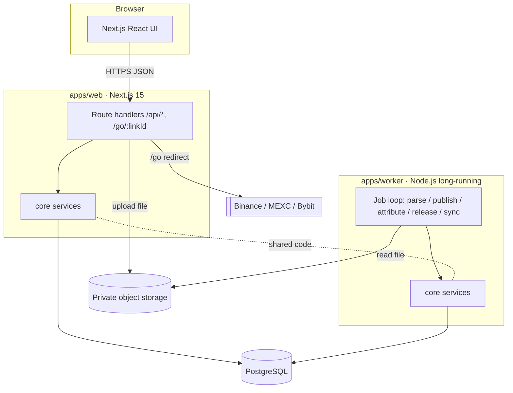
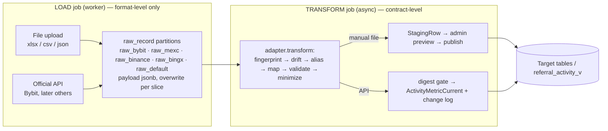
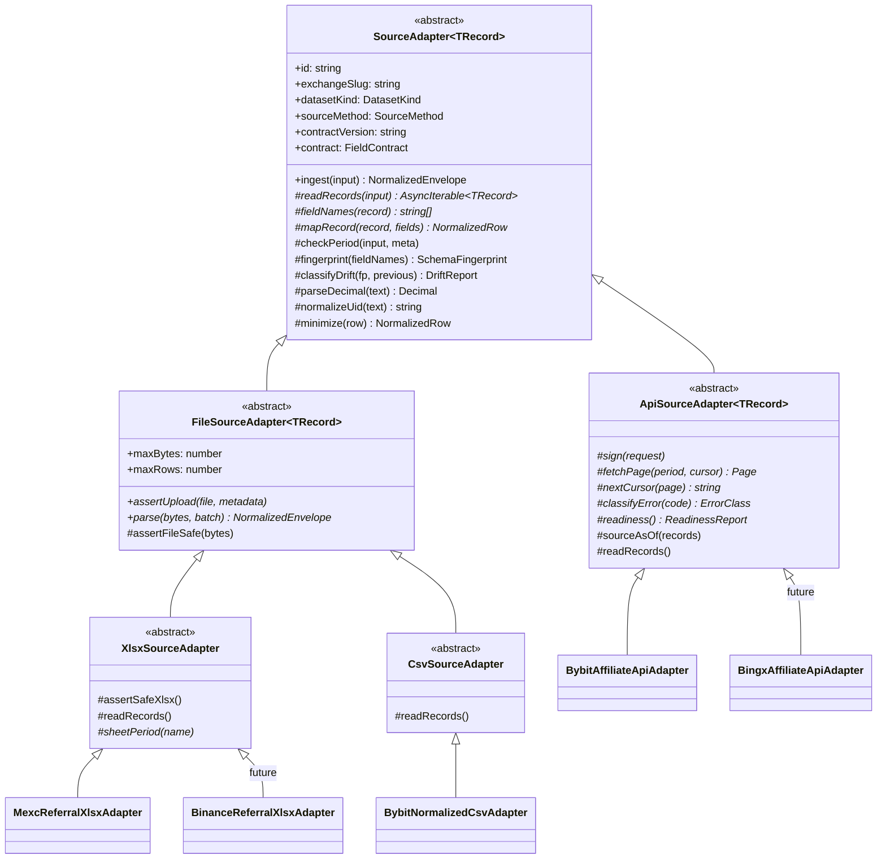
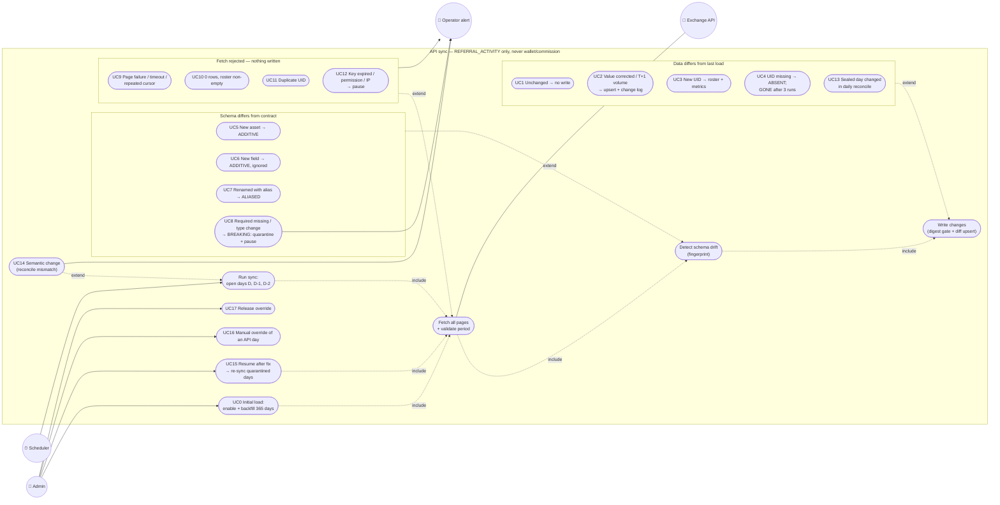
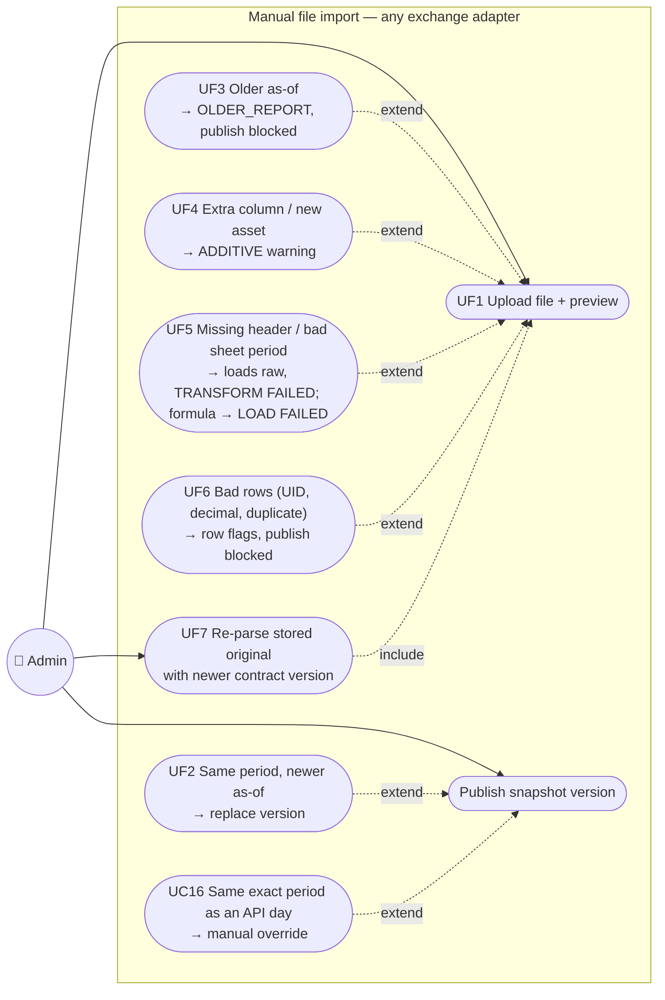
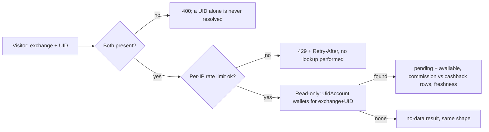
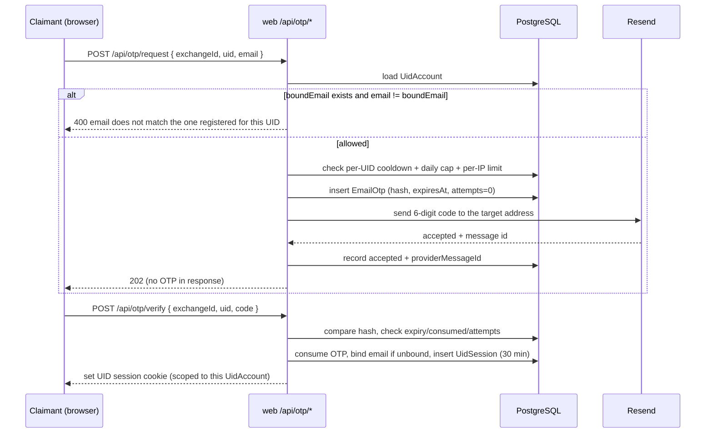
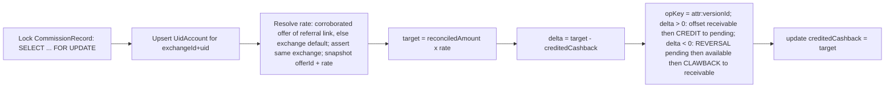
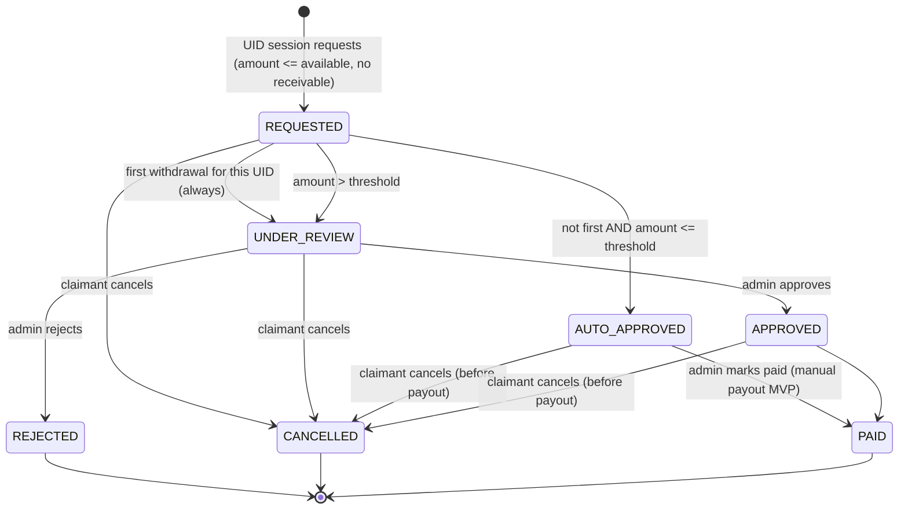
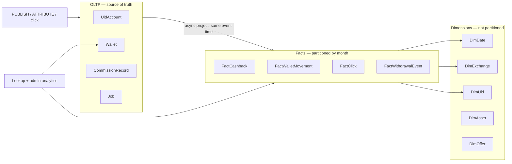

# Design — Cashback Affiliate Platform

- **Status:** Draft v1.0 (UID-first; adapter framework, drift policy, API write model)
- **Last updated:** 2026-09-26
- **Based on:** `.kiro/specs/cashback-platform/requirements.md` (Draft v0.9), `architecture.html` v0.4 (context only)
- **Audience:** implementers and AI coding agents (Kiro / Claude / Codex)

> This document turns the requirements into a concrete technical design: component
> boundaries, data model, flows, and cross-cutting concerns. Items marked **[PENDING]** map to open decisions in the requirements and must be
> confirmed before their dependent code is built. Per spec governance, `requirements.md`
> and `design.md` are the source of truth; `architecture.html` is background context only.
>
> **Reference convention:** `Req N.M` cites an EARS acceptance criterion in
> `requirements.md`. `Open decision #N` cites a numbered row in `requirements.md` →
> "Open decisions" (a stakeholder answer), NOT Requirement N.

## Overview

The platform is a TypeScript monorepo with two runtime apps sharing a PostgreSQL
database:

- **`apps/web`** — Next.js 15 (App Router). Serves the public site, the UID-session area
  (lookup/OTP/withdraw), and admin area. Contains all HTTP route handlers (`/api/*`,
  `/go/:linkId`).
- **`apps/worker`** — long-running Node.js process. Parses reports, attributes
  commission, releases holds, and runs scheduled affiliate API sync jobs.

Shared logic lives in packages so web and worker never diverge:

- **`packages/core`** — services: normalization, cashback engine, attribution, wallet,
  validation. No HTTP, no React.
- **`packages/db`** — Prisma schema, migrations, generated client, repository helpers.
- **`packages/contracts`** — zod schemas + TypeScript types for API request/response and
  report row shapes. No secrets. Safe to import from the browser bundle.

The browser never touches the database or `core`/`db` directly; it only calls `/api/*`.

## Architecture

### System context


```mermaid
flowchart TD
  subgraph client[Browser]
    UI[Next.js React UI]
  end
  subgraph web[apps/web · Next.js 15]
    RH[Route handlers /api/*, /go/:linkId]
    SVC1[core services]
  end
  subgraph worker[apps/worker · Node.js long-running]
    JOBS[Job loop: parse / publish / attribute / release / sync]
    SVC2[core services]
  end
  DB[(PostgreSQL)]
  STORE[(Private object storage)]
  EX[[Binance / MEXC / Bybit]]

  UI -->|HTTPS JSON| RH
  RH --> SVC1 --> DB
  RH -->|/go redirect| EX
  JOBS --> SVC2 --> DB
  RH -->|upload file| STORE
  JOBS -->|read file| STORE
  SVC1 -. shared code .- SVC2
```

### Technology & key decisions

| Concern | Decision | Rationale |
|---------|----------|-----------|
| Language | TypeScript everywhere | Single toolchain, shared types. |
| Web | Next.js 15 App Router | SSR public pages + colocated API routes. |
| Worker | Node.js long-running process | Long jobs off the request path (Req 12). |
| Monorepo | pnpm workspaces + Turborepo | Shared packages, cached builds. |
| DB | PostgreSQL + Prisma | Relational integrity, migrations, job queue. |
| Job queue | PostgreSQL `SKIP LOCKED` | No Redis at launch scale (Req 12.6). |
| Validation | zod in `packages/contracts` | One schema for API + parser boundaries. |
| Money | `Decimal` (Prisma `Decimal`/numeric); API returns strings | No float error (Req 7.4). |
| Auth | **[PENDING]** provider (open decision #13); interim email+password | Abstracted behind an auth port; see Components/Auth. |
| Styling (public site) | Tailwind CSS v4 + shadcn/ui (Radix primitives), copied into `src/components/ui` | Free/open-source component kit; replaces hand-rolled CSS for the public marketing pages (home, exchanges, guides) with a light, blue/teal "friendly-professional" theme. Admin uses the same tokens plus a **simple left-nav shell** (Req 18); do not import the full reference `cashback/` admin SPA. |
| Hosting | Local/SIT + Railway prod, dual-track | Verify local, push, deploy (Req 6.5). |
| Language / i18n | Single locale registry + message catalogs + locale-segment routing | English is the only enabled locale; enabling another is a registry + catalog change, not a routing change (Req 4). |

### Repository layout

```
apps/
  web/
    src/app/
      (public)/                 # home, /exchanges, /exchanges/[slug], /guides
      [locale]/                 # same public pages under a non-default locale prefix
      (uid)/                    # /uid/wallet, /uid/withdrawals (UidSession-guarded)
      (admin)/                  # /admin/... (guarded)
      api/                      # route handlers -> core services
      go/[linkId]/route.ts      # redirect + click tracking
    src/components/            # public-site components (public-pages.tsx) + ui/ (shadcn primitives)
    src/lib/utils.ts           # `cn()` class-merge helper (shadcn convention)
    components.json            # shadcn/ui CLI config (style, aliases, Tailwind entry)
    postcss.config.mjs         # @tailwindcss/postcss plugin
    src/i18n/                   # locale registry + message catalogs (en only)
    src/middleware.ts           # resolves request locale from the registry
  worker/
    src/index.ts                # boot + job loop
    src/jobs/                   # parse / publish / attribute / releaseHolds / sync
    src/adapters/               # per-exchange report parsers
packages/
  contracts/                    # zod schemas + types (no secrets)
  core/                         # services, cashback engine, normalization
  db/                           # prisma schema + migrations + repositories
infra/
  docker-compose.yml            # test/dev stack mirroring Railway (Postgres 18.6, web, worker)
  Dockerfile                    # one image per service, same build commands as Railway
  railway/                      # railway service config
architecture.html
.kiro/specs/cashback-platform/  # this spec
```

Turborepo pipeline: `build`, `lint`, `typecheck`, `test`, `db:migrate`, `dev`.
Dependency rule (enforced by lint/boundaries): `web` and `worker` may import
`core`, `db`, `contracts`; browser code may import only `contracts`.

### Key flows

#### Report import → publish (Req 6)

Ingest is source-neutral after parsing. A source adapter emits either
`REFERRAL_ACTIVITY` (UID metrics, no wallet effect) or `COMMISSION` (eligible for the
existing versioned commission path). Each batch records exchange, root affiliate
account, source method (`NATIVE_FILE`, `NORMALIZED_FILE`, `OFFICIAL_API`),
dataset kind, report period, source timezone, available source as-of time, and
private minimized evidence. Every source is a subclass of the same abstract adapter
(see "Source adapter framework") and emits the same `NormalizedEnvelope`. An admin
previews manual rows before publish (manual sink: `ImportBatch` + versioned
snapshot); the scheduled connector validates a complete period and writes through
the API sink (in-place metrics + change log, no per-run `ImportBatch`). Both paths
first land unchanged records in the raw layer and transform asynchronously (see
"Raw landing layer").

**MEXC native referral adapter.** The inspected file
`data/mexc/Referral Data Export-2026-09-25 14_22_39.xlsx` has one worksheet named
`_2026-09-18~2026-09-25`, 27 headers, and 46 distinct `Referral` UIDs. Its
`Trading volume` and `Your Earnings` columns are zero for every row, so it cannot
validate nonzero calculations or settlement. Every cell in the sample is an inline
string (numbers included, e.g. `"0"`), and it contains no formulas.

- **Workbook safety.** Accept `.xlsx` only (no `.xlsm`/`.xls`), exactly one
  worksheet, no external links. Before parsing, bound the decompressed size (e.g.
  50 MiB) and row/column counts; the 10 MiB upload limit only bounds compressed bytes.
  Read cell values only; a cell that contains a formula fails the batch (Req 6.4)
  rather than being silently evaluated or skipped. Use a maintained parser that does
  not evaluate formulas; the npm `xlsx` registry package is outdated and must not be used.
- **Headers.** Require `Referral`, `Trading volume`, `Trading token`, `Your Earnings`,
  and `Commission token` by name, not position. Extra or new columns are tolerated and
  listed as preview warnings (MEXC added columns such as
  `Prediction Markets Fee-Sharing Rate`); a missing required header fails the batch.
- **Values.** Keep UID text unchanged (the sample has UIDs with leading zeroes).
  Parse amounts from strict decimal text into Decimal; reject empty, non-numeric, or
  negative volume. Token columns must be a supported asset.
- **Period.** The sheet name gives inclusive calendar dates in the source timezone.
  Store `periodStart` = first day 00:00 and `periodEnd` = last day 23:59:59.999 in
  `sourceTz`, converted to UTC, matching the inclusive overlap rule used by the
  commission path. A sheet period that disagrees with admin metadata, or a missing
  `sourceTz`, fails the batch. The workbook does not state a timezone, so the admin
  must supply it.
- **As-of.** `sourceAsOf` is required for manual MEXC activity batches; the admin may prefill it
  from the filename timestamp only after confirming its timezone. When
  `sourceAsOf < periodEnd` (the sample was exported at 14:22 on the period's last day),
  mark the snapshot `partial` in preview and reports.
- **Data minimization (NĐ 13/2023).** Copy only mapped columns (UID, volume, earnings,
  tokens, referral code) plus the source row number into `StagingRow.raw` and
  `ReferralSnapshot`. Nickname, user tag, identification (KYC level) and asset band
  are `contract.personal`: dropped before the raw layer and kept only in the private
  original file, subject to the import retention policy. Other unmapped columns
  (e.g. sharing rate) stay in `raw_mexc` for 30 days, then only in the original file.

The adapter outputs one activity row per UID and period; `Your Earnings` is a
reported metric, not a CommissionVersion.

**Ingest choices.** (1) Native exchange XLSX/CSV exports are the preferred manual
input when their columns and semantics have been verified. (2) A documented
normalized CSV is the manual fallback for unsupported export formats; it carries
explicit dataset kind, exchange, UID, UTC period and units. For commission imports,
the original exchange evidence must also be retained privately. (3) The approved
Bybit Affiliate API connector produces activity rows and batch metadata through
the same ingest boundary without a separate ledger path. Screen scraping
or browser-session cookies are not an ingest source. For MEXC, a UID-level commission
export with nonzero data and period/settlement meaning must be inspected before
enabling the `COMMISSION` adapter; referral activity import may proceed earlier.

```mermaid
sequenceDiagram
  participant A as Admin (web)
  participant API as web /api/admin/ingest/batches
  participant S as Object storage
  participant DB as PostgreSQL
  participant W as Worker

  A->>API: POST report + metadata
  API->>API: authz + file type/size check
  API->>S: store original file (private)
  API->>DB: create ImportBatch + LOAD job
  API-->>A: 202 { batchId }
  W->>DB: claim LOAD job (SKIP LOCKED)
  W->>S: read file (format + safety checks only)
  W->>DB: overwrite raw_<exchange> slice + RawLoad; enqueue TRANSFORM
  W->>DB: claim TRANSFORM job (async)
  W->>DB: adapter contract → write StagingRow (normalized + flags)
  W->>DB: batch.status = PREVIEW
  A->>API: GET /imports/:id (poll ~5s)
  API-->>A: counts (new/dup/error/conflict) + totals
  A->>API: POST /imports/:id/commit
  API->>DB: create PUBLISH job
  W->>DB: claim PUBLISH job
  alt referral activity
    W->>DB: version ReferralSnapshot per UID and exact period
    W->>DB: batch.status = PUBLISHED (no wallet job)
  else commission evidence
    W->>DB: upsert CommissionRecord identity (exchangeId, dedupKey)
    W->>DB: upsert CommissionVersion; recompute reconciledAmount
    W->>DB: enqueue ATTRIBUTE job; batch.status = PUBLISHED
  end
```

#### Raw landing layer — `raw_<exchange>` before the target tables (Req 6.23–6.26)

Every source, file or API, first lands **unchanged records** in a raw table of its
exchange, then an **asynchronous transform** maps raw records into the target tables
(`StagingRow` → `ReferralSnapshot`/`CommissionRecord` for manual files,
`ActivityMetricCurrent` for API). Loading never depends on the adapter's field
contract, so an exchange that renames, adds or drops columns cannot make the import
step fail; the difference is judged later, at transform, and can be re-run after a
fix without asking the exchange or the admin for the data again.


```mermaid
flowchart LR
  subgraph EXTRACT_LOAD["LOAD job (worker) — format-level only"]
    F[File upload<br/>xlsx / csv / json] --> R
    A[Official API<br/>Bybit, later others] --> R
    R["raw_record partitions<br/>raw_bybit · raw_mexc · raw_binance · raw_bingx · raw_default<br/>payload jsonb, overwrite per slice"]
  end
  subgraph TRANSFORM["TRANSFORM job (async) — contract-level"]
    R --> T[adapter.transform:<br/>fingerprint → drift → alias → map → validate → minimize]
    T -->|manual file| S[StagingRow → admin preview → publish]
    T -->|API| M[digest gate → ActivityMetricCurrent + change log]
  end
  S --> TG[(Target tables / referral_activity_v)]
  M --> TG
```

**Why JSONB rows instead of re-creating a typed table per load.** The requested
behavior is "each load overwrites the data and the schema, so import never fails".
Storing each source record as one `jsonb` payload gives exactly that: the schema of a
load is whatever keys its records carry, recorded as a fingerprint on the load.
Re-creating real columns on every load (dynamic `DROP/CREATE TABLE` from uploaded
headers) is not used, because it turns untrusted header text into DDL (injection
risk), takes `ACCESS EXCLUSIVE` locks that block the transform reading the previous
load, guesses column types from strings, and puts tables outside Prisma migrations
so `prisma migrate` reports drift.

**Physical layout.** One parent table partitioned by exchange, so each exchange has
its own table and the code has one path:

```sql
CREATE TABLE raw_record (
  id              bigint GENERATED ALWAYS AS IDENTITY,
  _source_system  text        NOT NULL,             -- exchange slug; partition key
  _load_id        text        NOT NULL,             -- RawLoad.id
  _loaded_at      timestamptz NOT NULL DEFAULT now(),
  row_no          integer     NOT NULL,             -- file row or API position (page, index)
  payload         jsonb       NOT NULL,             -- one source record, keys as delivered
  PRIMARY KEY (_source_system, id)
) PARTITION BY LIST (_source_system);
CREATE TABLE raw_bybit   PARTITION OF raw_record FOR VALUES IN ('bybit');
CREATE TABLE raw_mexc    PARTITION OF raw_record FOR VALUES IN ('mexc');
CREATE TABLE raw_binance PARTITION OF raw_record FOR VALUES IN ('binance');
CREATE TABLE raw_bingx   PARTITION OF raw_record FOR VALUES IN ('bingx');
CREATE TABLE raw_default PARTITION OF raw_record DEFAULT;   -- an exchange without its own partition still loads
CREATE INDEX ON raw_record (_load_id, row_no);
```

A new exchange gets its partition in the same migration that registers its adapter;
until then its loads go to `raw_default` and still succeed. Column names follow the
Helios convention (snake_case, `_`-prefixed audit columns). Prisma does not model
partitions, so the tables live in raw SQL migrations and are accessed with
`$queryRaw`; `RawLoad` is a normal Prisma model.

**Slice and overwrite.** A *slice* is (exchange, dataset kind, source method, root
account, period start, period end); for API it is one UTC day. Each load of a slice
runs in one transaction under the slice advisory lock:
1. insert a new `RawLoad` (state `LOADED`, row count, `fieldNames` = sorted union of
   payload keys, `schemaFingerprint`, source metadata: sheet name, filename as-of,
   response time, page count);
2. `DELETE FROM raw_record WHERE _load_id IN (previous loads of the slice)` and mark
   those loads `SUPERSEDED`;
3. insert the new rows; commit; enqueue `TRANSFORM { loadId }`.
Only the latest load of a slice keeps raw rows ("overwrite"). History is not lost: a
manual file's original bytes stay in `ImportBatch.originalFile`, and API changes are
kept in `ActivityMetricChange`. Overwrite never touches other slices, other periods
or other roots of the same exchange.

**What may still fail at LOAD.** Only format and safety rules, never the contract:
unsupported extension, wrong file signature, size/row/column limits, ZIP bomb,
formulas or macros, unreadable workbook/CSV/JSON, more than one worksheet when the
adapter reads one, API transport/auth errors (Req 6.4, 6.24, 13.7). Header and value
problems (missing/renamed/extra columns, bad decimals, duplicate UIDs, sheet period
mismatch) are recorded and judged at TRANSFORM. The reader keys each record by its
header text; a duplicate header gets a `__2` suffix and an empty header becomes
`__col_<n>`, so every header layout can be stored.

**Personal data at LOAD (NĐ 13/2023).** Before insert, the reader drops keys listed
in the adapter's `contract.personal` (for example MEXC `Nickname`, `User tag`,
`Identification`; Bybit `isKyc`, `KycLevel`, `depositAmount*`, `totalWalletBalance`,
`remarks`). Unknown keys are kept, because they are exactly the drift a later
contract version may need, and they are covered by retention: raw rows of a load
that is `TRANSFORMED` are deleted after 30 days (or at the next overwrite). Raw
payloads are never returned by an admin or public API; admins see field names and
counts only.

**Asynchronous TRANSFORM.** A `TRANSFORM { loadId }` job:
1. stops as a no-op if the load is not the slice's current load (`SUPERSEDED`), so a
   slow transform can never publish older data over a newer load;
2. resolves the adapter (`ingestRegistry`, pinned `adapterId`/`contractVersion` for a
   manual batch), reads the raw rows in `row_no` order, and runs the contract steps
   (fingerprint → drift → alias → map → validate → minimize);
3. manual file: writes `StagingRow` rows and sets the batch to `PREVIEW` (admin
   publish unchanged); API: runs the API write model below (digest gate, diff upsert,
   change log, roster);
4. sets the load `TRANSFORMED`, or `FAILED` with the drift report (`BREAKING`) or a
   safe error code; raw rows stay for a re-transform.
Transform runs under the target's existing locks (activity period lock; `lockCashback`
only at commission publish) and job lease fencing, so it never blocks the load of the
next slice.

**Re-transform (recovery).** After a developer adds an alias or a new contract
version, an admin action "Re-run transform" enqueues `TRANSFORM` for the selected
failed or quarantined loads (audited). This replaces re-uploading a file or
re-fetching from the exchange; re-fetch is only needed when raw rows have expired.

**Job flow.** Manual: `POST /api/admin/ingest/batches` → `LOAD` (was `PARSE`) →
`TRANSFORM` → `PREVIEW` → admin commit → `PUBLISH` → (commission) `ATTRIBUTE`. API:
`SYNC` fetches all pages of a day and performs the LOAD step in-process (so a
partial page sequence never becomes a load), then enqueues `TRANSFORM`. `PARSE`
jobs still queued at deploy are handled as `LOAD`.

Versioned commission publish (Req 6.7, 7.8): a commission has a **stable identity**
(`exchangeId, dedupKey`) and one **version per import occurrence** (`CommissionVersion`,
unique per `(commissionId, batchId)`). Re-committing the same batch — or two publish
workers racing on the same batch — upserts the same version and changes no
`reconciledAmount` (idempotent). A corrected report adds a new version that supersedes the
prior one; the identity's `reconciledAmount` is recomputed (default rule: **latest version
supersedes**) and only the delta flows to cashback. Prior versions are retained for audit.
(`dedupKey` composition is **[PENDING]** — Open decision #11, finalized against a real
nonzero UID-level commission sample.)

Referral activity publish is separate: identify a snapshot by exchange, root
account, UID, and exact report period. Re-import of the same period versions the
snapshot; it never adds period values. Rules:

- **Which manual MEXC version is current.** The batch with the latest `sourceAsOf`
  (tie: latest `createdAt`) is current. Preview and publish reject an export older
  than the current one (`OLDER_REPORT`). Bybit API data does not use snapshot
  versions; see "API write model", subject to the manual override rule below.
- **Currency is per period, not per UID.** Publishing a new version sets
  `current = false` on every snapshot row of the same (exchange, root, periodStart,
  periodEnd) before inserting the new rows. A UID absent from the new export therefore
  becomes "no data" for that period instead of keeping a stale value from an older export.
- **Locking.** Activity publish takes a transaction advisory lock keyed on (exchange,
  root, period), not `lockCashback`, so it never blocks wallet work, and it never
  enqueues ATTRIBUTE. An admin-published correction for a Bybit period has precedence
  over later API versions until the admin releases that override; API observations must
  not silently undo an operator correction.

Different overlapping periods remain individually queryable, not summed. An activity
snapshot can show zero volume/earnings but cannot credit or reverse cashback. Keep
`sourceAsOf` (when the source was exported) separate from `periodEnd` (what dates it
covers) and `importedAt` (when this platform received it).

#### Scheduled Bybit Affiliate activity sync (Req 6.17–6.20, 11.4, 13)

**Scope and source semantics.** Use the official
[Affiliate User List](https://bybit-exchange.github.io/docs/v5/affiliate/affiliate-user-list)
endpoint with a master-account key that has only Affiliate read permission. Request
`startDate` and `endDate` explicitly for each inclusive UTC calendar day and `size=100`;
follow `nextPageCursor` until the list is empty or the cursor is empty (Bybit returns a
cursor on the last full page, then one empty page). Map `userId` to opaque UID,
`source` to the referral code, `tradeVol`/`takerVol`/`makerVol`/`tradfiTradeVol` to
volume metrics in USDT, and each key/value of
`commissionsVol` to reported commission in that asset. Do not sum BTC, USDT, etc.
without a separate conversion rule. Do not map `commissionsVol` to the portal's
pending balance, a settled commission, `CommissionRecord`, `CommissionVersion`,
wallet, or withdrawal eligibility. Bybit documents volume updates at T+1; a
30-minute fetch schedule means 30-minute *observation*, not 30-minute source data
freshness. The API response `time` is a response observation time, not a source
`as-of` or settlement timestamp.

**Periods and correction window.** Each run fetches today and the previous two UTC
days as separate exact periods. On first enable, backfill the previous 365 completed
UTC days (configurable) as daily jobs. Cost grows with the roster size N:
about `365 × (⌈N/100⌉ + 1)` requests (the `+1` is the trailing empty page), e.g.
~18,600 requests (~31 min at 10 req/s) for 5,000 UIDs, so the backfill runs at low
priority behind scheduled runs. Expose the earliest covered date and allow an admin to
request older date ranges later. Revisit the most recent 30 completed days once per
day for late source corrections. Do not combine a rolling 30-day response with daily
rows, and do not claim a lifetime total when historical coverage is incomplete.
Current-day rows are `partial` until the calendar day ends; completed days may still
change with Bybit's T+1 update. Store `fetchedAt` and `responseObservedAt` separately.
For `sourceAsOf`, each run samples up to 3 UIDs from the roster it has just fetched
(whatever its size) with `GET /v5/user/aff-customer-info` and reads `volUpdateTime`.
The probe found one identical value across every UID, so it is treated as a
dataset-wide freshness mark, not a per-UID value; the request count stays constant
as the roster grows. If the samples disagree, the call fails, or the roster is
empty, keep `sourceAsOf = null` and record a safe warning. Use the value only after
its timezone is confirmed (Open decision); until then, keep `sourceAsOf = null`. Daily periods are additive: the probe's sum of 30 daily
responses equalled the 30-day range response, so admin range reports may sum
disjoint daily API snapshots (never overlapping ones, Req 6.14).

**Verified API behavior (read-only probe, 2026-09-26).** Evidence only: the roster
held 54 UIDs at probe time. No design rule depends on that number.

| Call | Result | Design consequence |
|------|--------|--------------------|
| `GET /v5/user/query-api` | `readOnly=1`, only `Affiliate` permission, `ips=["*"]`, `deadlineDay=90`, `expiredAt=2026-12-26` | Readiness check on every run; alert 14 days before expiry; bind a stable Railway egress IP for production (Req 13.12) |
| `aff-user-list`, no dates/flags | identity fields only; all volumes `""`, `commissionsVol={}` | Always send `startDate` and `endDate` |
| `aff-user-list` + `startDate`/`endDate` | `takerVol`, `makerVol`, `tradeVol`, `tradfiTradeVol`, `commissionsVol{BTC,ETH,MNT,USDC,USDT}`; dates echoed | Mapped fields (Req 6.17). Inactive UIDs return `""` volume (EMPTY, not an error); commission assets return `"0"` |
| `+ needDeposit/need30/need365` | adds `depositAmount*`, rolling `*30Day`/`*365Day`, `commissions30Day/365Day` | Not requested (Req 6.20); rolling values are derivable |
| Date ranges | 1 day to 366 days accepted; data present one year back; future `endDate` accepted; `startDate > endDate` → `610015 Params Err`; `startDate` alone accepted but `endDate` not echoed | Daily explicit periods; treat 610015 as a permanent bug, not a retry |
| Same day, T+1 | Yesterday had nonzero commission while every UID's volume was still empty | Revisit window must cover volume arriving after commission |
| `GET /v5/user/aff-customer-info?uid=` | 30/365-day aggregates, `totalWalletBalance` band, `KycLevel`, `vipLevel`, `volUpdateTime`, `depositUpdateTime`, pay/card fields | Used only for `volUpdateTime`; store nothing else from it |
| Rate-limit headers | `x-bapi-limit: 10`, `x-bapi-limit-status`, `x-bapi-limit-reset-timestamp` per endpoint | Shared limiter from headers |
| `/v5/broker/earnings-info`, `/v5/broker/account-info` | `3500403 Only available to exchange broker main-account` | Broker earnings are not a source for this account |

The probe stored raw responses only under the gitignored `data/bybit/` folder. Its
output recorded field shapes and counts, never customer values.

**Adapter boundary.** `BybitAffiliateApiAdapter` (a subclass of `ApiSourceAdapter`,
see "Source adapter framework") signs the request using worker-only credentials. It
uses the documented rate-limit response headers (`x-bapi-limit*`, 10 req/s per
endpoint observed) and bounded backoff for transient/10006 failures, with a shared
per-key limiter across worker replicas. A trailing empty page is normal;
"suspiciously empty" applies to the whole period, not one page. Validate `retCode`,
requested date echo, cursor progress, unique nonempty UID per period, valid asset
codes, and nonnegative decimal strings before producing normalized rows. Hold all
pages of one period in worker memory (bounded by roster size), then validate the
complete period. An interrupted, repeated-cursor, malformed, or suspiciously empty
fetch (0 rows when the roster had rows) is quarantined and writes nothing. Persist
only the mapped fields, never unrelated Bybit profile, KYC, deposit, or remark
fields. Full API responses are not stored: Bybit keeps at least one year of daily
history, so re-fetching the period replaces replaying a stored payload.

**API write model (in place + change log, no per-run copy).** A 30-minute schedule
over three open days would create up to 144 full snapshot copies a day if every
changed fetch became a new version. API data therefore uses a different sink from
manual files, behind the same adapter/envelope/validation code:

0. **Input.** The `TRANSFORM` job of the day's current `RawLoad` supplies the
   mapped rows; `SYNC` itself only fetches and loads raw.
1. **Period digest gate.** `ActivityPeriodStatus` holds one row per (exchange, root,
   UTC day) with `contentDigest` (SHA-256 of sorted UID, referral code, metric
   kind/asset/value state/amount; request time and page order excluded), state,
   row count, `fetchedAt`, `responseObservedAt`, `sourceAsOf`, and schema
   fingerprint. An equal digest updates only `lastCheckedAt`/`SyncRun`; no metric
   row is touched. Completed days usually end here.
2. **Row-level diff upsert.** A changed digest loads the normalized rows into a
   transaction-scoped temp table (`ON COMMIT DROP`) and runs, under the (exchange,
   root, day) advisory lock and lease fencing:

   ```sql
   INSERT INTO activity_metric_current AS t
     (exchange_id, root_account, uid, period_date, kind, asset, value_state, amount, last_changed_run_id)
   SELECT exchange_id, root_account, uid, period_date, kind, asset, value_state, amount, $run_id
   FROM tmp_sync_rows
   ON CONFLICT (exchange_id, root_account, uid, period_date, kind, asset)
   DO UPDATE SET value_state = EXCLUDED.value_state, amount = EXCLUDED.amount,
                 last_changed_run_id = EXCLUDED.last_changed_run_id, updated_at = now()
   WHERE (t.value_state, t.amount) IS DISTINCT FROM (EXCLUDED.value_state, EXCLUDED.amount)
   RETURNING t.*;
   ```

   followed by one `UPDATE … SET value_state = 'ABSENT', amount = NULL` for rows of
   that day missing from `tmp_sync_rows` (only for a complete fetch). Every row
   returned by either statement is appended to `ActivityMetricChange` (old → new,
   run id). `INSERT … ON CONFLICT` is chosen over `MERGE`: it is atomic under
   concurrent inserts on any PostgreSQL version, whereas `MERGE` can raise a unique
   violation when two sessions both take the NOT MATCHED branch (safe here only
   because of the advisory lock) and needs PostgreSQL 17 for `WHEN NOT MATCHED BY
   SOURCE`. Prisma cannot express either, so the statements live in
   `packages/core` via `$executeRaw`/`$queryRaw` with bound parameters.
3. **Sparse rows.** A metric row is inserted only when its value is nonzero; a row
   that already exists is updated even to zero (a real correction). The 5 commission
   assets that Bybit always returns as `"0"` and the `""` volume of inactive UIDs
   (about 94% of rows in the probe) are not stored. Meaning is carried by
   completeness: day status `COMPLETE` + UID in `ActivityRoster` + no metric row =
   "reported no activity"; no complete day status = "no data" (Req 6.18).
4. **Roster.** `ActivityRoster` keeps one row per (exchange, root, UID) with
   referral code, `firstSeenAt`, `lastSeenAt`, and state `ACTIVE | GONE`. A UID
   missing from 3 consecutive complete roster fetches becomes `GONE` (history
   kept); a returning UID becomes `ACTIVE` again. Roster size is not a daily row count.
5. **Day lifecycle.** `OPEN` (today, `partial`) → `SETTLING` (D-1, D-2, refreshed
   every run because T+1 volume can arrive after commission) → `SEALED` (≥ D+3,
   touched only by the daily 30-day reconcile when its digest changes). The history
   of any day is its `ActivityMetricChange` rows; no snapshot copies.
6. **Manual override.** An admin-published manual activity batch for the same exact
   period sets `ActivityPeriodOverride`; the read view prefers it until an admin
   releases it. API runs still update `activity_metric_current` and the change log
   meanwhile, so releasing the override shows current API data immediately.
7. **Retention.** `SyncRun` rows with state `SUCCEEDED` and no change are purged
   after 90 days; failed/quarantined runs are kept 1 year; `ActivityMetricChange`
   is kept as audit history (partitioned by month once Task 29 applies).

No automatic API write enqueues ATTRIBUTE or touches commission/wallet tables.
Manual files keep the full-snapshot versioning above (`ReferralSnapshot` +
`ReferralMetric`, current by latest `sourceAsOf`). Admin reads go through one SQL
view, `referral_activity_v`, that unions current manual snapshots and API current
metrics with a `source` column and applies overrides.

The new admin range report selects manual rows only for their exact declared
`periodStart`/`periodEnd`. For API rows it includes UTC calendar day buckets
that overlap the requested range, sums
non-overlapping daily amounts by (exchange, root, UID, kind, asset), and returns
`coverageDays` plus `partial` when either boundary falls inside a UTC day, a requested day is OPEN or lacks a complete
`ActivityPeriodStatus`. The roster and completed day status identify a known UID
with no stored metric as no activity; an unfetched day is unknown. Page boundaries
are distinct UIDs, and each UID page contains all source/root groups for those UIDs.
The UI should explain that a partial local-time boundary includes the entire
overlapping UTC bucket; Bybit's daily data cannot be prorated.

**Schedule and operation.** `ExchangeSyncConfig` is one row per exchange, with
`enabled` (false until connector, key and network access pass a readiness check),
`intervalMinutes` constrained to `30 | 60 | 720 | 1440` (default 30), `nextRunAt`,
`lastAttemptAt`, `lastSuccessAt`, `lastFetchedPeriodEnd`, `consecutiveFailures`,
`pausedReason`, and actor/timestamps. The configured affiliate root is referenced
server-side; a future multi-root connector may add root-specific configuration
without changing the admin's exchange interval choice. `SyncRun` records one
attempt's exchange/root, trigger (`SCHEDULED` or `MANUAL`), state, page/period
checkpoint, start/end, safe error code, changed-row count and days written. Neither table stores
credentials. A worker scheduler tick claims due configs in Postgres, atomically
enqueues one `SYNC` job and advances `nextRunAt` from the previous due time to the
first future slot (skip missed slots, no burst after downtime). A unique active
run/lease plus per-(exchange, root) advisory lock prevents overlap across replicas.
The worker probes `/v5/user/query-api` at startup and at most once per minute,
then persists `credentialsConfigured`, `readinessReady`, `readinessReason`,
`readinessCheckedAt`, `readinessExpiresAt`, and `readinessIpWarning` on
`ExchangeSyncConfig` (Req 13.14). A transient probe failure records a safe
`CHECK_UNAVAILABLE` status. The web reads this snapshot only; Enable, Sync now,
and Resume require a successful probe no older than five minutes. It reports
`NOT_CHECKED` or `READINESS_STALE` when the worker has not provided a recent
result. The worker remains the only holder of API credentials and rechecks
readiness on every run. If its configured master UID differs from an established
config root, it reports `ROOT_MISMATCH` and pauses the connector instead of
attributing data to the wrong root.
An `ips=["*"]` result sets `readinessIpWarning` for the admin warning but does
not make readiness fail; a real Bybit 401/403 or key permission/expiry failure
still prevents runs (Req 13.12).
The worker rechecks enabled/readiness before a scheduled run and rechecks its lease
before publish. Manual `Sync now` may run while the schedule is disabled if the
connector is ready, but never overlaps another run. An admin schedule edit applies
on the next tick without a Railway restart and is written to `SyncConfigAudit`.

**Failure and UI.** Retry only transient network/429/5xx failures with jitter and
rate-limit reset headers. Pause on invalid signature, missing Affiliate permission,
expired key, or IP allowlist rejection until credentials/network are fixed. After two
consecutive failures or timeout, alert the operator and keep the last complete
snapshot visible with its measured age. `/admin/ingest/connectors` shows readiness, enabled
state, interval, next run, last attempt/success, covered period, partial/source
freshness distinction, safe failure code, and run history per exchange; it never
fetches Bybit on render. `/admin/reports/activity` shows UID, referral code, trade volume
(taker/maker/TradFi on expand) and asset-keyed reported commissions, clearly
labeled as activity. Public
lookup remains wallet-only. Admin APIs enforce session/CSRF and return
`Cache-Control: private, no-store`; secret values and raw responses never leave
the worker. The current key has no IP allowlist (`ips=["*"]`) and therefore
expires after 90 days (2026-12-26). Its missing allowlist is advisory; an
operator who chooses to restrict it must configure stable Railway outbound IP
bound to the key, which also removes the 90-day expiry. Key/secret rotation must be
possible without changing the schedule, and `/admin/ingest/connectors` shows the key's expiry.

#### Source adapter framework (Req 6.10, 6.21)

Every exchange source (XLSX/CSV file or official API) is a subclass of one abstract
base, so Bybit, Binance, MEXC, BingX and later exchanges only declare their field
contract and override the exchange-specific hooks. The pattern is the same as a
Python `abc.ABC` hierarchy, but it is written in **TypeScript** inside
`packages/core`: the worker, Prisma client, Decimal handling and `@cashback/contracts`
schemas are already TypeScript, and a separate Python runtime would add a second
Railway service, a second copy of the normalization rules, and an RPC boundary in
the middle of the publish transaction.


```mermaid
classDiagram
  class SourceAdapter~TRecord~ {
    <<abstract>>
    +id: string
    +exchangeSlug: string
    +datasetKind: DatasetKind
    +sourceMethod: SourceMethod
    +contractVersion: string
    +contract: FieldContract
    +ingest(input) NormalizedEnvelope
    #readRecords(input)* AsyncIterable~TRecord~
    #fieldNames(record)* string[]
    #mapRecord(record, fields)* NormalizedRow
    #checkPeriod(input, meta)
    #fingerprint(fieldNames) SchemaFingerprint
    #classifyDrift(fp, previous) DriftReport
    #parseDecimal(text) Decimal
    #normalizeUid(text) string
    #minimize(row) NormalizedRow
  }
  class FileSourceAdapter~TRecord~ {
    <<abstract>>
    +maxBytes: number
    +maxRows: number
    +assertUpload(file, metadata)*
    +parse(bytes, batch)* NormalizedEnvelope
    #assertFileSafe(bytes)
  }
  class XlsxSourceAdapter {
    <<abstract>>
    #assertSafeXlsx()
    #readRecords()
    #sheetPeriod(name)*
  }
  class CsvSourceAdapter {
    <<abstract>>
    #readRecords()
  }
  class ApiSourceAdapter~TRecord~ {
    <<abstract>>
    #sign(request)*
    #fetchPage(period, cursor)* Page
    #nextCursor(page)* string
    #classifyError(code)* ErrorClass
    #readiness()* ReadinessReport
    #sourceAsOf(records)
    #readRecords()
  }
  SourceAdapter <|-- FileSourceAdapter
  SourceAdapter <|-- ApiSourceAdapter
  FileSourceAdapter <|-- XlsxSourceAdapter
  FileSourceAdapter <|-- CsvSourceAdapter
  XlsxSourceAdapter <|-- MexcReferralXlsxAdapter
  CsvSourceAdapter <|-- BybitNormalizedCsvAdapter
  ApiSourceAdapter <|-- BybitAffiliateApiAdapter
  XlsxSourceAdapter <|-- BinanceReferralXlsxAdapter : future
  ApiSourceAdapter <|-- BingxAffiliateApiAdapter : future
```

- **Template methods, split at the raw layer.** `load()` (format level: read
  records, key by header, drop `contract.personal`, write the raw slice) and
  `transform()` (contract level: collect field names → fingerprint → classify drift
  against the last accepted fingerprint → resolve aliases → map each record →
  validate (decimal, UID text, asset code, duplicates) → minimize to mapped fields →
  emit a `NormalizedEnvelope`) are final. Subclasses override only readers/hooks
  (`readRecords`, `sheetPeriod`, `fetchPage`, `sign`, `mapRecord`…) and cannot skip
  validation or minimization. `load()` may fail only on format/safety rules;
  everything else is a transform result.
- **Field contract.** Each adapter declares data, not code, for its columns:

  ```ts
  const contract: FieldContract = {
    version: "bybit-affiliate@1",
    fields: [
      { target: "uid",          source: "userId",   aliases: [],            type: "uidText",  required: true },
      { target: "referralCode", source: "source",   aliases: [],            type: "text",     required: false },
      { target: "TRADE_VOLUME", source: "tradeVol", aliases: ["tradingVolume"], type: "decimalOrEmpty", unit: "USDT", required: true },
      { target: "REPORTED_COMMISSION", source: "commissionsVol", type: "assetMap", required: true },
    ],
    ignored: ["registerTime", "startDate", "endDate", "tradeVol30Day"],   // known, not mapped; kept in raw (30 days)
    personal: ["remarks", "isKyc", "KycLevel", "depositAmount30Day", "totalWalletBalance"], // dropped at LOAD, never stored (Req 6.20)
  };
  ```

  A rename that the exchange announces is a new alias or a new contract version, not
  new parsing code. Fields listed in `ignored` are known and silent; any other
  unknown field is additive drift.
- **Descriptor.** Each file adapter also declares `accept` (file extensions),
  `uploadFields` (metadata the form must collect) and `affectsCashback` (true only
  for `COMMISSION`). `describe()` turns these into the JSON returned by
  `GET /api/admin/ingest/adapters`, so the admin form follows the registry (Req 18.7).
- **File dispatch.** `FileSourceAdapter.assertUpload()` and `parse()` own the
  source-specific validation and parser call. Upload and worker parse resolve the
  same registered adapter; they do not branch on adapter ID or use a second registry.
  The route derives allowed extensions from active descriptors; the adapter checks
  file content. Persist adapter ID and contract version when creating the batch so
  replay selects that exact version. New uploads select the latest active version;
  the form lists each active adapter separately when one dataset has several formats.
- **Registry.** Adapters register themselves in `ingestRegistry` keyed by
  (exchange, dataset kind, source method, format, contract version).
  Registration rejects duplicate keys and a file adapter whose `accept` extensions
  disagree with its format. Older contract versions stay registered for replay
  from `originalFile`; only the latest active version appears in upload choices.
- **Layout.** `packages/core/src/ingest/base/` (abstract classes, contract, drift,
  decimal/UID helpers), `ingest/file/` (XLSX safety, CSV reader), `ingest/api/`
  (signing, limiter, pagination, retry), `ingest/exchanges/<slug>/` (one file per
  adapter plus its fixtures), `ingest/sinks/` (manual snapshot sink, API in-place
  sink). The existing `mexc-parser.ts`, `bybit-parser.ts` and `xlsx-safe.ts` move
  into this layout without behavior change first, then gain drift reporting.

#### Schema drift policy (Req 6.21)

Exchanges change exports and APIs without notice. A change must never corrupt
published data or fail silently.

- **Fingerprint.** `SchemaFingerprint` = SHA-256 of the sorted `name:type` pairs of
  the header row (file) or the union of record keys across all pages (API), plus the
  sorted key set of nested asset maps (`commissionsVol`). It is stored on
  `ImportBatch.schemaFingerprint` (manual) or `ActivityPeriodStatus.schemaFingerprint`
  (API) and compared with the last *accepted* fingerprint for the same adapter.
- **Classification and action.**

  | Class | Detected when | Manual file | API sync |
  |-------|---------------|-------------|----------|
  | `SAME` | fingerprint equal | normal | normal |
  | `ADDITIVE` | new unknown field or new asset key; all required fields valid | preview warning, publish allowed | continue; warning on run and `/admin/ingest/connectors`; new asset stored as new metric rows |
  | `ALIASED` | a required field is missing but a declared alias is present | preview warning naming the alias | continue with warning |
  | `BREAKING` | required field missing without alias, type change (e.g. number → object), unparseable decimal in a required field, date echo mismatch | batch `FAILED` with the drift report; nothing staged for publish | run `QUARANTINED`, connector `PAUSED` with `SCHEMA_DRIFT`, alert; last complete data stays visible as stale |
  | `SEMANTIC` | meaning changed, names unchanged (not detectable by schema) | — | daily reconcile compares a sampled UID/day with an admin-entered portal value; mismatch beyond tolerance alerts |

- **Consistency.** Bybit normalized CSV currently rejects any unknown header; it
  moves to the same rule as MEXC (unknown = `ADDITIVE` warning, missing required =
  `BREAKING`).
- **Recovery.** A developer adds an alias or a new contract version and deploys.
  The admin runs "Re-run transform" on the failed loads; their raw rows are still
  stored, so neither a re-upload nor a re-fetch is needed. The admin then resumes
  the connector. Only when raw rows have expired (30 days) does a "re-sync range"
  re-fetch API days (Bybit history ≥ 1 year) or a manual file get re-loaded from its
  stored `originalFile`.
- **Accepted fingerprint** advances only after a batch/period is published, so a
  quarantined drift is reported again on every run until fixed.

#### Use cases: data that differs from the initial load

**A. Scheduled API sync**


```mermaid
flowchart LR
  sched(("⏱ Scheduler"))
  admin(("👤 Admin"))

  subgraph API["API sync — REFERRAL_ACTIVITY only, never wallet/commission"]
    direction TB
    UC0(["UC0 Initial load:<br/>enable + backfill 365 days"])
    UCR(["Run sync:<br/>open days D, D-1, D-2"])
    UCF(["Fetch all pages<br/>+ validate period"])
    UCD(["Detect schema drift<br/>(fingerprint)"])
    UCW(["Write changes<br/>(digest gate + diff upsert)"])
    UC15(["UC15 Resume after fix<br/>→ re-sync quarantined days"])
    UC16(["UC16 Manual override of an API day"])
    UC17(["UC17 Release override"])

    subgraph DATA["Data differs from last load"]
      UC1(["UC1 Unchanged → no write"])
      UC2(["UC2 Value corrected / T+1 volume<br/>→ upsert + change log"])
      UC3(["UC3 New UID → roster + metrics"])
      UC4(["UC4 UID missing → ABSENT;<br/>GONE after 3 runs"])
      UC13(["UC13 Sealed day changed<br/>in daily reconcile"])
    end
    subgraph DRIFT["Schema differs from contract"]
      UC5(["UC5 New asset → ADDITIVE"])
      UC6(["UC6 New field → ADDITIVE, ignored"])
      UC7(["UC7 Renamed with alias → ALIASED"])
      UC8(["UC8 Required missing / type change<br/>→ BREAKING: quarantine + pause"])
    end
    subgraph FAIL["Fetch rejected — nothing written"]
      UC9(["UC9 Page failure / timeout /<br/>repeated cursor"])
      UC10(["UC10 0 rows, roster non-empty"])
      UC11(["UC11 Duplicate UID"])
      UC12(["UC12 Key expired / permission / IP<br/>→ pause"])
    end
    UC14(["UC14 Semantic change<br/>(reconcile mismatch)"])
  end

  bybit(("🏦 Exchange API"))
  ops(("🚨 Operator alert"))

  sched --> UCR
  admin --> UC0
  admin --> UC15
  admin --> UC16
  admin --> UC17
  UC0 -. include .-> UCF
  UC15 -. include .-> UCF
  UCR -. include .-> UCF
  UCF -. include .-> UCD
  UCD -. include .-> UCW
  UCF --- bybit
  DATA -. extend .-> UCW
  DRIFT -. extend .-> UCD
  FAIL -. extend .-> UCF
  UC14 -. extend .-> UCR
  UC8 --> ops
  FAIL --> ops
  UC14 --> ops
```

**B. Manual file import (XLSX/CSV)**


```mermaid
flowchart LR
  admin(("👤 Admin"))
  subgraph FILE["Manual file import — any exchange adapter"]
    direction TB
    UF1(["UF1 Upload file + preview"])
    UFP(["Publish snapshot version"])
    UF2(["UF2 Same period, newer as-of<br/>→ replace version"])
    UF3(["UF3 Older as-of<br/>→ OLDER_REPORT, publish blocked"])
    UF4(["UF4 Extra column / new asset<br/>→ ADDITIVE warning"])
    UF5(["UF5 Missing header / bad sheet period<br/>→ loads raw, TRANSFORM FAILED; formula → LOAD FAILED"])
    UF6(["UF6 Bad rows (UID, decimal, duplicate)<br/>→ row flags, publish blocked"])
    UF7(["UF7 Re-parse stored original<br/>with newer contract version"])
    UC16(["UC16 Same exact period as an API day<br/>→ manual override"])
  end
  admin --> UF1
  admin --> UFP
  admin --> UF7
  UF3 -. extend .-> UF1
  UF4 -. extend .-> UF1
  UF5 -. extend .-> UF1
  UF6 -. extend .-> UF1
  UF2 -. extend .-> UFP
  UC16 -. extend .-> UFP
  UF7 -. include .-> UF1
```

| UC | Trigger | Detected by | System action | Data written | Admin sees |
|----|---------|-------------|---------------|--------------|------------|
| UC0 | Admin enables a ready connector | readiness passes | backfill 365 completed days as low-priority daily jobs, then schedule | roster, sparse metrics, day status `SEALED`/`SETTLING`/`OPEN`, change log (initial insert) | coverage bar, earliest covered day |
| UC1 | Scheduled run | period digest equal | skip writes | `SyncRun`, `lastCheckedAt` only | "checked, no change" |
| UC2 | T+1 volume, late commission, source correction | digest differs; row `IS DISTINCT FROM` | upsert changed rows | changed metric rows + `ActivityMetricChange` | changed-row count per run |
| UC3 | Customer signs up via referral | UID not in roster | insert roster row; metrics only if nonzero | `ActivityRoster`, metrics | new UID count |
| UC4 | UID removed / unlinked at exchange | UID absent from a complete fetch | existing metric rows → `ABSENT`; roster `GONE` after 3 complete runs | metric update + change log, roster state | "UID no longer reported" |
| UC5 | Exchange adds an asset (e.g. `SOL`) | new key in asset map | store as new `REPORTED_COMMISSION` asset | metric rows | `ADDITIVE` warning |
| UC6 | Exchange adds a field | unknown key, not in `ignored` | ignore value | fingerprint only | `ADDITIVE` warning with field name (never its values) |
| UC7 | Announced rename | alias matched | map via alias | as normal | `ALIASED` warning |
| UC8 | Breaking change | required field missing/type change | quarantine run, pause connector | `SyncRun` quarantined, drift report | `SCHEMA_DRIFT` alert, stale label |
| UC9 | Network/5xx/429 mid-period | missing pages, timeout, cursor repeat | discard period, retry with backoff | nothing for that period | failure count; alert after 2 in a row |
| UC10 | Empty response anomaly | 0 rows vs non-empty roster | quarantine | nothing | alert |
| UC11 | Source bug | same UID twice in one period | quarantine period | nothing | alert |
| UC12 | Key expired, permission removed, IP not allowed | `classifyError` → `PAUSE`; readiness | pause connector | `pausedReason` | pause banner, expiry warning 14 days ahead |
| UC13 | Daily reconcile of 30 sealed days | digest differs | diff upsert | changed rows + change log | "late correction on day X" |
| UC14 | Meaning changed silently | sampled portal value ≠ API value | alert, no auto action | reconcile record | mismatch alert |
| UC15 | Admin resumes after deploy fix | new contract version registered | re-fetch quarantined range | as UC2/UC3 | quarantine cleared |
| UC16 | Admin uploads manual activity for an API day | same exact period | publish manual snapshot + override | manual snapshot, override row | "manual override active" |
| UC17 | Admin releases override | explicit action (audited) | view switches to API data | override inactive, audit | API values |
| UF1–UF7 | Manual upload | LOAD (format/safety) then TRANSFORM (contract + drift) | preview, flags, publish rules above | raw slice overwritten; staging rows; snapshot version on publish | preview warnings / errors |
| UC18 | Admin re-runs transform after a fix | load `FAILED`/quarantined, raw rows present | enqueue `TRANSFORM` for selected loads (audited) | as UC2/UF1 from the stored raw rows | load `TRANSFORMED`; no re-upload or re-fetch |
| UC19 | A newer load arrives while an older one is still transforming | `RawLoad` not current | older `TRANSFORM` exits as no-op | nothing from the older load | only the newer load's result |

#### Cashback lookup by exchange + UID (Req 14)


```mermaid
flowchart LR
  V[Visitor: exchange + UID] --> V2{Both present?}
  V2 -- no --> E400[400; a UID alone is never resolved]
  V2 -- yes --> RL{Per-IP rate limit ok?}
  RL -- no --> R429[429 + Retry-After, no lookup performed]
  RL -- yes --> Q[Read-only: UidAccount wallets for exchange+UID]
  Q -- found --> Y[pending + available, commission vs cashback rows, freshness]
  Q -- none --> N[no-data result, same shape]
```

- **Exchange is mandatory.** The lookup key is the pair; the same UID string on two
  exchanges is two different subjects (Req 14.1). A request missing either half is rejected
  before any query runs.
- **Amounts returned:** `pending` / `available` per asset (what the UID receives) plus
  freshness timestamps, plus a `transactions` array of attributed `CommissionRecord`s
  (newest `periodEnd` first, cap 100): `asset`, `periodStart`, `periodEnd`,
  `commission` (amount on the latest applied `CommissionVersion`, matched by
  `WalletEntry.sourceRef`, not by parsing `opKey`. A published correction that
  ATTRIBUTE has not applied yet stays off this row. If no applied entry exists,
  commission is 0, never the in-flight `reconciledAmount`), `cashbackRate` (snapshot),
  `cashback` (`creditedCashback`). `hasMore` is true when more than 100 rows exist
  (Req 7, 14.2, 14.7).
- **Withheld even so:** bound email (in any form, including masked), payout addresses,
  withdrawal records, wallet-movement types (hold release, reserve, settle, clawback),
  and the `reserved`/`withdrawn`/`receivable` buckets (Req 14.3). Those require a UID
  session. Do not name the array `history`.
- **Read-only.** No writes to `UidAccount`, `Wallet`, `EmailOtp`, or `UidSession` (Req 14.5),
  so a lookup can never squat or claim a UID. `UidAccount` rows are created only by the
  ATTRIBUTE job (Req 5.3).
- **Rate limited per IP** in Postgres (`RateLimitCounter`), not in process memory: Railway
  may run more than one web instance, and an in-memory counter would reset on every deploy.
  Redis stays out per Req 12.6.
- "No data" uses the same response shape whether the UID is unknown or known-with-zero
  (Req 14.6), and is distinguishable from a real zero balance via an explicit flag rather
  than by inference from the numbers.

#### UID accounts (Req 5)
1. A `UidAccount` is the unit of cashback ownership, unique per `(exchangeId, uid)`.
2. The `ATTRIBUTE` job creates the `UidAccount` on demand when a published commission
   references a UID that has no account yet (Req 5.3), then credits its wallet. No claimant
   action, email, or session is needed for cashback to accrue (Req 7.2).
3. UID is an opaque string, always scoped by exchange (Req 5.2).
4. Ownership is **not** established here. It is asserted only at withdrawal, by binding an
   email via OTP (Req 15). Until then a `UidAccount` has `boundEmail = null` and simply
   holds a balance.
5. Because there is no ownership proof, the effective rule is first-claimant-wins — see
   requirements "Accepted risk". The design compensates only with rate limits, mandatory
   admin review of first withdrawals, OTP limits, and the holding period.

#### Email OTP binding & UID session (Req 15)


```mermaid
sequenceDiagram
  participant C as Claimant (browser)
  participant API as web /api/otp/*
  participant DB as PostgreSQL
  participant R as Resend

  C->>API: POST /api/otp/request { exchangeId, uid, email }
  API->>DB: load UidAccount
  alt boundEmail exists and email != boundEmail
    API-->>C: 400 email does not match the one registered for this UID
  else allowed
    API->>DB: check per-UID cooldown + daily cap + per-IP limit
    API->>DB: insert EmailOtp (hash, expiresAt, attempts=0)
    API->>R: send 6-digit code to the target address
    R-->>API: accepted + message id
    API->>DB: record accepted + providerMessageId
    API-->>C: 202 (no OTP in response)
  end
  C->>API: POST /api/otp/verify { exchangeId, uid, code }
  API->>DB: compare hash, check expiry/consumed/attempts
  API->>DB: consume OTP, bind email if unbound, insert UidSession (30 min)
  API-->>C: set UID session cookie (scoped to this UidAccount)
```

- **Send target rule (Req 15.2):** if a bound email exists, the OTP goes only to it. A
  mismatched submission is rejected *without* sending anything to the submitted address, and
  the error never reveals the bound address — otherwise the endpoint becomes an oracle for
  discovering which email owns a UID.
- **OTP storage:** hash only, never the plaintext, never logged, never in a response
  (Req 15.8). Single-use with a short TTL (proposed 5 min) and a wrong-attempt cap (proposed
  5) after which the OTP is invalidated (Req 15.4–15.5). 6 digits is only ~10⁶ codes, so the
  attempt cap — not the TTL — is what makes guessing infeasible.
- **Quota protection (Req 15.6–15.7, 16.4):** per-UID cooldown + daily send cap, plus an
  independent per-IP limit. Resend's free plan allows 100 sends/day, so an unmetered resend
  button would let one actor exhaust the daily quota and block real withdrawals.
- **UID session:** hashed token stored server-side, 30-minute expiry, scoped to exactly one
  `UidAccount`. Every withdrawal/history action derives the UID account **from the session**,
  never from a request parameter (Req 15.10). Presenting a session against a different UID
  is rejected (Req 15.11).
- **Binding is not authorisation:** a bound email lets you request a withdrawal; the first
  withdrawal per UID still goes to admin review regardless of amount (Req 9.5, 15.9).

#### Bybit MVP implementation (2026-09-16)
- Normalized Bybit CSV v1 is the first adapter. Native Bybit export mapping remains
  pending a real Bybit sample. UTC, explicit per-currency commissions, strict headers and
  bounded rows; transaction IDs fall back to aggregate period identities when absent.
- New originals are stored privately in `ImportBatch.originalFile` (bounded BYTEA)
  rather than container-local disk, so web and worker share durable input. Object
  storage remains the longer-term storage design. See `apps/web/docs/bybit-cashback.md`.
- Commission publish, attribution and ledger mutations use a transaction-scoped Postgres
  advisory lock for the low-volume MVP. Jobs carry a unique per-claim `lockedBy`
  token; business changes and DONE commit atomically only while the lease is valid.
- `WalletEntry.remainingPending` prevents reversed credits from being released;
  immutable `balanceChanges` records the per-bucket deltas. Missing holding-period
  configuration keeps funds pending. Report freshness reflects applied ledger
  versions, not merely an uploaded or not-yet-attributed report.

#### Attribution → cashback → wallet (Req 7, 8)


```mermaid
flowchart LR
  LOCK[Lock CommissionRecord: SELECT ... FOR UPDATE] --> ATTR[Upsert UidAccount for exchangeId+uid]
  ATTR --> RATE[Resolve rate: corroborated offer of referral link, else exchange default; assert same exchange; snapshot offerId + rate]
  RATE --> TARGET[target = reconciledAmount x rate]
  TARGET --> DELTA[delta = target - creditedCashback]
  DELTA --> ENTRY[opKey = attr:versionId; delta > 0: offset receivable then CREDIT to pending; delta < 0: REVERSAL pending then available then CLAWBACK to receivable]
  ENTRY --> UPD[update creditedCashback = target]
```

Cashback is **delta-based and concurrency-safe**: the ATTRIBUTE job locks the
`CommissionRecord` row (`SELECT ... FOR UPDATE`) before reading `creditedCashback` and
computing `delta = target − creditedCashback`. Every resulting `WalletEntry` carries a
unique `opKey` (e.g., `attr:{commissionVersionId}`), so a retried or racing worker cannot
insert a duplicate CREDIT/REVERSAL — the unique constraint rejects the second write. A
separate `RELEASE_HOLDS` job periodically moves cleared CREDITs `pending → available`
(Req 8.3).

**Reversal policy (Req 8.4, 8.7)** — when `delta < 0` (a downward correction):
1. reduce `pending` by `min(|delta|, pending)`;
2. reduce `available` by `min(remaining, available)`;
3. any still-uncovered remainder (cashback already `withdrawn`/settled) increases the
   wallet `receivable` via a `CLAWBACK` entry.
`pending`, `available`, `reserved` never go negative. While `receivable > 0`, new
withdrawals are blocked, and a later positive `delta` first offsets `receivable` before
crediting `pending`.

#### Withdrawal (Req 9)


```mermaid
stateDiagram-v2
  [*] --> REQUESTED: UID session requests (amount <= available, no receivable)
  REQUESTED --> UNDER_REVIEW: first withdrawal for this UID (always)
  REQUESTED --> AUTO_APPROVED: not first AND amount <= threshold
  REQUESTED --> UNDER_REVIEW: amount > threshold
  UNDER_REVIEW --> APPROVED: admin approves
  UNDER_REVIEW --> REJECTED: admin rejects
  AUTO_APPROVED --> PAID: admin marks paid (manual payout MVP)
  APPROVED --> PAID
  REQUESTED --> CANCELLED: claimant cancels
  UNDER_REVIEW --> CANCELLED: claimant cancels
  AUTO_APPROVED --> CANCELLED: claimant cancels (before payout)
  APPROVED --> CANCELLED: claimant cancels (before payout)
  REJECTED --> [*]
  CANCELLED --> [*]
  PAID --> [*]
```

Reserved-balance model with full audit. Every transition below requires a valid UID session
for that UID account (Req 9.1); admin transitions require an admin session.
- **REQUESTED** (only if `receivable = 0`) → `WITHDRAWAL_RESERVE` entry:
  `available -= amount`, `reserved += amount` (Req 9.2, 9.4, 9.11).
- **First withdrawal per UID always routes to `UNDER_REVIEW`** regardless of amount
  (Req 9.5). The auto-approval threshold applies only from the second withdrawal onward.
  This is the last human checkpoint before money leaves, given there is no ownership proof.
- **REJECTED / CANCELLED** → `WITHDRAWAL_RELEASE` entry: `reserved -= amount`,
  `available += amount` (Req 9.7, 9.10). Cancel is claimant-initiated (via the UID session)
  and allowed only before `PAID`.
- **PAID** → `WITHDRAWAL_SETTLE` entry: `reserved -= amount`, `withdrawn += amount`
  (Req 9.5).
- Every transition writes a `WithdrawalEvent` (fromStatus, toStatus, actor, time,
  note/reference) (Req 9.8). Only `available` is withdrawable (Req 9.7).

### Job queue design (Postgres)

- Claim (correct PostgreSQL clause order):
  ```sql
  SELECT * FROM "Job"
  WHERE state = 'PENDING' AND "runAfter" <= now()
  ORDER BY "runAfter"
  LIMIT 1
  FOR UPDATE SKIP LOCKED;
  ```
  then set `state='CLAIMED'`, `leaseUntil=now()+lease`.
- Heartbeat updates `heartbeatAt`/`leaseUntil` while running.
- Reaper: jobs whose `leaseUntil < now()` return to `PENDING` (crash recovery, Req 12.3).
- Commit path re-verifies the worker still holds the lease before writing results.
- Job types: `LOAD` (was `PARSE`; queued `PARSE` jobs run as `LOAD`), `TRANSFORM`, `PUBLISH`, `ATTRIBUTE`, `RELEASE_HOLDS`, `SYNC` (enabled per exchange only after readiness checks).
- `RELEASE_HOLDS` enqueued by a lightweight scheduler tick (worker interval).
- `SYNC` uses the same queue but is eligible only for an enabled, ready exchange
  schedule. A due check and enqueue/update of `nextRunAt` occur in one database
  transaction; an active-run uniqueness guard also protects multi-replica workers.

### Environments & deployment (Req 6.5)

| Aspect | Test / dev (Docker, mirrors Railway) | Production (Railway) |
|--------|--------------------------------------|----------------------|
| Definition | `infra/docker-compose.yml` + `infra/Dockerfile` | `.railway/railway.ts` |
| Postgres | `postgres:18.6-trixie`, `TimeZone=Etc/UTC`, `max_connections=500`, DB `railway`, host `postgres` | Railway Postgres 18.6 (Debian), same settings, private endpoint `postgres` |
| Storage | originals in Postgres (`ImportBatch.originalFile`) | same; no object storage service |
| Web | image built with `pnpm --filter @cashback/web... build`; `db:migrate` then `pnpm --filter @cashback/web start`; healthcheck `/api/health` | Railpack, same build/preDeploy/start/healthcheck |
| Worker | image built with `pnpm --filter @cashback/worker... build`; `pnpm --filter @cashback/worker start` | Railpack, same build/start, always-on |

All agent tests run on the Docker stack (`.kiro/steering/production-safety.md`). Railway is
used only for debugging or reading data when the user asks. When Railway changes
(Postgres version, Node version, build/start commands, settings), the Docker stack is
updated in the same change so the two stay identical. Node: the Docker image uses
`NODE_VERSION` (default 22); pin `engines.node` in `package.json` to the major Railway
resolves so both sides match.

Dual-track from Phase 0: a minimal Railway skeleton (web + worker + Postgres, build,
migrate, health check) is stood up early alongside local/SIT, so both tracks stay green.
Production hardening (observability, backup/restore, scaling) lands in Phase 3. Flow:
build+test locally → migrations → push to Git → deploy to Railway. Migrations run once
per deploy; builds reproducible.

Env vars (proposed): `DATABASE_URL`, `APP_URL`, `IMPORT_STORAGE_*`, `WORKER_POLL_SECONDS`,
`HOLDING_PERIOD_HOURS`,
`WITHDRAWAL_AUTO_APPROVE_THRESHOLD`, `JOB_LEASE_SECONDS`, plus admin auth provider vars
**[PENDING]**, and for Req 15/16: `RESEND_API_KEY`, `EMAIL_FROM` (must be an address on a
Resend-verified domain — the shared `resend.dev` testing domain only delivers to the
account owner, per Resend's own docs), `OTP_TTL_MINUTES` (proposed 5),
`OTP_MAX_ATTEMPTS` (proposed 5), `OTP_RESEND_COOLDOWN_SECONDS`, `OTP_DAILY_CAP_PER_UID`,
`LOOKUP_RATE_PER_MINUTE`, `UID_SESSION_MINUTES` (proposed 30). The Bybit worker
service additionally receives `BYBIT_AFFILIATE_API_KEY` and
`BYBIT_AFFILIATE_API_SECRET` via local ignored `.env` or Railway service variables;
neither belongs in source control or the browser/web service. Sync intervals are DB
settings per exchange, not environment variables. A key with an IP allowlist needs
stable Railway outbound egress to remain usable. The worker
also reads `BYBIT_AFFILIATE_MASTER_UID` (affiliate root), `BYBIT_API_BASE`, and
`BYBIT_VOL_TIMEZONE` (set only after the `volUpdateTime` zone is confirmed).

**Connecting to Railway Postgres for debugging (on request only).** Through the public
TCP proxy, a Prisma connect plus `SELECT 1` took 2.2–3.4 s on 2026-09-26 while TCP alone
took about 60 ms; with no `connect_timeout` in the URL (Prisma default 5 s) a slow moment
produced P1001 "Can't reach database server" although the database was healthy. Add
`connect_timeout=30` to a Railway URL used for debugging or reading data.

**Resend send path (Req 16):** OTP send happens **in-request**, not via the job queue —
the claimant is waiting on the code, and a queued send would add worker-poll latency on
top of email delivery latency. If Resend's API errors or times out, `otpService` does not
create the `EmailOtp` row as sent and returns a retryable error; it never leaves a
withdrawal in a state that implies delivery succeeded (Req 16.3). Resend's free plan caps
at 100 sends/day and 3,000/month, reset at 00:00 UTC — this is the operational reason the
per-UID cooldown/cap and per-IP limit in Req 15.6–15.7 exist: without them, one actor
spamming OTP requests exhausts the day's quota and blocks real withdrawals for everyone
until the reset.

## Components and Interfaces

### apps/web
- **Public routes** (SSR): read published content via `core` read services; return
  `Cache-Control: public` where safe. Never call exchange APIs on render (Req 1, 11).
- **`/go/[linkId]` route handler:** look up active link, then record the click via a
  **reliable best-effort** mechanism — the Next.js post-response hook (`after()` /
  platform `waitUntil`) or a short-timeout awaited insert — and return 302. The click
  insert must not be an unawaited/dropped promise (which can be lost on process exit);
  recording failure still returns the redirect. Unknown/inactive link → safe fallback,
  no open redirect (Req 2.1, 2.2, 2.3, 2.4).
- **UID API** (`/api/uid/*`): `UidSession`-guarded; scopes every query to the session's
  `uidAccountId`; never trusts a client-sent UID/account id (Req 3.3, 15.10).
- **Admin API** (`/api/admin/*`): admin-guarded; `Cache-Control: private, no-store`.
  Ingest and report routes are grouped under `/api/admin/ingest/*` and
  `/api/admin/reports/*` (Req 18.7); retired paths stay as aliases (Req 18.8).
- **Admin shell (Req 18):** presentation/routing only. Not a money, schema or worker
  redesign.

  **Information architecture.** The nav is grouped by operator job, the same split
  as the backend: *Data ingest* operates sources (source adapter → envelope → sink),
  *Reports* reads the published result regardless of source. Neither exchange nor
  file format is a nav level: exchange is a form/filter value, and format is
  detected from the file by the registered adapter. A new format (JSON) or exchange
  (BingX) is a new `SourceAdapter` subclass and appears in the existing upload form.

  ```
  Operations
  ├─ Overview                      /admin
  ├─ Data ingest
  │   ├─ Uploads                   /admin/ingest/uploads         every file, exchange and dataset kind
  │   │                            /admin/ingest/uploads/[id]    preview → publish
  │   └─ API connectors            /admin/ingest/connectors      per-exchange schedule, run, resume, history
  ├─ Reports
  │   └─ Referral activity         /admin/reports/activity       manual + API (referral_activity_v)
  ├─ Withdrawals                   /admin/withdrawals
  └─ Exchanges · Offers · Referral links · Guides
  ```

  **Navigation presentation (Req 18.9).** `Overview`, `Withdrawals`, `Exchanges`,
  `Offers`, `Referral links`, and `Guides` are full-width, single-row links.
  `Data ingest` and `Reports` are native disclosure dropdowns: their summary
  controls expand/collapse child links in a vertical list directly below the
  label. The disclosure for the current route starts expanded, including nested
  routes such as upload preview; route changes update that default. Mark the
  current link with `aria-current="page"`, keep summary keyboard-operable and
  show a visible focus state. On narrow screens the nav moves above the main
  content, retains the same stacked dropdown structure, and does not clip links.

  **Referral activity filter (Req 18.10).** The server passes the current UTC
  calendar date (`YYYY-MM-DD`) when rendering the report. Both period date inputs
  start with that value; the admin may change either date. The client converts the
  inclusive selected dates to UTC boundaries before querying
  `/api/admin/reports/activity`. The report form has no source timezone input;
  `sourceTz` remains part of manual upload metadata and parsing only.

  **Report readability and navigation (Req 18.11–18.12).** Style the native date
  picker indicator as a visible, high-contrast button on the dark background,
  retaining keyboard and native picker behavior. Render friendly labels for
  `REPORTED`, `INCOMPLETE`, and `NO_ACTIVITY`, with an explanation of their
  coverage meaning. `REPORTED` means source metrics exist, not settled cashback;
  `INCOMPLETE` means at least one requested UTC day is not sealed or is missing, so a blank
  metric is unknown rather than zero; label the API `open` coverage count as
  "unsealed" because it includes both OPEN and SETTLING states. `NO_ACTIVITY`
  means complete coverage but no
  reported metric for that UID. Keep a client-side stack of cursors for the current
  query: advance on Next, use the prior cursor for Previous, and omit the cursor
  for First. Change the page index or reset the stack only after a successful
  response, and reset it when a new search succeeds. The report API remains a
  forward-cursor API.

  Route group so login has no sidebar:

  ```
  app/admin/login/page.tsx                          # unauthenticated form; no shell
  app/admin/(shell)/layout.tsx                      # session guard + left nav + main pane
  app/admin/(shell)/page.tsx                        # Overview / analytics
  app/admin/(shell)/ingest/uploads/page.tsx         # upload form + batch list
  app/admin/(shell)/ingest/uploads/[id]/page.tsx    # batch preview + publish
  app/admin/(shell)/ingest/connectors/page.tsx      # API connector per exchange
  app/admin/(shell)/reports/activity/page.tsx       # referral activity report
  app/admin/(shell)/withdrawals/page.tsx            # Withdrawal queue
  app/admin/(shell)/exchanges/page.tsx
  app/admin/(shell)/offers/page.tsx
  app/admin/(shell)/links/page.tsx                  # Referral links
  app/admin/(shell)/guides/page.tsx
  ```

  **Registry-driven upload form (Req 18.7).** `GET /api/admin/ingest/adapters`
  returns one descriptor per registered file adapter, built from the
  `SourceAdapter` class (see "Source adapter framework"), never from hand-written UI
  config:

  ```json
  [{ "id": "mexc-referral-xlsx", "exchangeSlug": "mexc", "datasetKind": "REFERRAL_ACTIVITY",
     "sourceMethod": "NATIVE_FILE", "accept": [".xlsx"], "fields": ["rootAccount", "sourceTz", "period", "sourceAsOf"],
     "affectsCashback": false, "contractVersion": "mexc-referral-xlsx@1" },
   { "id": "bybit-normalized-csv", "exchangeSlug": "bybit", "datasetKind": "COMMISSION",
     "sourceMethod": "NORMALIZED_FILE", "accept": [".csv"], "fields": ["rootAccount", "period", "reportType"],
     "affectsCashback": true, "contractVersion": "bybit-csv@1" }]
  ```

  The admin picks exchange, then an active file adapter; the form renders that adapter's
  fields and restricts the file picker to `accept`. The server resolves the adapter
  again from exchange + dataset kind + file extension (`ingestRegistry`) and rejects
  a mismatch; the client choice is never trusted. The batch list filters by exchange,
  dataset kind, source method and status, and marks `COMMISSION` batches
  **Affects cashback**. API adapters are listed on the connectors page, not in the
  upload form.

  **Retired routes (Req 18.8).** Each old page redirects after `requireAdminPage()`:
  `/admin/imports`, `/admin/crawl-data`, `/admin/referrals` → `/admin/ingest/uploads`
  (the old activity table moves to `/admin/reports/activity`); `/admin/sync` →
  `/admin/ingest/connectors`. Old API paths reuse new handlers only when the
  response contract is identical. `/api/admin/referral-snapshots` retains its
  `snapshots[]` response and exact-period query through `listReferralSnapshots`;
  the new activity report has a separate range contract.

  Layout: `requireAdminPage()` → redirect `/admin/login` if not admin; otherwise a
  two-column flex: sticky left nav (~14–16rem) + scrollable main. Nav items are
  English `Link`s; the active path is highlighted. The layout check does **not**
  stop Next.js from rendering the page slot into an RSC payload, so middleware
  redirects any `/admin` request except `/admin/login` when the admin session
  cookie is missing, and **each** shell page calls `requireAdminPage()` again
  before any data read or returned content (Req 18.5). Reuse the existing
  `AnalyticsDashboard`, `BybitOperations`, `WithdrawalQueue`, and split
  `AdminContentManager` into four section components (same fetch/save APIs:
  `/api/admin/exchanges|offers|links|guides`). Choice lists are still paged
  (default 50). When the exchange or offer already saved on the row is not in
  that page, the form keeps an option for that id so an edit cannot clear it
  or retarget it by accident (Req 10.6).

  Polling: each page's `useEffect` interval runs only while that page is mounted
  and `document.visibilityState === "visible"` (Req 11.2, 18.4). Opening
  `/admin/ingest/uploads` in one tab and `/admin/withdrawals` in another is how the
  operator works two jobs at once (shared `cashback_session` cookie). Do not
  keep hidden sections mounted, do not add split-pane, do not add SSE.

  `GET /admin` stays the overview landing after login. Deep links to
  `/admin/links` etc. are first-class. Retired URLs redirect as listed above so
  existing bookmarks work.
- Route handlers are thin: validate with `contracts` zod schema → call `core` service →
  map result to response. No business logic in handlers.
- **Exchange logo assets (static, in-repo):** logo files live at
  `apps/web/public/exchange-logos/<slug>.png` and are served by Next.js from `public/` at
  the site root. `Exchange.logoUrl` holds only the root-relative path to one of those files
  (e.g. `/exchange-logos/binance.png`); the app never renders a logo from a third-party
  host, so public pages carry no external image dependency. Offer tiles render the logo
  when `logoUrl` is set and keep the existing generated colour placeholder when it is
  `null`. Assets are baked into the build image, so adding or replacing a logo is a repo
  change plus deploy, not a runtime upload (Req 1.1, 1.2).
- **Online Rebate Ledger (home, Req 17):** a marketing ticker on `/`. Not a wallet
  statement, not SSE, not a cashback lookup (Req 14). **Interim source is fake
  data** because live attributed credits are too few to look busy.

  **Interim data (now):** `generateLedgerDemoRows(100)` in
  `apps/web/src/content/ledger-demo.ts`. Deterministic (seeded from the row index),
  never hand-typed to resemble a real person. **100 rows.** Amounts are **large
  on purpose** to attract visitors:
  - most rows ~480–2,600 USDT
  - about every 11th row a headline credit ~3,200–8,500 USDT
  - asset always `USDT`; exchanges rotate Binance / MEXC / Bybit; rates 40 / 35 / 30
    to match seed offer rates; dates spread across the last ~30 days
  Keep the visible `home.ledgerDemoBadge` ("illustrative example — not live data").
  Do **not** read `WalletEntry` / `CommissionRecord` for this ticker yet.

  **Later (not this task):** swap the generator for
  `contentService.listRecentRebateCredits({ limit: 100 })` (CREDIT entries, newest
  first) and remove the badge + `ledger-demo.ts` in the same change.

  **Masking:** UID shown as asterisks plus 3–4 trailing characters (e.g. `***4567`).
  Never full UID, never `boundEmail`, never payout address, never
  `reserved` / `withdrawn` / `receivable`, never withdrawal history.

  **Motion:** CSS-only vertical marquee. Viewport shows a handful of rows; the
  track contains the 100-row table **twice** so the loop is seamless. Pause on
  hover and `:focus-within`. `prefers-reduced-motion: reduce` stops the animation
  and shows a static scrollable table of the same 100 rows (Req 17.5). Loop
  duration ~40s. No polling. Home stays SSR; the browser only animates HTML
  already on the page (Req 1.5).

  **Copy:** `home.ledger*` in the English catalog. Lead must not claim the ticker
  is the visitor's own wallet — they still look up exchange + UID (Req 14).

  No new public `/api/*` route.

### apps/worker
- Boot connects to Postgres, starts a poll loop (~10s) that claims one job via
  `FOR UPDATE SKIP LOCKED`, sets `leaseUntil` and heartbeats while running.
- Job handlers are pure `core` calls; the worker only owns scheduling/lease/retry.
- Retry: transient errors → exponential backoff + jitter, capped attempts; config/auth
  errors → mark FAILED, surface, no infinite retry (Req 12.5).
- A stale worker must re-check lease ownership before committing (Req 12.3).

### packages/core services
- `contentService` — read/write exchanges, offers, links (incl. link↔offer binding and
  exchange default rate), guides. (Live rebate-ledger read is deferred; the home
  ticker uses `ledger-demo.ts` until Req 17.7.)
- `clickService` — record click (best-effort), aggregate analytics.
- `lookupService` — cashback lookup by exchange + UID: consume the per-IP rate-limit budget
  (`RateLimitCounter`, scope `lookup:ip`), then read the `UidAccount`'s wallets
  (`pending`/`available`) and attributed `CommissionRecord`s (commission vs cashback
  rows, cap 100). `commission` is the latest version that already has `attr:{versionId}`,
  not an in-flight `reconciledAmount` (Req 14.7). Read-only; never creates a `UidAccount`,
  `Wallet`, or session (Req 14).
- `otpService` — generates a 6-digit code with `crypto.randomInt(100000, 1000000)`, hashes
  it with the `bcryptjs` already used for admin credentials, and enforces send order:
  check per-UID cooldown + daily cap (`RateLimitCounter` scope `otp:uid`) and per-IP limit
  (scope `otp:ip`) → if a bound email exists, target only it → create `EmailOtp` → call
  `emailPort.sendOtp` → record `providerAccepted`/`providerMessageId`. Verification compares
  the hash, checks `expiresAt`/`consumedAt`/`failedAttempts`, consumes the OTP, binds the
  email if unbound, and issues a `UidSession` (Req 15).
- `uidSessionService` — issues/verifies/expires hashed session tokens scoped to one
  `UidAccount`; every `/api/uid/*` handler resolves its principal through this service, never
  from a request parameter (Req 15.10).
- `emailPort` — a narrow interface (`sendOtp({ to, code }): Promise<{ accepted: boolean;
  messageId?: string }>`) so `otpService` does not depend on the Resend SDK directly. The
  only implementation is `resendEmailAdapter`, calling the official `resend` package. Kept
  behind a port for the same reason as `AuthPort`: swapping providers later should not touch
  callers.
- `importService` — create batch, enqueue parse, preview, commit (enqueue publish).
- `ingestRegistry` — resolve a `SourceAdapter` subclass by (exchange, dataset kind,
  source method, format, contract version); adapters emit a shared
  `NormalizedEnvelope` with typed activity or commission rows, warnings and a drift
  report. File and API sources share validation, minimization and drift checks.
- `manualSnapshotSink` — stage envelope rows for preview; publish a versioned
  `ReferralSnapshot` (activity) or hand off to `commissionService` (commission).
- `apiActivitySink` — digest gate, temp-table diff upsert into
  `activity_metric_current`, `ABSENT` marking, change log, roster and day status.
- `affiliateSyncService` — read the per-exchange schedule, select a configured root,
  run the registered API adapter, validate all pages, apply the drift policy, and
  write a complete period through `apiActivitySink`. It cannot call the commission
  or cashback engine for Bybit Affiliate User List data.
- `commissionService` — upsert commission identity + version (unique per commission+batch),
  recompute reconciled amount.
- `attributionService` — lock the commission (`FOR UPDATE`), upsert the `UidAccount` for
  (exchangeId, uid), resolve + snapshot rate (system-corroborated, same exchange).
- `cashbackEngine` — compute target cashback, apply signed delta (credit/reversal/clawback,
  receivable offset) with a unique op key, release holds.
- `walletService` — balances (pending/available/reserved/withdrawn/receivable), typed
  entries, reservations.
- `withdrawalService` — request/reserve (blocked while receivable > 0), first-withdrawal
  detection (always `UNDER_REVIEW`), threshold decision from the second withdrawal onward,
  approve/reject/settle, claimant cancel, events.
- All services take a transaction/context object so they compose atomically.

### API contracts (shape summary)

All requests/responses validated by zod schemas in `packages/contracts`. Money is a
decimal string with an `asset`. Errors use a consistent envelope
`{ error: { code, message, details? } }`.

| Endpoint | Method | Auth | Notes |
|----------|--------|------|-------|
| `/api/exchanges` | GET | public | published exchanges + offers |
| `/go/:linkId` | GET | public | 302 redirect; records click (best-effort) |
| `/api/lookup` | POST | public | `{ exchangeId, uid }` → `pending`/`available`, freshness, `transactions[]` (commission vs cashback); IP rate-limited, 429 + `Retry-After` when exceeded |
| `/api/otp/request` | POST | public (rate-limited) | send OTP for a withdrawal; targets the bound email if one exists |
| `/api/otp/verify` | POST | public (rate-limited) | verify OTP → bind email + issue 30-min `UidSession` cookie |
| `/api/admin/auth/*` | POST | public→admin session | admin login/logout (interim) **[PENDING provider]** |
| `/api/uid/wallet` | GET | UID session | balances (incl. reserved, receivable) + as-of + history, scoped to the session's UID |
| `/api/uid/withdrawals` | GET/POST | UID session | history / request |
| `/api/uid/withdrawals/:id/cancel` | POST | UID session | cancel a not-yet-paid withdrawal |
| `/api/admin/ingest/adapters` | GET | admin | registered file adapters: id, exchange, dataset kind, source method, `accept`, required fields, `affectsCashback`, contract version; no credentials |
| `/api/admin/ingest/batches` | POST | admin | file + exchange/dataset kind/period/source timezone/source as-of/report type as the adapter requires; adapter re-resolved server-side; 202 + batchId |
| `/api/admin/ingest/batches` | GET | admin | list; filters `exchangeId`, `datasetKind`, `sourceMethod`, `status`; cursor paged |
| `/api/admin/ingest/batches/:id` | GET | admin | status/preview/errors, drift warnings, dataset kind, source method, period/as-of, wallet-impact flag |
| `/api/admin/ingest/batches/:id/commit` | POST | admin | idempotent |
| `/api/admin/reports/activity` | GET | admin | manual exact-period rows plus disjoint UTC API days in the requested range; page by UID, group by source/root/UID; asset-keyed metrics, source as-of, coverageDays, partial; no wallet values |
| `/api/admin/uid-accounts/:id/activity` | GET | admin | per UID account, paginated |
| `/api/admin/analytics` | GET | admin | click metrics |
| `/api/admin/sync-status` | GET | admin | per-exchange readiness, enabled/interval, next run, last attempt/success, fetched period, source as-of if known, safe error; no secrets |
| `/api/admin/ingest/connectors/:exchangeId` | GET/PATCH | admin | read/change enabled and interval (30/60/720/1440 minutes); audit actor |
| `/api/admin/ingest/connectors/:exchangeId/run` | POST | admin | enqueue immediate run or `from`/`to` re-sync if ready and no active run; 202 |
| `/api/admin/ingest/connectors/:exchangeId/resume` | POST | admin | clear a pause after readiness passes; audit actor |

Retired aliases (Req 18.8): `/api/admin/imports*` →
`/api/admin/ingest/batches*`, `/api/admin/sync-config/*` →
`/api/admin/ingest/connectors/*`; `/api/admin/referral-snapshots` keeps its
original response shape and authorization.
| `/api/admin/withdrawals/:id/decision` | POST | admin | approve/reject/mark-paid |

`POST /api/admin/ingest/batches` remains the manual entry point. The API connector
produces the same `NormalizedEnvelope` directly in the worker; it does not call
the admin upload route or need a second public ingestion API. Raw rows and private
payloads are never returned by sync-status or public lookup.

### Auth (admin only)
- Define an `AuthPort` in `core` with `getSession(req)` and `requireAdmin`. Route handlers
  depend on the port, not a concrete provider. End-user identity is a `UidSession`,
  resolved by `uidSessionService`, not `AuthPort` (Req 3.2).
- **Interim implementation (until a provider is chosen):** email + password with server
  sessions. Credentials are stored as a `passwordHash` on `AdminAccount`; admin sessions
  live in the `Session` table (hashed token, expiry). These fields are **interim** and are
  replaced (dropped/migrated) if a managed provider (Auth0/Clerk/Supabase) is adopted; the
  rest of the design is unaffected because everything depends on `AuthPort`.
- An admin `Session` and a `UidSession` are structurally different tables with no shared
  code path: an admin session cannot be presented to a `/api/uid/*` route and a `UidSession`
  cannot be presented to a `/api/admin/*` route (Req 3.4).

### Language & i18n (Req 4)
- **English is the only enabled locale.** No other language is served (Req 4.1).
- `apps/web/src/i18n/index.ts` is the **single locale registry**: `locales`, `Locale`,
  the message catalogs map, `isLocale`, and `localePath`. It currently holds `en` only.
  `middleware.ts`, `<html lang>`, navigation links, and the `app/[locale]/...` route group
  all derive from that registry — nothing hard-codes a locale code — so enabling a locale
  means adding a catalog and one registry entry, with no route restructuring (Req 4.3).
- The default locale is served unprefixed. `app/[locale]/...` renders the same shared
  public page components for a non-default enabled locale; a prefixed segment that is not
  an enabled locale (and the default-locale prefix, which would duplicate the unprefixed
  route) returns 404 (Req 4.5). While `en` is the only entry, this group is inert by
  design and is the seam kept for Req 4.3 — not dead legacy.
- Message catalogs are typed against the default catalog (`Messages`), so a new locale
  cannot ship with missing keys (Req 4.2).
- Content models store localized fields in an `i18n` JSON keyed by locale; public reads
  resolve the requested locale and fall back to `en` when a value is missing (Req 4.4).
  Extra locale keys already present in stored content are simply never resolved.
- Admin content forms author only enabled locales — English fields alone today (Req 10.5).
- `contracts` keeps locale keys generic (`^[a-z]{2}(-[A-Z]{2})?$`) and requires `en`
  content, so enabling a locale needs no schema change.

### Cashback engine details
- **Rate resolution** (Req 7.3): precedence (1) the `cashbackRate` of the offer bound to
  the referral link reported alongside the commission **only when corroborated by
  system-verified report data** (e.g., a referral code / sub-ID present in the report),
  else (2) `Exchange.defaultCashbackRate`. A client-supplied link/offer is never trusted for
  rate selection. The engine asserts `UidAccount.exchangeId = ReferralLink.exchangeId =
  Offer.exchangeId`; on mismatch it falls back to the exchange default. The resolved
  `offerId` and `cashbackRate` are **snapshotted** onto the `CommissionRecord` at
  attribution time, so later offer/exchange rate edits do not change already-credited
  cashback.
- **Concurrency & idempotency**: attribution locks the `CommissionRecord` with
  `SELECT ... FOR UPDATE`; each wallet movement gets a unique `opKey`
  (`attr:{commissionVersionId}`), so retries/racing workers cannot double-apply.
- Computation uses decimal arithmetic only; no floating point. `cashbackRate` is
  `Decimal(6,4)`.
- **Delta application**: `target = reconciledAmount × rate`; `delta = target −
  creditedCashback`. `delta > 0` → offset any `receivable` first, then `CREDIT` the
  remainder to `pending` with `availableAt = now + holdingPeriod`. `delta < 0` → reduce
  `pending`, then `available`, then record the uncovered remainder as `receivable` via a
  `CLAWBACK` entry (Req 8.4, 8.7). `creditedCashback` is updated to `target` in the same
  transaction.
- Every wallet movement references its source (`sourceRef`) for audit (Req 7.7, 8.6).
- Holding period is a config value (`HOLDING_PERIOD_HOURS`, **[PENDING]** default).

## Data Models

Prisma schema is indicative, not final; commission dedup remains **[PENDING]**
until a nonzero UID-level commission sample arrives (Open decision #11). The MEXC
activity sample fixes only the activity mapping. Money fields are `Decimal`. UID is
`String`. Timestamps are stored UTC with the source timezone retained.

Ingest migration: backfill existing `ImportBatch` rows with
`datasetKind = COMMISSION`, `sourceMethod = NORMALIZED_FILE` before making the columns
required, then make `reportType` nullable. `importMetadataSchema` becomes a union on
`datasetKind`: `reportType` is required for `COMMISSION`; `sourceAsOf` is required for
manual `REFERRAL_ACTIVITY`. API sync does not create `ImportBatch` rows; its
freshness lives on `ActivityPeriodStatus`. The Bybit/CSV/UTC checks in
`createImportBatch` move into the adapter that `ingestRegistry` resolves.

```prisma
// ---------- Content ----------
model Exchange {
  id                  String   @id @default(cuid())
  slug                String   @unique
  name                String
  status              PublishStatus @default(DRAFT)
  defaultCashbackRate Decimal? @db.Decimal(6,4) // fallback when offer has no rate
  logoUrl             String?  // root-relative path to a repo-committed logo asset,
                               // e.g. "/exchange-logos/binance.png"; never an external URL
  offers              Offer[]
  links               ReferralLink[]
  guides              Guide[]
  i18n                Json?    // localized name/description
  createdAt           DateTime @default(now())
  updatedAt           DateTime @updatedAt
}

model Offer {
  id           String   @id @default(cuid())
  exchangeId   String
  exchange     Exchange @relation(fields: [exchangeId], references: [id])
  status       PublishStatus @default(DRAFT)
  cashbackRate Decimal  @db.Decimal(6,4) // e.g. 0.4000 = 40% of commission
  conditions   Json?
  verifiedAt   DateTime?
  i18n         Json?
  links        ReferralLink[]
}

model ReferralLink {
  id          String   @id @default(cuid())
  exchangeId  String
  exchange    Exchange @relation(fields: [exchangeId], references: [id])
  offerId     String?
  offer       Offer?   @relation(fields: [offerId], references: [id])
  destination String
  active      Boolean  @default(true)
  clicks      ClickEvent[]
  // No relation to UidAccount: which referral link corroborated a commission is recorded
  // on CommissionVersion.referralLinkId (report-reported, per import row), not tracked
  // per UID account (a UidAccount is never client-linked to a referral link).
}

model Guide {
  id         String @id @default(cuid())
  slug       String @unique
  exchangeId String?
  exchange   Exchange? @relation(fields: [exchangeId], references: [id])
  status     PublishStatus @default(DRAFT)
  i18n       Json?  // localized title/content
}

model ClickEvent {
  id        String   @id @default(cuid())
  linkId    String
  link      ReferralLink @relation(fields: [linkId], references: [id])
  createdAt DateTime @default(now())
  @@index([linkId, createdAt])
}

// ---------- Identity & sessions (interim auth) ----------
model AdminAccount {
  id           String @id @default(cuid())
  email        String @unique
  passwordHash String? // interim auth; replaced if a managed provider is chosen
  sessions     Session[]
}

/// The unit of cashback ownership (Req 5.1). No password, no username, no login.
/// Created by the ATTRIBUTE job on demand (Req 5.3), never by a lookup (Req 14.5).
model UidAccount {
  id           String   @id @default(cuid())
  exchangeId   String
  exchange     Exchange @relation(fields: [exchangeId], references: [id])
  uid          String   // opaque string, always scoped by exchange (Req 5.2)
  boundEmail   String?  // null until the first successful OTP (Req 15.3)
  emailBoundAt DateTime?
  wallets      Wallet[]
  withdrawals  Withdrawal[]
  otps         EmailOtp[]
  sessions     UidSession[]
  createdAt    DateTime @default(now())
  @@unique([exchangeId, uid]) // one UID account per (exchange, UID)
  @@index([boundEmail])       // one email may hold several UID accounts
}

/// A 6-digit code proving control of an email. Hash only; the plaintext is never stored,
/// logged, or returned (Req 15.8).
model EmailOtp {
  id                String     @id @default(cuid())
  uidAccountId      String
  uidAccount        UidAccount @relation(fields: [uidAccountId], references: [id])
  email             String   // address this code was sent to
  codeHash          String   // bcrypt hash of the 6 digits
  expiresAt         DateTime // now + OTP_TTL_MINUTES (proposed 5)
  consumedAt        DateTime?
  failedAttempts    Int      @default(0) // invalidate at OTP_MAX_ATTEMPTS (proposed 5)
  providerAccepted  Boolean  @default(false) // Resend accepted the send (Req 16.6)
  providerMessageId String?
  createdAt         DateTime @default(now())
  @@index([uidAccountId, createdAt]) // supports cooldown + daily-cap checks
  @@index([expiresAt])               // supports pruning
}

/// Short-lived, scoped to exactly ONE UidAccount (Req 15.3, 15.10). Grants no admin
/// capability. Stored hashed like an admin Session.
model UidSession {
  id           String     @id @default(cuid())
  uidAccountId String
  uidAccount   UidAccount @relation(fields: [uidAccountId], references: [id])
  tokenHash    String   @unique
  expiresAt    DateTime // now + 30 minutes
  createdAt    DateTime @default(now())
  @@index([uidAccountId])
}

/// Counter windows backing the lookup and OTP-send rate limits (Req 14.4, 15.6-15.7).
/// `scope` distinguishes limiter kinds (e.g. "lookup:ip", "otp:ip", "otp:uid"). `subjectHash`
/// is a hash: raw IPs are never persisted. Holds no lookup result, so this is a rate-limit
/// ledger, not a search history.
model RateLimitCounter {
  id          String   @id @default(cuid())
  scope       String
  subjectHash String
  windowStart DateTime
  count       Int      @default(0)
  @@unique([scope, subjectHash, windowStart])
  @@index([windowStart]) // supports pruning old windows
}

/// Admin-only server session. End-user identity uses `UidSession` instead.
/// Kept separate so an admin session can never be
/// mistaken for withdrawal rights over a UID (Req 3.4).
model Session {
  id        String   @id @default(cuid())
  adminId   String
  admin     AdminAccount @relation(fields: [adminId], references: [id])
  tokenHash String   @unique
  expiresAt DateTime
  createdAt DateTime @default(now())
  @@index([adminId])
}

// ---------- Import & commission (versioned) ----------
model ImportBatch {
  id          String   @id @default(cuid())
  exchangeId  String
  rootAccount String
  datasetKind IngestDatasetKind // REFERRAL_ACTIVITY or COMMISSION
  sourceMethod IngestSourceMethod // NATIVE_FILE, NORMALIZED_FILE, OFFICIAL_API
  reportType  ReportType? // TRANSACTION/AGGREGATE only for commission data
  periodStart DateTime
  periodEnd   DateTime
  sourceTz    String
  sourceAsOf  DateTime? // export time; required for manual activity
  adapterId   String? // selected at upload; null only for pre-migration batches
  contractVersion String? // selected at upload; legacy batches may be backfilled
  schemaFingerprint String? // sorted header name:type hash (Schema drift policy)
  driftReport Json?   // class + field names only (never values)
  contentDigest String? // canonical mapped rows; identical re-upload is detected
  fileRef     String   // private source locator
  originalFile Bytes?  // bounded private original manual upload (replay with a newer contract)
  // Manual files only. API sync does not create ImportBatch rows; see ActivityPeriodStatus.
  publishedAt DateTime?
  status      BatchStatus @default(UPLOADED)
  totals      Json?
  createdAt   DateTime @default(now())
  rows        StagingRow[]
  versions    CommissionVersion[]
  snapshots   ReferralSnapshot[]
}

model StagingRow {
  id         String @id @default(cuid())
  batchId    String
  batch      ImportBatch @relation(fields: [batchId], references: [id])
  raw        Json    // mapped source fields only (after transform), never the raw payload
  normalized Json?
  flags      Json?   // { duplicate, error, unmappedUid, conflict }
}

enum RawLoadState { LOADED TRANSFORMING TRANSFORMED FAILED SUPERSEDED }

/// One load of one slice into raw_record (raw SQL, partitioned by exchange).
model RawLoad {
  id                String @id @default(cuid())
  exchangeSlug      String          // = raw_record._source_system
  datasetKind       IngestDatasetKind
  sourceMethod      IngestSourceMethod
  rootAccount       String
  periodStart       DateTime
  periodEnd         DateTime
  batchId           String?         // manual file
  syncRunId         String?         // API
  state             RawLoadState @default(LOADED)
  rowCount          Int
  fieldNames        Json            // sorted union of payload keys (names only)
  schemaFingerprint String
  sourceMeta        Json?           // sheet name, filename as-of, response time, pages
  errorCode         String?
  driftReport       Json?
  loadedAt          DateTime @default(now())
  transformedAt     DateTime?
  @@index([exchangeSlug, datasetKind, rootAccount, periodStart, periodEnd, state])
}
// A partial unique index keeps one current load per slice:
// UNIQUE (exchangeSlug, datasetKind, sourceMethod, rootAccount, periodStart, periodEnd)
// WHERE state <> 'SUPERSEDED'. raw_record and its partitions are created in raw SQL.

model ReferralSnapshot {
  id             String   @id @default(cuid())
  batchId        String
  batch          ImportBatch @relation(fields: [batchId], references: [id])
  exchangeId     String
  rootAccount    String
  uid            String
  periodStart    DateTime
  periodEnd      DateTime
  // Legacy scalar volume/earnings columns are backfilled into ReferralMetric,
  // then retired after readers switch. A UID has one parent, regardless of assets.
  referralCode   String?  // operator's own code from the export; not personal data
  partial        Boolean  @default(false) // current calendar day or manual sourceAsOf < periodEnd
  commissionFieldState String // ABSENT, EMPTY, PRESENT; distinguishes missing map from {}
  metrics        ReferralMetric[]
  current        Boolean  @default(true) // see "Which version is current"
  importedAt     DateTime @default(now())
  @@unique([batchId, uid])
  @@index([exchangeId, rootAccount, periodStart, periodEnd, current])
  @@index([exchangeId, uid, periodEnd])
}

model ReferralMetric {
  id          String @id @default(cuid())
  snapshotId  String
  snapshot    ReferralSnapshot @relation(fields: [snapshotId], references: [id])
  kind        ActivityMetricKind // TRADE_VOLUME, TAKER_VOLUME, MAKER_VOLUME, TRADFI_VOLUME, REPORTED_COMMISSION (activity only)
  asset       String // text, not enum: a new exchange asset needs no migration
  valueState  MetricValueState // VALUE or EMPTY; no row = absent asset/field
  amount      Decimal? @db.Decimal(30,10) // 0 is a known value; null only if EMPTY
  @@unique([snapshotId, kind, asset])
}

// Current snapshot uniqueness for (exchangeId, rootAccount, uid, periodStart,
// periodEnd) is a partial unique index WHERE current = true. Prisma cannot declare
// it, so the migration adds it in raw SQL (as with the existing partial index).
// Migration 1 adds ReferralMetric and backfills every existing MEXC snapshot's
// tradingVolume/tradingAsset and reportedEarnings/earningsAsset, keeping the scalar
// columns as compatibility reads. Migration 2 switches admin readers/writers to
// metrics and verifies counts/amounts. Only then may a later migration remove the
// legacy scalar columns. Never introduce one parent row per commission asset.

model ExchangeSyncConfig {
  exchangeId           String @id // one schedule per exchange
  rootAccount          String // server-side master affiliate root mapping
  enabled              Boolean @default(false)
  intervalMinutes      Int @default(30) // SQL CHECK IN (30, 60, 720, 1440)
  nextRunAt            DateTime?
  lastAttemptAt        DateTime?
  lastSuccessAt        DateTime?
  lastFetchedPeriodEnd DateTime?
  consecutiveFailures  Int @default(0)
  pausedReason         String?
  updatedBy            String?
  updatedAt            DateTime @updatedAt
}

model SyncRun {
  id             String @id @default(cuid())
  exchangeId     String
  rootAccount    String
  trigger        SyncTrigger // SCHEDULED, MANUAL, BACKFILL, RECONCILE, RESYNC
  state          SyncRunState // QUEUED, RUNNING, SUCCEEDED, FAILED, QUARANTINED, PAUSED
  contractVersion String
  changedRows    Int @default(0) // 0 + SUCCEEDED rows are purged after 90 days
  driftReport    Json? // class + field names only
  checkpoint     Json?  // bounded period/page position; resume revalidates full period
  daysWritten    Json?  // UTC days whose metrics changed in this run
  safeErrorCode  String?
  startedAt      DateTime?
  finishedAt     DateTime?
  createdAt      DateTime @default(now())
  @@index([exchangeId, createdAt])
}

model ActivityPeriodOverride {
  exchangeId   String
  rootAccount  String
  periodStart  DateTime
  periodEnd    DateTime
  manualBatchId String
  active       Boolean @default(true)
  updatedBy    String
  updatedAt    DateTime @updatedAt
  @@id([exchangeId, rootAccount, periodStart, periodEnd])
}

model SyncConfigAudit {
  id             String @id @default(cuid())
  exchangeId     String
  adminId        String
  action         SyncAuditAction // UPDATE_CONFIG, RUN_NOW, RESUME, RESYNC_RANGE, RELEASE_OVERRIDE
  before         Json?
  after          Json?
  createdAt      DateTime @default(now())
}

enum ActivityMetricKind { TRADE_VOLUME TAKER_VOLUME MAKER_VOLUME TRADFI_VOLUME REPORTED_COMMISSION }
enum MetricValueState   { VALUE EMPTY ABSENT } // ABSENT only in activity_metric_current
enum ActivityDayState   { OPEN SETTLING SEALED QUARANTINED }
enum RosterState        { ACTIVE GONE }

/// API sync: one row per UID per (exchange, root). Not a daily row.
model ActivityRoster {
  exchangeId   String
  rootAccount  String
  uid          String
  referralCode String?
  state        RosterState @default(ACTIVE)
  missedRuns   Int @default(0) // consecutive complete fetches without this UID; GONE at 3
  firstSeenAt  DateTime
  lastSeenAt   DateTime
  @@id([exchangeId, rootAccount, uid])
}

/// API sync: completeness, digest gate and freshness for one UTC day.
model ActivityPeriodStatus {
  exchangeId         String
  rootAccount        String
  periodDate         DateTime @db.Date
  state              ActivityDayState
  contentDigest      String?
  schemaFingerprint  String?
  contractVersion    String
  rowCount           Int      // UIDs in the complete fetch (roster size for that day)
  fetchedAt          DateTime?
  responseObservedAt DateTime?
  sourceAsOf         DateTime? // volUpdateTime once its timezone is confirmed
  lastCheckedAt      DateTime
  lastChangedRunId   String?
  @@id([exchangeId, rootAccount, periodDate])
}

/// API sync: current sparse metrics, updated in place (IS DISTINCT FROM).
model ActivityMetricCurrent {
  exchangeId       String
  rootAccount      String
  uid              String
  periodDate       DateTime @db.Date
  kind             ActivityMetricKind
  asset            String
  valueState       MetricValueState
  amount           Decimal? @db.Decimal(30,10)
  lastChangedRunId String
  updatedAt        DateTime @updatedAt
  @@id([exchangeId, rootAccount, uid, periodDate, kind, asset])
  @@index([exchangeId, rootAccount, periodDate])
}

/// API sync: append-only history of real changes (the version history of a day).
model ActivityMetricChange {
  id          String @id @default(cuid())
  runId       String
  exchangeId  String
  rootAccount String
  uid         String
  periodDate  DateTime @db.Date
  kind        ActivityMetricKind
  asset       String
  oldState    MetricValueState?
  oldAmount   Decimal? @db.Decimal(30,10)
  newState    MetricValueState
  newAmount   Decimal? @db.Decimal(30,10)
  changedAt   DateTime @default(now())
  @@index([exchangeId, rootAccount, periodDate])
  @@index([runId])
}

// SQL view referral_activity_v unions current manual ReferralSnapshot/ReferralMetric
// and ActivityMetricCurrent (+ roster/day status for "reported no activity"),
// with a source column; an active ActivityPeriodOverride hides API rows of that day.

// Add FKs and a partial unique SQL index for one active SyncRun per
// (exchangeId, rootAccount), state IN (QUEUED, RUNNING). An expired lease can be
// reclaimed; a checkpoint never authorizes publishing an incomplete period.

model CommissionRecord {
  id                   String   @id @default(cuid())
  exchangeId           String
  uid                  String
  asset                String
  dedupKey             String   // [PENDING] composition per adapter (Open decision #11)
  periodStart          DateTime
  periodEnd            DateTime
  reconciledAmount     Decimal  @db.Decimal(30,10) @default(0) // current authoritative amount
  activeVersionId      String?  @unique
  activeVersion        CommissionVersion? @relation("active_version", fields: [activeVersionId], references: [id])
  attributedUidAccountId String? // set by ATTRIBUTE; the account is created on demand (Req 5.3)
  offerId              String?  // snapshot resolved at attribution
  cashbackRate         Decimal? @db.Decimal(6,4) // snapshot resolved at attribution
  creditedCashback     Decimal  @db.Decimal(30,10) @default(0) // cashback already applied to wallet
  createdAt            DateTime @default(now())
  updatedAt            DateTime @updatedAt
  versions             CommissionVersion[] @relation("record_versions")
  @@unique([exchangeId, dedupKey]) // stable identity (idempotent publish)
  @@index([exchangeId, uid])
}

model CommissionVersion {
  id           String   @id @default(cuid())
  commissionId String
  commission   CommissionRecord @relation("record_versions", fields: [commissionId], references: [id])
  batchId      String
  batch        ImportBatch @relation(fields: [batchId], references: [id])
  amount       Decimal  @db.Decimal(30,10)
  superseded   Boolean  @default(false)
  importedAt   DateTime @default(now())
  activeFor    CommissionRecord? @relation("active_version")
  @@unique([commissionId, batchId]) // idempotent commit; no double-insert under concurrency
  @@index([commissionId, importedAt])
}

// ---------- Wallet & payout ----------
model Wallet {
  id           String @id @default(cuid())
  uidAccountId String
  uidAccount   UidAccount @relation(fields: [uidAccountId], references: [id])
  asset        String
  pending      Decimal @db.Decimal(30,10) @default(0)
  available    Decimal @db.Decimal(30,10) @default(0)
  reserved     Decimal @db.Decimal(30,10) @default(0)
  withdrawn    Decimal @db.Decimal(30,10) @default(0)
  receivable   Decimal @db.Decimal(30,10) @default(0) // uncovered clawback owed by the UID account
  entries      WalletEntry[]
  @@unique([uidAccountId, asset])
}

model WalletEntry {
  id        String   @id @default(cuid())
  walletId  String
  wallet    Wallet   @relation(fields: [walletId], references: [id])
  type      WalletEntryType
  amount    Decimal  @db.Decimal(30,10)
  sourceRef String?  // commissionRecord id or withdrawal id
  opKey     String?  @unique // idempotency key, e.g. attr:{commissionVersionId} or wd:{withdrawalId}:{transition}
  availableAt DateTime? // when a CREDIT becomes available (holding period)
  createdAt DateTime @default(now())
  @@index([walletId, createdAt])
}

model Withdrawal {
  id           String   @id @default(cuid())
  uidAccountId String
  uidAccount   UidAccount @relation(fields: [uidAccountId], references: [id])
  asset        String
  amount       Decimal  @db.Decimal(30,10)
  network      String
  address      String
  email        String   // the bound email used for this withdrawal's OTP (Req 9.9)
  isFirst      Boolean  // true routes unconditionally to UNDER_REVIEW (Req 9.5, 15.9)
  status       WithdrawalStatus @default(REQUESTED)
  payoutRef    String?
  createdAt    DateTime @default(now())
  updatedAt    DateTime @updatedAt
  events       WithdrawalEvent[]
  @@index([status])
  @@index([uidAccountId])
}

model WithdrawalEvent {
  id           String   @id @default(cuid())
  withdrawalId String
  withdrawal   Withdrawal @relation(fields: [withdrawalId], references: [id])
  fromStatus   WithdrawalStatus?
  toStatus     WithdrawalStatus
  actorType    ActorType
  actorId      String?  // admin id when actorType = ADMIN, uidAccount id when CLAIMANT
  note         String?
  reference    String?  // payout reference when settled
  createdAt    DateTime @default(now())
  @@index([withdrawalId, createdAt])
}

// ---------- Jobs ----------
model Job {
  id          String   @id @default(cuid())
  type        JobType
  payload     Json
  state       JobState @default(PENDING)
  attempts    Int      @default(0)
  runAfter    DateTime @default(now())
  leaseUntil  DateTime?
  heartbeatAt DateTime?
  lastError   String?
  createdAt   DateTime @default(now())
  @@index([state, runAfter])
}
```

Enums:
`PublishStatus{DRAFT,PUBLISHED}`,
`IngestDatasetKind{REFERRAL_ACTIVITY,COMMISSION}`,
`IngestSourceMethod{NATIVE_FILE,NORMALIZED_FILE,OFFICIAL_API}`,
`ReportType{TRANSACTION,AGGREGATE}` (commission only),
`BatchStatus{UPLOADED,PARSING,PREVIEW,COMMITTING,PUBLISHED,FAILED}`,
`WalletEntryType{CREDIT,HOLD_RELEASE,WITHDRAWAL_RESERVE,WITHDRAWAL_RELEASE,WITHDRAWAL_SETTLE,ADJUSTMENT,REVERSAL,CLAWBACK}`,
`WithdrawalStatus{REQUESTED,AUTO_APPROVED,UNDER_REVIEW,APPROVED,PAID,REJECTED,CANCELLED}`,
`ActorType{CLAIMANT,ADMIN,SYSTEM}`,
`JobType{PARSE,LOAD,TRANSFORM,PUBLISH,ATTRIBUTE,RELEASE_HOLDS,SYNC}` (`PARSE` kept only so queued jobs deserialize; new jobs never use it),
`JobState{PENDING,CLAIMED,DONE,FAILED}`.

## Dimensional store & fact partitioning (5,000 transacting UIDs/day)

This is the **scale architecture** for when ~5,000 UIDs generate cashback
transactions per day. It does **not** replace the OLTP Prisma schema above for
MVP. Money mutations (publish, attribute, reserve, settle) stay on the compact
normalized tables. Facts are an append-only projection so history queries do
not scan an ever-growing heap.

### Load sketch

| Stream | Conservative | Busy |
|--------|--------------|------|
| Transacting UIDs / day | 5,000 | 5,000 |
| Commission / cashback facts / day | ~5k–15k (1–3 rows per UID) | ~25k (5 rows) |
| Wallet-movement facts / day | ~10k–20k | ~40k |
| Click facts / day | ~5k–20k | ~50k (already in NFR band) |
| Rows / year (all facts) | ~7–20 million | ~40 million |

Dims stay small: tens of exchanges/offers/links; UID accounts grow with unique
(exchange, UID) pairs (hundreds of thousands over years, still a dim).

PostgreSQL handles this **if** range queries hit **one or two monthly
partitions** and current balances stay a tiny `Wallet` table. A single
unpartitioned `WalletEntry` / `ClickEvent` heap of tens of millions of rows is
what slows lookup and admin analytics.

### Two layers


```mermaid
flowchart LR
  subgraph oltp[OLTP — source of truth]
    UidAccount
    Wallet
    CommissionRecord
    Job
  end
  subgraph facts[Facts — partitioned by month]
    FactCashback
    FactWalletMovement
    FactClick
    FactWithdrawalEvent
  end
  subgraph dims[Dimensions — not partitioned]
    DimDate
    DimExchange
    DimUid
    DimAsset
    DimOffer
  end
  PUBLISH[PUBLISH / ATTRIBUTE / click] --> oltp
  oltp -->|async project, same event time| facts
  facts --> DimDate
  facts --> DimExchange
  facts --> DimUid
  Lookup[Lookup + admin analytics] --> Wallet
  Lookup --> facts
```

| Layer | Tables (today → target) | Partition? | Why |
|-------|-------------------------|------------|-----|
| **Dim** | `Exchange`, `Offer`, `ReferralLink`, `UidAccount`, `AdminAccount`, `DimDate`, `DimAsset` | **No** | Small, updated in place, looked up by id |
| **Snapshot (not a fact)** | `Wallet` (pending/available/reserved/withdrawn/receivable) | **No** | One row per UID+asset. Partitioning would break `SELECT … FOR UPDATE` and unique `(uidAccountId, asset)` |
| **OLTP identity** | `CommissionRecord` (current reconciled amount + snapshots) | **No** | Unique `(exchangeId, dedupKey)`; locked during attribution |
| **Fact** | `ClickEvent`, `WalletEntry`, `CommissionVersion`, `WithdrawalEvent`, lookup `transactions` history | **Yes — RANGE by month** on `event_date` (UTC date of the event) | Append-only, queried by UID + recent time window |
| **Blob / control** | `ImportBatch.originalFile`, `Job`, `Session`, `EmailOtp`, `RateLimitCounter`, `WorkerHeartbeat` | No (move BYTEA to object storage before it grows) | Not analytics facts |

### Dimension grain

| Dim | Natural key | Notes |
|-----|-------------|--------|
| `DimDate` | `date_key` int `YYYYMMDD` | Pre-populated 10 years. Facts store `date_key` for prune-friendly filters |
| `DimExchange` | `exchange_id` (OLTP id) | slug, name, default rate |
| `DimUid` | `(exchange_id, uid)` | Same grain as `UidAccount`. No bound email on this dim if used for public lookup |
| `DimAsset` | `asset` text (`USDT`, …) | Tiny |
| `DimOffer` | `offer_id` | Snapshotted rate lives on the **fact**, not only on the dim |
| `DimBatch` | `batch_id` | period, report type, published_at — not the CSV bytes |

### Fact grain and measures

**`FactCashback` (one row per attributed commission version for a UID+asset+period)**  
Used by lookup “exchange paid vs your share” (Req 14.7).

- Keys: `date_key` (partition), `uid_sk`, `exchange_sk`, `asset_sk`, `offer_sk` nullable, `batch_sk`
- Degenerate: `period_start`, `period_end`
- Measures (decimal, not float): `commission_amount` (exchange paid), `cashback_rate`, `cashback_amount` (UID share)
- Partition: `PARTITION BY RANGE (date_key)` monthly, e.g. `fact_cashback_2026_09` for `date_key` 20260901–20260930
- PK must **include** `date_key` (PostgreSQL partition requirement)

**`FactWalletMovement`** — grain = one `WalletEntry`. Measures: `amount`, JSON/numeric bucket deltas. Types CREDIT / HOLD_RELEASE / … stay on the fact as a degenerate `entry_type`. Session-only reads (Req 8.6). Same monthly partition.

**`FactClick`** — grain = one click. Degenerate `link_id`. Monthly partition. Aggressive drop after 12–24 months (clicks are not money).

**`FactWithdrawalEvent`** — grain = one status transition. Keep ≥ 7 years once compliance (#19) is known; until then same monthly partition, no drop.

### Partition operations (so the heap never becomes “all history”)

1. **Create ahead:** a monthly job (or `pg_partman`) creates the next 3 month partitions before the month starts. A `DEFAULT` partition exists so a clock/skew row never fails the insert.
2. **Prune on read:** every UID lookup of transactions **must** include
   `date_key >= :from` (e.g. last 24 months). PostgreSQL then opens only those
   partitions. A query without a date predicate **scans every month** — forbidden
   on fact tables in app SQL.
3. **Detach/drop:** click facts older than retention `DETACH` then `DROP`. Money
   facts are detached to a cheap archive schema / dump, not deleted, until
   compliance says otherwise.
4. **Indexes:** create **on the parent** so they apply to all partitions:
   `(uid_sk, date_key DESC)`, `(exchange_sk, date_key DESC)`. No global unique
   on a column that is not the partition key unless it includes `date_key`.
5. **Writes:** OLTP commit first; project to the fact in the same worker
   transaction as ATTRIBUTE/PUBLISH/click when cheap, or a follow-up job. Idempotent
   `opKey` / `(commission_id, batch_id)` still applies so retries do not double-insert
   facts.

### Application rules at this scale

- **Lookup (Req 14)** reads `Wallet` for pending/available (tiny) and
  `FactCashback` for the table (partition-pruned). It does not `SELECT * FROM
  WalletEntry`.
- **Admin analytics** aggregates facts with `date_key BETWEEN`. No
  `COUNT(*)` on unfiltered facts.
- **Prisma:** keep OLTP models in Prisma. Declare fact parents in raw SQL
  migrations (`CREATE TABLE ... PARTITION BY RANGE`). Prisma 6 does not manage
  partition children well — worker/SQL owns `CREATE TABLE fact_cashback_YYYY_MM
  PARTITION OF fact_cashback FOR VALUES FROM (...) TO (...)`.
- **Do not** partition `Wallet`, `UidAccount`, `Job`, or `CommissionRecord`.
  Those are hot unique rows, not time-series.

### When to build this

Not before go-live while facts are hundreds of rows. Build when **any** of
these is true: approaching 5,000 transacting UIDs/day, `WalletEntry` or
`ClickEvent` sequential scans show up in `pg_stat_statements`, or lookup
transaction history exceeds ~200 ms p95. Until then the OLTP tables remain the
only store; the mapping above is the target, not a second live database today.

## Correctness Properties

Invariants the implementation and tests must uphold.

### Property 1: Idempotent versioned publish
Re-committing the same batch (or two publish workers racing on it) upserts the same
`CommissionVersion` (unique `(commissionId, batchId)`) and does not change any
`reconciledAmount`; overlapping/duplicate imports never inflate totals. Commission
identity is `@@unique([exchangeId, dedupKey])`.
**Validates: Requirements 6.9, 7.5, 7.6, 7.8**

### Property 2: Cashback equals reconciled target (delta-correct, concurrency-safe)
For each commission identity, `creditedCashback` equals `reconciledAmount × snapshotRate`
after attribution. Attribution locks the record (`SELECT ... FOR UPDATE`) and each wallet
movement carries a unique `opKey`, so concurrent or retried runs apply no duplicate
CREDIT/REVERSAL.
**Validates: Requirements 7.6, 7.8, 8.2**

### Property 3: One UID account per (exchange, UID)
At most one `UidAccount` row exists per (exchange, UID), enforced by `@@unique([exchangeId,
uid])`. Uniqueness is unconditional (no verification status): ownership is asserted only at
withdrawal (see "Accepted risk").
**Validates: Requirements 5.1, 5.2**

### Property 4: Attribution needs no claimant action
A `UidAccount` accrues cashback purely from published commissions matching its
(exchange, UID); it can hold a positive balance with `boundEmail = null` and no session ever
issued. No claimant action, email, or session is a precondition for crediting `pending`
(only for withdrawing it — Property 6).
**Validates: Requirements 5.3, 5.5, 7.1, 7.2**

### Property 5: Balance conservation & non-negativity
For each wallet+asset, `pending`, `available`, `reserved` never go negative and
`receivable >= 0`; every bucket equals the signed sum of its `WalletEntry` movements.
**Validates: Requirements 8.1, 8.4, 8.7, 9.3**

### Property 6: Only-available is withdrawable, and only through a valid UID session
A withdrawal amount is `<= available` at request time (and only when `receivable = 0`),
requires a `UidSession` valid for that exact `UidAccount`, and is moved into `reserved` so
it cannot be double-requested. A UID's **first** withdrawal is always `UNDER_REVIEW`
regardless of amount; the auto-approval threshold applies only from the second withdrawal
onward.
**Validates: Requirements 9.1, 9.2, 9.4, 9.5, 9.8, 9.11**

### Property 7: Atomic batches
A failed publish leaves no partially-published data readable by the dashboard.
**Validates: Requirements 6.8**

### Property 8: Lease safety
A job result is only committed by the worker currently holding the lease; reclaimed jobs
do not double-write.
**Validates: Requirements 12.2, 12.3**

### Property 9: No double-count on overlap
Overlapping report periods are reconciled (latest version supersedes) before totals are
computed.
**Validates: Requirements 7.5, 7.8**

### Property 10: Withdrawal auditability
Every withdrawal status transition (including claimant cancel) is persisted as a
`WithdrawalEvent` (from/to status, actor, time, reference).
**Validates: Requirements 9.9, 9.10**

### Property 11: Rate-snapshot immutability
Credited cashback uses the `offerId`/`cashbackRate` snapshotted at attribution; later
offer/exchange rate edits do not retroactively change it.
**Validates: Requirements 7.3**

### Property 12: Reversal coverage
A downward correction reduces `pending` then `available`; any uncovered remainder is
recorded as `receivable`, new withdrawals are blocked while `receivable > 0`, and later
credits offset it before increasing `pending`.
**Validates: Requirements 8.4, 8.7, 9.10**

### Property 13: Rate source integrity
The snapshot rate derives only from a system-corroborated referral link/offer with a
matching exchange; a client-supplied link/offer never raises the rate, and mismatches
fall back to the exchange default.
**Validates: Requirements 7.3**

### Property 14: Lookup discloses balances and commission split, never identity or payouts
For any (exchange, UID), the lookup response carries `pending`/`available` per asset,
freshness timestamps, and per-period `commission` vs `cashback` rows. It never includes a
bound email (in any form), payout address, withdrawal record, wallet-movement types, or
the `reserved`/`withdrawn`/`receivable` buckets — those require a `UidSession` for that
exact `UidAccount`. `commission` matches the latest attributed version, not a published
amount ATTRIBUTE has not applied yet. The endpoint performs no writes, so a lookup can
never create or claim a `UidAccount` (Req 14.3, 14.5, 14.7).
**Validates: Requirements 14.2, 14.3, 14.5, 14.7**

### Property 15: Rate limits survive restarts and multiple instances
Lookup and OTP-send budgets are stored in Postgres (`RateLimitCounter`), so they are shared
across web instances and are not reset by a deploy or process restart. Exceeding a budget
yields a rejection, not a computed answer or a sent email.
**Validates: Requirements 14.4, 15.6, 15.7**

### Property 16: OTP is hashed, single-use, time-boxed, and attempt-limited
`EmailOtp.codeHash` never stores the plaintext; the plaintext never appears in a log or API
response. An OTP is accepted at most once (`consumedAt` set atomically with the check), is
rejected once `expiresAt` has passed, and is invalidated after `OTP_MAX_ATTEMPTS` wrong
guesses — whichever comes first blocks further use of that code.
**Validates: Requirements 15.4, 15.5, 15.8**

### Property 17: A UID session is scoped to exactly one UID account
Every `/api/uid/*` handler derives its target `UidAccount` from the session's
`uidAccountId`, never from a request parameter. Presenting a valid session against a
different UID, or an expired/consumed session, is rejected outright — it does not fall back
to any other identifier.
**Validates: Requirements 15.3, 15.10, 15.11**

## Error Handling
- API: consistent error envelope; 4xx for validation/authz, 202 for accepted imports,
  5xx only for unexpected server faults.
- Redirect: never fails to a broken state; unknown/inactive link → safe fallback, no
  open redirect; click recording is best-effort and never faults the redirect.
- Worker: transient → retry w/ backoff+jitter (capped); permanent (config/auth) → FAILED
  + surfaced in sync-status; batch failures never leave partial published data (Req 6.8).
- Money: reject any operation that would make `pending`/`available`/`reserved` negative;
  uncovered reversals become `receivable` (never a negative balance).
- Withdrawal: reject a request while `receivable > 0`; reject a cancel once `PAID`.
- Scheduled sync: two consecutive failures or job timeout → alert; keep last
  successful data labeled stale; auth/permission/IP failures pause the connector
  until repaired (Req 13.7).

## Testing Strategy

Keep testing light (project preference): a thin smoke layer plus targeted checks on the
most critical money/concurrency invariants, not an exhaustive suite.

- **Smoke:** app boots; public browse → get link → redirect records a click; admin login;
  seed import runs.
- **Critical invariant checks (targeted integration/concurrency):**
  - Two publish runs racing to attribute the same (exchange, UID) → exactly one
    `UidAccount` row exists (Property 3); it accrues cashback with `boundEmail = null`
    (Property 4).
  - ATTRIBUTE re-run, and two ATTRIBUTE workers racing the same commission → no duplicate
    credit (Properties 2, 8; `FOR UPDATE` + unique `opKey`).
  - Publish failing mid-transaction → no partially-published data (Property 7).
  - Two concurrent withdrawals against the same balance → they cannot both reserve it
    (Property 6).
  - Downward correction after cashback was withdrawn → uncovered remainder becomes
    `receivable`, new withdrawal blocked, next credit offsets it (Property 12).
  - Claimant cancel of a not-yet-paid withdrawal → reserved released, event recorded
    (Property 10).
  - Lookup on a funded UID returns `pending`/`available` and freshness only — no email,
    address, history, or `reserved`/`withdrawn`/`receivable` field anywhere in the body —
    and writes no rows; exceeding the per-IP budget returns 429 without querying the wallet
    (Properties 14, 15).
  - A wrong OTP guess increments `failedAttempts`; the `OTP_MAX_ATTEMPTS`-th wrong guess
    invalidates the code even if the TTL has not elapsed; a consumed or expired OTP is
    rejected on reuse (Property 16).
  - A `UidSession` for UID A rejects every request scoped to UID B; an expired session is
    rejected even against its own UID (Property 17).
  - A UID account's first withdrawal is routed to `UNDER_REVIEW` even when the amount is
    far below the auto-approval threshold; its second withdrawal, same amount, auto-approves
    (Property 6).
  - Bybit fixture with cursor pages and several commission assets yields one UID
    volume metric and an asset-keyed commission map; zero and empty values are not
    stored, and a complete day distinguishes "reported no activity" from "no data".
    Changed page order does not change the digest.
  - A second identical API run writes no metric or change-log row; a changed value
    updates only that row and appends one change; a UID missing from a complete
    fetch becomes `ABSENT`, and `GONE` in the roster after 3 runs. A failed last
    page, repeated cursor, stale worker lease, or suspicious zero-row response
    writes nothing. A manual correction remains current until its override is
    explicitly released.
  - One fixture per use case UC5–UC12 and UF2–UF6 (Use cases section): new asset,
    unknown field, alias, missing required field, type change, duplicate UID,
    pause codes, older as-of, bad sheet period. Each asserts the drift class,
    what was written, and that published data is unchanged on `BREAKING`.
  - Adapter contract test: every registered subclass runs through the base
    template (cannot skip validation/minimization) and rejects unknown required
    targets at registration.
  - Two worker instances racing the same due slot enqueue one active run. Changing
    an interval takes effect without restart; a disabled schedule enqueues nothing;
    429 retry and auth/IP pause expose only safe error codes. Confirm a 30-minute
    run never credits a wallet or changes withdrawal eligibility.
- Run these on local/SIT before deploying to Railway; broaden coverage later only if the
  money logic grows.

## Security (Req 6.2)
- Server-side authorization on every non-public route; the acting `UidAccount` is derived
  from the `UidSession` only, never from a request parameter.
- Private report files in a private bucket; only web (write) and worker (read) have
  credentials.
- Secrets in env/secret store; never in client bundles; no public-prefixed secret vars,
  including `RESEND_API_KEY`.
- Admin credentials: store only a password hash; admin session tokens stored hashed with
  an expiry. `UidSession` tokens are stored hashed the same way, with a 30-minute expiry.
- Postgres reachable only from web/worker services (Railway private networking / local
  compose network).
- Financial state changes are append-only auditable (WalletEntry, WithdrawalEvent).
- Lookup is the only anonymous **API** that returns a specific UID's balances. It is
  read-only, per-IP rate limited from Postgres, and constrained to `pending`/`available`
  amounts and freshness — never email, address, history, or `reserved`/`withdrawn`/
  `receivable` (Req 14.3). The home **Online Rebate Ledger** (Req 17) is interim
  **fake marketing HTML** (100 large deterministic credits, badge on). It must not
  be mistaken for live wallets and must not grow into an unmasked feed.
- **Exposure note:** admin APIs and every `/api/uid/*` write MUST require the matching
  session type before shipping; the only intentionally anonymous endpoints are content
  reads, the redirect, the amount-only lookup, and `/api/otp/*` (which are self-rate-limited).
- **Accepted exposure (do not silently tighten or loosen further without revisiting):**
  lookup discloses real per-UID amounts, and there is no ownership proof at withdrawal
  time — see requirements.md "Accepted risk — first claimant wins". The only compensating
  controls are per-IP rate limiting on lookup and OTP send (Req 14.4, 15.6-15.7), mandatory
  admin review of every first withdrawal (Req 9.5, 15.9), OTP attempt/TTL limits
  (Req 15.4-15.5), and the holding period (Req 8.3).

## Requirements mapping

| Requirement | Design sections |
|-------------|-----------------|
| R1 Public discovery | Components/apps/web, API contracts |
| R17 Online Rebate Ledger | Components/apps/web (home ticker + `ledger-demo.ts` interim 100 large fake credits) |
| R2 Redirect/tracking | Components/apps/web (best-effort click), Key flows, API contracts |
| R3 Admin auth & principal separation | Components/apps/web, Auth (interim + admin `Session`) |
| R4 Language/i18n | Components/Language & i18n |
| R5 UID accounts | Key flows (UID accounts), Data Models (`UidAccount`), Properties 3-4 |
| R6 Import pipeline | Key flows (import), Data Models (versioned), Job queue |
| R7 Attribution/cashback | Key flows (attribution), Cashback engine (rate trust + delta + concurrency) |
| R8 Wallet | Key flows (attribution), Cashback engine, Data Models (reserved + receivable) |
| R9 Withdrawal | Key flows (withdrawal + cancel), Data Models (WithdrawalEvent), Property 6 |
| R14 Cashback lookup | Key flows (Cashback lookup by exchange + UID), core services (`lookupService`), Data Models (`RateLimitCounter`), Properties 14-15 |
| R15 Email OTP + UID session | Key flows (Email OTP binding & UID session), core services (`otpService`, `uidSessionService`), Data Models (`EmailOtp`, `UidSession`), Properties 6, 15-17 |
| R16 Outbound email (Resend) | Components/core services (`emailPort`), Environments & deployment (Resend send path) |
| R10 Admin content | Components/apps/web, core services |
| R11 Admin analytics | Components/apps/web, API contracts |
| R18 Admin operations shell | Components/apps/web (admin `(shell)` layout + nested routes) |
| R12 Worker/jobs | Components/apps/worker, Job queue |
| R13 Scheduled API sync | Key flows (Scheduled Bybit Affiliate activity sync, API write model, Use cases), Job queue, Data Models (`ExchangeSyncConfig`, `SyncRun`, `ActivityPeriodStatus`, `ActivityMetricCurrent`, `ActivityMetricChange`, `ActivityRoster`) |
| R6.21 Schema drift | Key flows (Source adapter framework, Schema drift policy) |
| NFR security | Security |
| NFR deploy | Environments & deployment |
| NFR scale 5k UID/day | Dimensional store & fact partitioning |

## Open design decisions

> `Open decision #N` = row #N in `requirements.md` → "Open decisions" (stakeholder
> answers), not Requirement N.

- **[PENDING]** commission dedup key composition per adapter (Open decision #11) —
  needs a nonzero UID-level commission sample; the MEXC activity XLSX does not resolve it.
- **[PENDING]** Bybit portal pending/settled reconciliation — Affiliate User List
  provides `commissionsVol` by asset and date, but no portal pending/settled state.
  Keep the scheduled connector on the activity side until a matching export and
  payout semantics are reviewed; do not infer payable commission from API totals.
- **[PENDING]** admin auth provider (Open decision #13, admin only) — abstracted via
  `AuthPort`; interim email+password + `Session` ships until a provider is chosen
  (Components/Auth). End-user auth is out of scope for this decision — see Req 15.
- **Resolved (Open decision #12):** anyone entering exchange + UID sees that UID's
  `pending`/`available` and per-period commission vs cashback rows; history, email and
  address need a `UidSession`.
- **[PENDING]** compliance/KYC for payouts (Open decision #19) — payout identity kept isolated.
- **[PENDING]** default values: cashback rate, holding period, auto-approve threshold,
  supported assets/networks, lookup rate-limit window (proposed 5/min + 30/hour per IP),
  OTP tuning (TTL, max attempts, cooldown, daily cap). (Resolution *rules* are decided; only
  default *values* remain.)
- **Resolved (Open decision #20): Resend.** The only remaining prerequisites are
  operational: verify an operator-owned domain (SPF/DKIM) — the shared `resend.dev` testing
  domain only delivers to the account owner — and confirm the free-tier quota (100/day,
  3,000/month) covers expected withdrawal volume. See "Resend send path" under Environments
  & deployment.
- **Accepted (Open decision #21): first-claimant-wins.** Lookup shows real amounts
  for any (exchange, UID) and there is no way to verify the true owner from affiliate report
  data alone, so ownership is effectively whoever binds an email first. The operator
  accepted this trade-off for a frictionless flow. Mandatory admin review of every first
  withdrawal (Req 9.5) is a velocity/sanity check, not proof of ownership — see
  requirements.md "Accepted risk — first claimant wins" for the full reasoning and the
  compensating controls. Revisit only if losses appear or an exchange-side ownership proof
  becomes available.
- **[PENDING]** admin-managed exchange logos (upload/edit from the admin UI). MVP keeps
  logos as repo-committed static assets and populates `Exchange.logoUrl` from the seed
  script only; the admin content form does not expose the field. An exchange created purely
  through the admin UI therefore has `logoUrl = null` and renders the colour placeholder
  until a file and path are added in the repo. Req 10.4 (exchanges/offers/links as data,
  no code change) still holds for those records; only the logo asset needs a repo change.
  Revisit when runtime upload (volume or object storage) is in scope.
- **Decided:** reversal-after-release policy = reduce pending → available → record
  `receivable` (clawback), block new withdrawals while `receivable > 0`, offset future
  credits (Req 8.7). Revisit if business prefers correction-only-before-holding.

## Changelog

| Ngày | File | Thay đổi | Lý do | Loại |
|------|------|----------|-------|------|
| 2026-09-15 | design.md | Tạo design ban đầu (heading chuẩn, Correctness Properties, Testing gọn); review round 1–2: CommissionVersion + delta/opKey + FOR UPDATE, reserved + WithdrawalEvent + cancel, reversal/receivable/CLAWBACK, rate snapshot + rate source trust, interim auth; Language & i18n English-only với locale registry; Tailwind v4 + shadcn/ui cho trang public | Chuyển requirements thành thiết kế và khắc phục review | added |
| 2026-09-16 | design.md | Chuyển sang UID-first + Resend: `UidAccount`, `EmailOtp`, `UidSession`, `RateLimitCounter`, `Session` admin-only; FK ví/withdrawal/commission sang UidAccount; luồng lookup trả số dư thật, OTP binding + UID session 30 phút; core services lookup/otp/uidSession/emailPort; Property 3, 4, 6, 14, 16, 17; Open decision #12/#20/#21. `Exchange.logoUrl` là path asset trong repo | Operator chọn UID-first không cần tài khoản (Req 5, 14, 15, 16) | updated |
| 2026-09-17 | design.md | Home Online Rebate Ledger dùng 100 credit giả lớn (`generateLedgerDemoRows`) + badge illustrative; lookup trả `transactions[]` commission vs cashback; kiến trúc dim/fact partition theo tháng cho 5,000 UID/ngày | Req 17, 14.2/14.7, NFR scale | added |
| 2026-09-19 | design.md | Admin left-nav shell: route group `(shell)`, 7 trang, poll theo page; API/Prisma/worker không đổi | Req 18 — `/admin` một cột quá dài | added |
| 2026-09-22 | design.md | Lookup lấy commission từ version đã có `attr:{versionId}`. Admin: middleware thiếu cookie + `requireAdminPage()` trên từng page. Form giữ id exchange/offer ngoài trang đã tải | Req 18.5, 10.6, 14.7 | updated |
| 2026-09-25 | design.md | Shared ingest envelope tách referral activity snapshot khỏi commission ledger; adapter MEXC XLSX (an toàn workbook, header theo tên, period inclusive theo sourceTz, cờ `partial`, chỉ lưu cột đã map theo NĐ 13/2023); snapshot current theo `sourceAsOf` và theo cả period, advisory lock riêng; migration backfill + contract union; normalized CSV fallback và API tương lai. Compact tài liệu: bỏ nội dung Hybrid/v0.5 và ghi chú lịch sử v0.6 | Export MEXC thật toàn số 0, chưa phải bằng chứng hoa hồng; tài liệu chỉ mô tả thiết kế hiện hành | updated |
| 2026-09-26 | design.md | Thiết kế Bybit Affiliate sync theo lịch DB từng sàn, worker/adapter và cursor đầy đủ, backfill + correction window, version idempotent, schema metric nhiều asset, trạng thái/admin audit, Railway secret và IP allowlist | API trả UID/volume/commission theo asset nhưng không trả pending/settled; tần suất gọi khác freshness nguồn | updated |
| 2026-09-26 | design.md | Bổ sung kết quả probe Bybit API thật: bảng hành vi đã xác minh (query-api, aff-user-list có/không có ngày, cờ need*, giới hạn ngày, lỗi 610015/3500403, rate limit 10/s, aff-customer-info); map thêm taker/maker/TradFi volume; trang cuối rỗng khi phân trang; sourceAsOf từ `volUpdateTime`; backfill 365 ngày; ngày cộng được; key IP `*` hết hạn 90 ngày | Thiết kế trước đó giả định không có freshness, chỉ backfill 30 ngày và có allowlist IP | updated |
| 2026-09-26 | design.md | Thêm Source adapter framework (abstract TypeScript: SourceAdapter → File/Xlsx/Csv/Api → adapter từng sàn, field contract + alias, registry theo contract version); Schema drift policy (fingerprint, SAME/ADDITIVE/ALIASED/BREAKING/SEMANTIC, quarantine + pause, re-sync); API write model thay version theo run: digest gate theo ngày, temp table + `INSERT … ON CONFLICT … WHERE IS DISTINCT FROM`, đánh dấu ABSENT, change log, lưu thưa (bỏ 0/rỗng), roster, vòng đời OPEN/SETTLING/SEALED, retention; model mới ActivityRoster/ActivityPeriodStatus/ActivityMetricCurrent/ActivityMetricChange, enum thay String; use case diagram + bảng UC0–UC17, UF1–UF7; test theo từng use case | Tránh 144 bản sao snapshot/ngày khi sync 30 phút; sàn đổi format không làm hỏng dữ liệu đã publish; thêm sàn mới chỉ cần kế thừa | updated |
| 2026-09-26 | design.md | Environments: Local/SIT dùng Railway hosted Postgres (bỏ "compose container" trái steering); ghi nguyên nhân P1001 khi connect Railway từ máy local (connect 2,2–3,4 s so với `connect_timeout` mặc định 5 s) và khuyến nghị `connect_timeout=30`; bổ sung biến `BYBIT_AFFILIATE_MASTER_UID`, `BYBIT_API_BASE`, `BYBIT_VOL_TIMEZONE` | Bảng cũ mâu thuẫn `production-safety`; lỗi kết nối bị hiểu nhầm là DB hỏng | updated |
| 2026-09-26 | design.md | Đổi trang dữ liệu affiliate thành `/admin/crawl-data`, giữ `/admin/referrals` chuyển hướng sau kiểm tra admin session | Đường dẫn và menu mới dễ hiểu, bookmark cũ vẫn dùng được | updated |
| 2026-09-26 | design.md | Admin shell: nhóm menu Data ingest (Uploads, API connectors) và Reports (Referral activity) thay cho Commission imports/Crawl data/Sync schedules; cây route `/admin/ingest/*`, `/admin/reports/*`; form upload dựng theo descriptor adapter (`GET /api/admin/ingest/adapters`, server resolve lại adapter); bảng API dùng `/api/admin/ingest/*`, `/api/admin/reports/activity`; route/API cũ redirect hoặc alias; SourceAdapter thêm `accept`/`uploadFields`/`affectsCashback`/`describe()` | Req 18.2, 18.7, 18.8: menu theo việc vận hành, không theo sàn hay định dạng; thêm adapter không cần trang mới | updated |
| 2026-09-26 | design.md | Task 32 review: file adapter tự validate/parse, lưu ID+version từ lúc upload, registry chọn bản active; báo cáo range cộng ngày API UTC với coverage và phân trang UID/root; API alias cũ giữ shape `snapshots[]` | Sửa 4 lỗi dữ liệu và tránh hai registry chạy song song | updated |
| 2026-09-26 | design.md | Thêm Raw landing layer: mọi nguồn (file/API) ghi bản ghi nguyên trạng vào `raw_record` partition theo sàn (`raw_bybit`, `raw_mexc`, `raw_binance`, `raw_bingx`, `raw_default`) dạng `payload jsonb`, ghi đè theo slice (xoá load cũ, `RawLoad` SUPERSEDED), LOAD chỉ fail vì định dạng/an toàn; TRANSFORM chạy async (bỏ qua load đã bị thay thế), lỗi contract để lại raw và chạy lại được (UC18/UC19); bỏ key cá nhân khi load, raw giữ 30 ngày; job `LOAD`/`TRANSFORM` thay `PARSE`; model `RawLoad`; template method tách `load()`/`transform()`; recovery bằng re-transform | Sàn đổi cấu trúc dữ liệu không làm fail bước import; chọn JSONB thay vì tạo lại bảng/cột mỗi lần load (tránh DDL từ header không tin cậy, khoá bảng, lệch Prisma migrate) | updated |
| 2026-09-27 | design.md | Environments: test/dev chạy trên Docker mô phỏng Railway (`infra/docker-compose.yml`, `infra/Dockerfile`: Postgres 18.6 trixie, UTC, max_connections 500, build/preDeploy/start/healthcheck như `.railway/railway.ts`), bỏ MinIO; Railway chỉ để debug/đọc dữ liệu; ghi chú `connect_timeout` chuyển thành hướng dẫn debug Railway | Người dùng đổi chính sách môi trường test; bảng cũ ghi "Railway only" | updated |
| 2026-09-27 | design.md | Admin nav dùng disclosure dropdown cho Data ingest/Reports, link xếp dọc full-width, nhóm route hiện tại tự mở; giữ focus và mobile layout | Req 18.9: tránh link dồn ngang/ngắt nhãn trong sidebar | updated |
| 2026-09-27 | design.md | Worker probe readiness định kỳ và lưu snapshot không chứa secret; web dùng kết quả còn hạn để điều khiển Enable/Sync/Resume, UI hiện mã lỗi; chặn root UID lệch | Req 13.14: sửa kiểm tra nhầm biến môi trường của web | updated |
| 2026-09-27 | design.md | Cho phép readiness với key `ips=["*"]`, giữ cảnh báo và ngày hết hạn; chỉ chặn khi Bybit thực sự trả lỗi IP/quyền/key | Req 13.12: bỏ cổng chặn IP allowlist do ứng dụng tự đặt | updated |
| 2026-09-27 | design.md | Bộ lọc Referral activity lấy ngày UTC lúc render làm mặc định cho period start/end, cố định phép đổi ranh giới kỳ sang UTC và bỏ ô source timezone riêng của báo cáo | Req 18.10: thao tác xem dữ liệu hôm nay đơn giản và cùng ranh giới ngày với API | updated |
| 2026-09-27 | design.md | Date picker báo cáo có nút lịch tương phản cao; nhãn/ghi chú giải thích REPORTED, INCOMPLETE, NO_ACTIVITY; lưu cursor theo trang trên client để Next, Previous và First, chỉ đổi trang sau khi tải thành công | Req 18.11–18.12: dễ đọc trạng thái và không kẹt ở trang cuối | updated |
