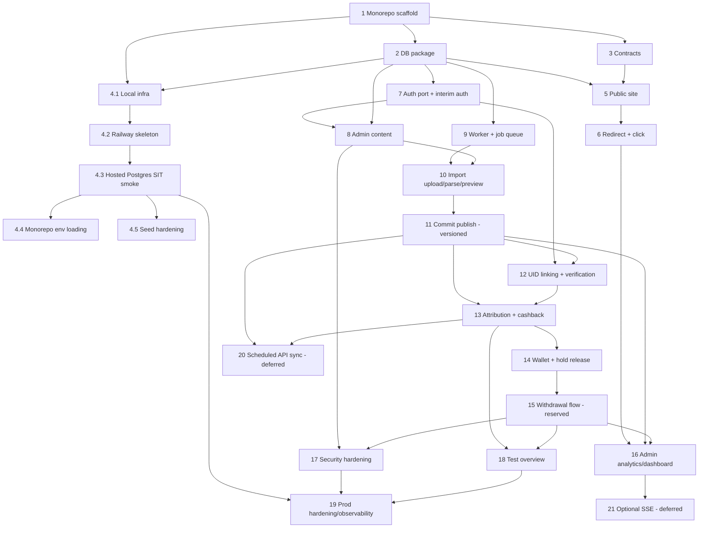

# Implementation Plan — Cashback Affiliate Platform

- **Status:** Draft v1.3 (Phase 0 complete and English-only; Phase 1 import intake/preview shell verified)
- **Last updated:** 2026-09-16
- **Derives from:** `requirements.md` (Draft v0.4), `design.md` (Draft v0.5)

## Overview

This plan sequences the build into phases. Tasks are incremental coding steps; each
references the requirement acceptance criteria it fulfills and the design sections it
implements. `[PENDING]` markers block only their own task, not the whole plan.

**Reference convention:** `Requirements: N.M` cites EARS criteria in `requirements.md`.
`Open decision #N` cites a numbered row in `requirements.md` → "Open decisions"
(a stakeholder answer), not Requirement N.

- **Phase 0** — Foundation & smoke: monorepo, DB, contracts, local + Railway skeleton,
  public site, redirect, interim auth, admin content. Runs on seed data.
- **Phase 1** — Import pipeline (versioned), UID linking, attribution + cashback.
- **Phase 2** — Wallet (reserved) & withdrawals.
- **Phase 3** — Hardening: security, targeted tests, production observability/backups.
- **Phase 4** — Deferred: scheduled API sync and optional SSE (do not start until
  confirmed).

### Current status (2026-09-16)

Phase 0 foundation is implemented and now **verified end to end against a real, hosted
Postgres** (Railway test DB, no local Docker) — see Tasks 4.3–4.5. `pnpm build`, `pnpm typecheck`,
`pnpm lint`, Prisma schema validation, migrate, seed, and a live smoke pass (public pages,
`/api/exchanges`, `/go/:linkId` redirect + real `ClickEvent`, `/api/auth/register` + real
`Customer`/`Session`) all pass.

Done: monorepo scaffold + import-boundary lint, Prisma schema + migrations (incl. the partial unique index),
idempotent seed with guides, shared contracts, local/Railway infra skeleton, root `.env` loading, SIT wired to a Railway test Postgres and
verified live, public SSR pages + `GET /api/exchanges`, referral redirect with `after()`-based
click recording, interim auth behind `AuthPort`, admin content services/API/forms, and the job-queue foundation
(claim/lease/reaper/retry).

Task 5.5 (English-only enforcement) is done — see Phase 0 additions above.

Open in Phase 1 scope: report parsing/publishing (Tasks 10.2–10.3 onward) and commit-time lease ownership check
(9.3, intentionally paired with the first real publish handler). A real exchange report sample
is still needed to finalize adapter columns and Open decision #11 (`dedupKey`).

**Note on local hosting:** the verified smoke run used `web` on the local host via `pnpm dev`
and a dedicated Railway **test** Postgres reached over its public/proxy host; no local Docker
database and no mocked/in-memory data layer were used. The local dev server was stopped after
verification. Seed data is fictitious, while reads/writes use the production-identical Prisma
schema, migrations, and `core`/`db` services. `infra/docker-compose.yml` remains an optional
contributor convenience rather than the active SIT database workflow.

## Task Dependency Graph

The Mermaid diagram shows task-to-task dependencies; the JSON block groups tasks into
execution waves (all tasks in a wave can run in parallel once previous waves are done).



```json
{
  "waves": [
    { "wave": 1, "tasks": ["1"] },
    { "wave": 2, "tasks": ["2", "3"] },
    { "wave": 3, "tasks": ["4.1", "5", "7", "9"] },
    { "wave": 4, "tasks": ["4.2", "6", "8"] },
    { "wave": 5, "tasks": ["4.3", "10"] },
    { "wave": 6, "tasks": ["4.4", "4.5", "11"] },
    { "wave": 7, "tasks": ["12"] },
    { "wave": 8, "tasks": ["13"] },
    { "wave": 9, "tasks": ["14"] },
    { "wave": 10, "tasks": ["15"] },
    { "wave": 11, "tasks": ["16", "17", "18"] },
    { "wave": 12, "tasks": ["19"] },
    { "wave": 13, "tasks": ["20", "21"], "deferred": true }
  ]
}
```

## Tasks

### Phase 0 — Foundation & smoke (seed data, no real affiliate data)

- [x] 1. Scaffold the monorepo
  - [x] 1.1 Initialize pnpm workspace + Turborepo with `apps/web`, `apps/worker`, `packages/contracts`, `packages/core`, `packages/db`; configure `build`, `lint`, `typecheck`, `test`, `dev`, `db:migrate` pipelines and shared tsconfig/eslint.
    - _Requirements: technical constraints §4; Design: Architecture/Repository layout_
  - [x] 1.2 Add import-boundary enforcement (e.g. `eslint-plugin-import-x`/`boundaries` rules): browser/client code may import only `contracts`; `web`/`worker` may import `core`/`db`/`contracts`; `contracts` stays dependency-free.
    - ESLint now detects `"use client"` modules anywhere under `apps/web/src` and rejects `core`/`db` imports; package rules keep `contracts` independent and prevent `db` from depending on upper layers. A negative probe confirmed the client rule fails lint.
    - _Requirements: technical constraints §4; Design: Architecture/Repository layout_

- [x] 2. Set up the database package
  - [x] 2.1 Add Prisma to `packages/db` with the schema from the design, including versioned commission, interim auth, and payout audit: Exchange (with `defaultCashbackRate`), Offer, ReferralLink (with `offerId`), Guide (with `exchange` relation), ClickEvent, AdminAccount (with `passwordHash`), Customer (with `passwordHash`), Session, UidLink (with `referralLinkId`, `flaggedForReview`), ImportBatch, StagingRow, CommissionRecord (identity: `reconciledAmount`, `activeVersion` FK, snapshot `offerId`/`cashbackRate`, `creditedCashback`), CommissionVersion, Wallet (pending/available/reserved/withdrawn/receivable), WalletEntry (with `opKey`), Withdrawal, WithdrawalEvent, Job, and all enums (incl. `PrincipalType`, `CLAWBACK` entry type, `CANCELLED` status).
    - Money as `Decimal`, UID as `String`, timestamps UTC. Unique: `CommissionRecord(exchangeId,dedupKey)`, `CommissionVersion(commissionId,batchId)`, `Wallet(customerId,asset)`, `WalletEntry.opKey`, `Session.tokenHash`. Do NOT put a full unique on `UidLink(exchangeId,uid)`. Interim auth fields (passwordHash/Session) are replaceable if a managed provider is chosen.
    - _Requirements: 3.5, 5.3, 6.7, 6.9, 7.4, 7.6, 7.8, 8.1, 8.7, 9.8; Design: Data Models, Auth_
  - [x] 2.2 Generate the initial migration, and add a raw-SQL PARTIAL unique index for UID ownership: `CREATE UNIQUE INDEX uidlink_verified_owner ON "UidLink"("exchangeId","uid") WHERE status = 'VERIFIED';`. Add repository/query helpers.
    - _Requirements: 5.3, 6.5; Design: Data Models, Key flows/UID_
  - [x] 2.3 Add a seed script (sample exchanges with default rates, offers, links bound to offers, guides, one admin) for the smoke phase.
    - Offers/links use optional unique seed keys so admin-created rows remain unconstrained; the seed adopts the original legacy rows, upserts three published guides, and is idempotent.
    - _Requirements: 1.1; Design: Testing Strategy_

- [x] 3. Define shared contracts
  - Add zod schemas + types in `packages/contracts` for public content, click, auth, wallet (incl. reserved), uid-link, withdrawal, and admin import/analytics/sync payloads.
  - Define the error envelope `{ error: { code, message, details? } }` and a decimal-string money type with `asset`.
  - _Requirements: 3.3, 7.4, 8.1; Design: Components/API contracts_

- [x] 4. Local/SIT infra + Railway skeleton (dual-track from day one)
  - [x] 4.1 Add `infra/docker-compose.yml` for Postgres and private object storage (e.g. MinIO or local dir) and `.env.example` with `DATABASE_URL`, `APP_URL`, `IMPORT_STORAGE_*`, `WORKER_POLL_SECONDS`, `HOLDING_PERIOD_HOURS`, `WITHDRAWAL_AUTO_APPROVE_THRESHOLD`, `JOB_LEASE_SECONDS`, `SYNC_INTERVAL_MINUTES` (disabled).
    - _Requirements: 6.5; Design: Environments & deployment_
  - [x] 4.2 Stand up the Railway skeleton in parallel: web + worker services + managed Postgres, build pipeline, run migrations, and a health check on each service. Keep both local and Railway green.
    - Config + `/api/health` are in place. The verified application smoke was a local web process using Railway test Postgres; deploying the web/worker processes on Railway remains part of production hardening rather than this smoke result.
    - _Requirements: 6.5; Design: Environments & deployment_
  - [x] 4.3 Stand up SIT against a hosted Railway test Postgres (no local Docker) and verify it end to end.
    - **Decision:** SIT does not use local Docker for the database. App processes (`web`, `worker`) run on the host via `pnpm dev`; the database is a dedicated Railway **test** Postgres (separate from prod), reached over its public/proxy host — `*.internal` only resolves inside Railway's network. Object storage stays deferred (local-dir adapter) until Task 10 needs a real bucket. `infra/docker-compose.yml` remains only as an optional convenience for contributors who prefer containers.
    - Verified live against the Railway test DB: `prisma migrate deploy` applied the 1 existing migration (19 tables incl. `_prisma_migrations`, plus the partial unique index `uidlink_verified_owner` — confirmed present via `pg_indexes`); `pnpm db:seed` created 3 exchanges/3 offers/3 referral links/1 admin (`guide` count is legitimately 0 — no guide seed rows exist yet, tracked below); `pnpm --filter @cashback/web dev` served `/api/health` (200), `/api/exchanges` (200, slugs binance/bybit/mexc), `/`, `/exchanges`, `/exchanges/binance`, `/guides` (all 200); `/go/:linkId` returned 302 to the real destination and incremented `ClickEvent` count 0→1 (via `after()`); an unknown `/go/:id` fell back to `/exchanges` (no open redirect); `POST /api/auth/register` created a real `Customer` + `Session` row. All reads/writes went through Prisma against Postgres — no mocks or in-memory fakes.
    - Gaps found during this historical run: (a) root env loading and (b) seed correctness were subsequently resolved and verified in Tasks 4.4/4.5. (c) Prisma CLI (`migrate deploy`/`migrate status`) output was truncated by the earlier Windows shell setup; the current wrapper emits complete migration output, and DB state was also verified through direct Postgres queries.
    - _Requirements: 1.1, 2.1, 3.1, 6.5; Design: Environments & deployment, Testing Strategy_
  - [x] 4.4 Add a monorepo-wide env-loading story: dev scripts for `web`/`worker`/`db` should read a single root `.env` (e.g. via `dotenv-cli` / `node --env-file=../../.env`) instead of requiring vars to be exported manually per shell session.
    - `scripts/with-root-env.mjs` loads the optional root `.env` without overriding Railway/process variables and wraps web dev/build/start, worker dev/start, and Prisma migrate/generate/seed commands. Verified on Windows through generate, migrate, seed, and production build.
    - _Requirements: 6.5; Design: Environments & deployment_
  - [x] 4.5 Harden the seed script: `upsert` for `offer`/`referralLink` (idempotent re-run), add seed `guide` rows, and replace `main().finally()` with explicit error logging + exit code so failures aren't silent.
    - Migration `202609150002_seed_keys` was applied to Railway test Postgres. Two consecutive seed runs both produced 3 exchanges, 3 seed offers, 3 seed links, and 3 guides.
    - _Requirements: 1.1; Design: Testing Strategy_

- [x] 5. Public site (SSR) with seed content
  - [x] 5.1 Implement `contentService` read methods in `core` and `GET /api/exchanges`.
    - _Requirements: 1.1, 1.2, 1.5; Design: Components/apps/web, core services_
  - [x] 5.2 Build public pages: home, `/exchanges`, `/exchanges/[slug]`, `/guides`, `/guides/[slug]`; render published content server-side; hide unpublished.
    - _Requirements: 1.1, 1.2, 1.3, 1.4_
  - [x] 5.3 Content-level i18n: localized fields resolved per locale with default-locale (`en`) fallback in `contentService`, and a `locale` parameter on public reads.
    - _Requirements: 4.4; Design: Components/i18n_
  - [x] 5.4 UI-level i18n scaffolding: extract hardcoded public UI strings into typed message catalogs under `apps/web/src/i18n`, wire a locale provider, and add locale-aware routing (default locale unprefixed, non-default enabled locales under `app/[locale]/...`) so enabling a locale needs no route restructuring.
    - Added the typed catalog type (`Messages`, checked against the default catalog), locale-aware shared SSR page components, request locale propagation to `<html lang>`/provider/navigation, and the `app/[locale]/...` route group reusing the same page components. Live smoke confirmed `lang`, localized DB fields, and locale-prefixed links resolve from the registry.
    - _Requirements: 4.1, 4.2, 4.3; Design: Components/Language & i18n_
  - [x] 5.5 English-only enforcement: made `apps/web/src/i18n/index.ts` the single locale registry (`defaultLocale`, `locales`, `prefixedLocales`, `isLocale`, `isPrefixedLocale`, `localeFromPathname`) holding `en` alone; deleted the Vietnamese catalog; `middleware.ts` derives the request locale via `localeFromPathname` (no hard-coded locale code); the `app/[locale]/...` group now 404s via `isPrefixedLocale` for any segment that isn't a non-default enabled locale (currently none, so the group is inert but ready); dropped Vietnamese seed content from `packages/db/prisma/seed.ts`; reduced admin content forms to English-only fields.
    - Closes the earlier follow-up where `middleware.ts` hard-coded the `"vi"` prefix instead of reading the registry.
    - Verified: `pnpm --filter @cashback/web build` (tsc/eslint via Next's build step) compiles, typechecks, and lints clean; production build emits 13/13 static routes with no `/vi*` route in the output.
    - _Requirements: 4.1, 4.3, 4.5, 10.5; Design: Components/Language & i18n_
  - [-] 5.6 Exchange logo images on offer tiles (local repo assets, no external URLs)
    - Added the nullable Prisma field and migration `202609160001_exchange_logo_url/migration.sql`; the prior in-flight changes described below were absent from the checkout.
    - [x] 5.6.1 Finish the in-flight `core` change. `PublicExchange` and `PublicOfferCard` in `packages/core/src/services/content.ts` already declare `logoUrl: string | null`, but the three mapping sites were left unchanged, so the package currently fails typecheck. Add `logoUrl: row.logoUrl ?? null` to the object returned from `listPublishedExchanges`, the same to `getPublishedExchange`, and `logoUrl: exchange.logoUrl` to the `exchange` object built inside `toOfferCard`.
      - _Requirements: 1.1, 1.2, 1.5; Design: Data Models, core services_
    - [x] 5.6.2 Remove `logoUrl` from `adminExchangeCreateSchema` in `packages/contracts/src/index.ts` (it was added during an earlier URL-based attempt). The admin form does not author logos, so the field would be dead API surface. Keep `logoUrl` on `exchangeSchema`, which describes the `GET /api/exchanges` response and now legitimately includes it.
      - _Requirements: 10.2; Design: Open design decisions (admin-managed logos = [PENDING])_
      - Verified the admin create/update schemas already exclude `logoUrl`; the public response schema now accepts only local `/exchange-logos/<slug>.png` paths or null.
    - [x] 5.6.3 Create `apps/web/public/exchange-logos/` and add the three real exchange logos as `binance.png`, `mexc.png`, `bybit.png`, preferring each exchange's official brand/press asset. Note that `web_fetch` cannot retrieve binary images — download via `curl -L -o` or `Invoke-WebRequest`, then verify each file is a non-empty, valid PNG. If a source is unreachable, generate a simple local placeholder image rather than falling back to a remote URL. Nothing in `.gitignore` excludes this folder, so the files commit normally.
      - _Requirements: 1.1; Design: Components/apps/web (Exchange logo assets)_
      - Review follow-up: all three assets now use transparent horizontal wordmarks in a shared centered box on the dark `bg-card` surface; asset provenance moved to `apps/web/docs/exchange-logos.md` outside `public/`.
    - [x] 5.6.4 Render the logo in `OfferCard` in `apps/web/src/components/public-pages.tsx`: when `card.exchange.logoUrl` is set, show the image with `next/image` (`fill` + `object-contain` + `sizes`, padded inside the existing `aspect-square` tile) in place of the centered name text; when it is `null`, keep the current `tileHue` gradient + name placeholder unchanged. Use `alt=""` (decorative) because the wrapping `<Link>` already exposes the exchange name via the `<p>` beneath the tile, so a filled `alt` would be announced twice.
      - _Requirements: 1.1, 1.2; Design: Components/apps/web (Exchange logo assets)_
    - [x] 5.6.5 Set `logoUrl` for the three seeded exchanges in `packages/db/prisma/seed.ts` (`/exchange-logos/<slug>.png`), adding it to BOTH the `create` and `update` halves of the `exchange.upsert` so a re-seed backfills the existing rows.
      - _Requirements: 1.1; Design: Testing Strategy_
    - [ ] 5.6.6 Verify locally, then deploy in the right order. Run `corepack pnpm --filter @cashback/web... build`, which also re-runs `prisma generate` so the Prisma client picks up the new column. Deploy order matters: push first so the built image contains both migration `202609160001_exchange_logo_url` and the logo files, then apply the migration and re-seed inside the deployed container (`railway ssh -s "@cashback/web" -- sh -c "cd packages/db && npx prisma migrate deploy"`, then the seed command), and confirm the tiles show real logos. The home route is dynamic (`ƒ /` in the build output), so no extra redeploy is needed after re-seeding. The `check-railway-deploy` skill has the SSH key setup, migration, and seed details.
      - Local verification (2026-09-16): `corepack pnpm --filter @cashback/web... build` and `lint` passed. All three PNGs decoded successfully. Production-server smoke with a fixture DB passed for home/catalog logo rendering, null-logo fallback, service/API mapping, and local/optimized image HTTP responses. No database writes were performed.
      - Deployment remains pending: push the build/assets/migration, then migrate and re-seed in Railway and verify the live tiles. Task 5.6.6 remains unchecked until this is done.
      - _Requirements: 1.1, 6.5; Design: Environments & deployment_

- [x] 6. Referral redirect + reliable click tracking
  - Implement `clickService.recordClick` and `GET /go/[linkId]`: resolve active link, return 302, and record the click via a reliable best-effort mechanism (Next.js `after()`/`waitUntil` post-response task, or a short-timeout awaited insert) — not an unawaited/dropped promise. Recording failure still redirects; never wait on sync; unknown/inactive → safe fallback, no open redirect.
  - _Requirements: 2.1, 2.2, 2.3, 2.4, 2.5; Design: Key flows, Components/apps/web_

- [x] 7. Auth port + interim auth
  - [x] 7.1 Define `AuthPort` in `core` (`getSession`, `requireCustomer`, `requireAdmin`) with distinct customer/admin principals.
    - _Requirements: 3.3, 3.4; Design: Components/Auth_
  - [x] 7.2 Implement the interim auth provider behind the port (email+password with hashed `passwordHash` and a `Session` table of hashed tokens + expiry) and customer register/login/logout routes; server-side authz on all guarded routes. These interim tables are replaceable if a managed provider (open decision #13) is chosen without touching route handlers.
    - _Requirements: 3.1, 3.2, 3.5; Design: Components/Auth_

- [x] 8. Admin content management
  - [x] 8.1 Guard the admin area: admin-only session check on `/admin` routes, denying non-admin principals.
    - _Requirements: 10.1; Design: Components/apps/web, Security_
  - [x] 8.2 Add `contentService` write/publish methods in `core`: create/update/publish/unpublish for exchanges (incl. `defaultCashbackRate`), offers (`cashbackRate`), referral links (bind `offerId`, assert same `exchangeId`), and guides; write localized fields into the `i18n` payload.
    - Core write methods keep `seedKey` outside admin inputs, translate missing/unique conflicts into domain errors, validate link↔offer ownership on link writes, and prevent moving an offer while links from another exchange remain attached.
    - _Requirements: 10.2, 10.4, 10.5; Design: core services, Cashback engine (rate source)_
  - [x] 8.3 Add admin write API routes (`/api/admin/exchanges`, `/api/admin/offers`, `/api/admin/links`, `/api/admin/guides`) validating with `contracts` zod schemas, enforcing `requireAdmin`, and returning `Cache-Control: private, no-store`.
    - Added typed localized payload schemas and `rateSchema` (0–1, max 4 decimal places), shared admin error mapping, and authenticated GET/POST/PATCH handlers. Live checks confirmed unauthenticated 401, invalid rate 400, cross-exchange offer binding 409, and private/no-store headers.
    - _Requirements: 10.1, 10.2; Design: Components/API contracts_
  - [x] 8.4 Build the admin UI forms for exchanges/offers/links/guides replacing the placeholder dashboard, and confirm an edit is visible on the next public read.
    - The guarded admin page now renders client-side create/edit/status forms that call only `/api/admin/*`. A live exchange edit appeared on the next public read; switching it to DRAFT hid it immediately; the original seed data was restored afterward.
    - _Requirements: 10.2, 10.3; Design: Components/apps/web_
  - [x] 8.5 Fix admin content defects found in review of 8.2–8.4 (ordered by impact):
    - **(a) Foreign-key errors surface as 500.** `write()` in `content.ts` maps only Prisma `P2025`→404 and `P2002`→409. A non-existent `exchangeId` on offer/guide create or update raises `P2003` (foreign key constraint), which falls through to `INTERNAL_ERROR` 500 and logs a stack trace — a client mistake reported as a server fault. Map `P2003` to a domain error returning 400 (or 404) alongside the existing cases.
    - **(b) Same-exchange invariant is check-then-write.** `assertOfferExchange` (link create/update) and the incompatible-link probe in `updateOffer` run as separate round-trips outside a transaction, so two concurrent admin writes can each pass their own check and still commit a state where `ReferralLink.exchangeId ≠ Offer.exchangeId`. This invariant feeds cashback rate resolution, so prefer a structural guarantee: add `@@unique([id, exchangeId])` on `Offer` and make `ReferralLink`'s offer relation composite on `(offerId, exchangeId) → Offer(id, exchangeId)`, which makes the violation unrepresentable. Otherwise wrap check + write in `db.$transaction` with row locking. Guards Correctness Property 13 / Req 7.3.
    - **(c) Minor:** every admin `GET` calls `listAdminContent()`, which queries all four entities and discards three, so one admin page load costs ~16 queries instead of 4 (noticeable against a remote Postgres) — split into per-entity reads or expose one aggregate endpoint; admin lists are unpaginated; an *authenticated* non-admin principal receives 401 where 403 is more accurate; and `ExchangeSelect` emits two `value=""` options when `optional` is set.
    - Note: stale `vi` keys remain in `Exchange.i18n`/`Guide.i18n` rows from pre-5.5 seeds. They are inert (the registry only resolves `en`) and the next seed run overwrites `i18n`, so no migration is needed.
    - Completed: Prisma error codes are mapped without cross-package `instanceof`; migration `202609150003_offer_link_exchange_invariant` adds a composite FK `(offerId, exchangeId) → Offer(id, exchangeId)`; admin reads use per-entity cursor-paginated queries with UI load-more; auth distinguishes 401/403; and optional exchange selects have one empty option. Verified on Railway test Postgres: direct mismatched write blocked with P2003 and unchanged data, invalid FK API returned 400, customer session returned 403, and cursor pages were distinct.
    - _Requirements: 7.3, 10.2; Design: core services, Components/API contracts, Correctness Properties 13_

### Phase 1 — Import pipeline, UID linking, attribution

- [-] 9. Worker runtime + Postgres job queue (foundation landed early in Phase 0)
  - [x] 9.1 Build the worker boot + poll loop claiming jobs with the correct PostgreSQL clause order (`... ORDER BY "runAfter" LIMIT 1 FOR UPDATE SKIP LOCKED`), lease, and heartbeat.
    - _Requirements: 12.1, 12.2; Design: Job queue design_
  - [x] 9.2 Add lease reaper (requeue expired) and retry policy (transient→backoff capped; exhausted attempts→FAILED, no infinite retry).
    - _Requirements: 12.3, 12.5; Design: Job queue design, Error Handling_
  - [ ] 9.3 Enforce lease ownership at commit time: before writing a job's results, re-verify this worker still holds the lease (and fail the commit if it was reclaimed), plus add jitter to the retry backoff.
    - The claim/reap/heartbeat path exists; the commit-time ownership check lands with the first real job handler (Task 10.3/11).
    - Current state: the DONE transition guards on `state = CLAIMED`, which blocks a double-complete but does **not** prove *this* worker still owns the lease — there is no worker identity on `Job`. Add a `lockedBy` (worker id) column, set it at claim time, and scope every result write to `{ id, lockedBy: thisWorker }`.
    - _Requirements: 12.3, 12.5; Design: Job queue design, Correctness Properties 8_

- [-] 10. Report import: upload → parse → preview
  - [x] 10.1 Implement `POST /api/admin/imports`: authz, file type/size check, store original in private storage, create `ImportBatch` + PARSE job, return 202 + batchId (no in-request parsing).
    - Multipart API accepts only non-empty CSV/XLSX within `IMPORT_MAX_BYTES`, validates typed metadata, writes the original under non-public `IMPORT_STORAGE_LOCAL_DIR`, then atomically creates `ImportBatch` + PARSE job. A failed DB transaction removes the stored file. Live probe returned 202 and created exactly one PARSE job; probe DB/file data was removed afterward.
    - _Requirements: 6.1, 6.2; Design: Key flows/import_
  - [ ] 10.2 Implement `parserRegistry` + a first CSV/XLSX adapter interface distinguishing TRANSACTION vs AGGREGATE reports; no formula/macro execution; fall back to aggregate when transaction identity keys are missing.
    - _Requirements: 6.4, 6.10, 6.11; Design: Components/core services_
  - [ ] 10.3 Implement PARSE job: normalize (UID string, UTC timestamps + source tz, decimals), flag error/duplicate/unmapped/conflict rows into `StagingRow`, compute totals, set batch to PREVIEW.
    - _Requirements: 6.3; Design: Key flows/import_
  - [x] 10.4 Implement `GET /api/admin/imports/:id` returning status, preview counts, error rows, reconciliation info.
    - Admin-only endpoint returns batch lifecycle/source fields, totals, total/flagged row counts, and up to 100 flagged preview rows under private/no-store caching. Live probe returned 200 for the newly uploaded `UPLOADED` batch with zero rows before parsing.
    - _Requirements: 6.6; Design: Components/API contracts_

- [ ] 11. Report commit: versioned publish (idempotent + atomic)
  - Implement `POST /api/admin/imports/:id/commit` (creates PUBLISH job) and the PUBLISH job in `commissionService`: per row, upsert the `CommissionRecord` identity by `(exchangeId, dedupKey)`, upsert a `CommissionVersion` keyed by the unique `(commissionId, batchId)`, mark prior version superseded, set `activeVersion`, and recompute `reconciledAmount` (default rule: latest version supersedes). Commit the whole batch atomically, then enqueue ATTRIBUTE.
  - Re-committing the same batch, or two publish workers racing the same batch, upserts the same version and changes no reconciled amount; a mid-failure leaves no partial published data.
  - _Requirements: 6.7, 6.8, 6.9, 7.5, 7.8; Design: Key flows/import, Data Models, Correctness Properties 1, 7, 9_
  - _Note: `dedupKey` composition is [PENDING] Open decision #11 (needs real sample)._

- [ ] 12. UID linking + verification
  - [ ] 12.1 Implement `POST /api/me/uids` and `GET /api/me/uids`: create link in `PENDING_VERIFICATION` (optionally capturing referral link used), list customer's links; UID stored as opaque string.
    - _Requirements: 5.1, 5.5; Design: Key flows/UID_
  - [ ] 12.2 Implement verification in the ATTRIBUTE job: verify a pending UID when it appears in published commissions and no other `VERIFIED` owner exists (relying on the partial unique index); store a conflicting claim as `REJECTED` + `flaggedForReview`; re-evaluate pending links when new UIDs appear.
    - _Requirements: 5.2, 5.3, 5.4, 5.6; Design: Key flows/UID, Correctness Properties 3, 4_

- [ ] 13. Attribution + cashback engine (rate resolution + delta, concurrency-safe)
  - Implement `attributionService` + `cashbackEngine`: lock the `CommissionRecord` with `SELECT ... FOR UPDATE`, attribute it to the verified customer (keep unattributed when no link); resolve the rate by precedence (offer of the UID's referral link **only when corroborated by system-verified report data**, else exchange default), assert `UidLink.exchangeId = ReferralLink.exchangeId = Offer.exchangeId` (else fall back to default), and snapshot `offerId`/`cashbackRate` onto the record; compute `target = reconciledAmount × rate` and apply only `delta = target − creditedCashback` — positive delta offsets any `receivable` then CREDITs `pending` (with `availableAt`), negative delta reduces `pending` then `available` then records the remainder as `receivable` via CLAWBACK. Write every wallet movement with a unique `opKey` (e.g. `attr:{commissionVersionId}`) so retries/racing workers cannot double-apply; update `creditedCashback`.
  - _Requirements: 7.1, 7.2, 7.3, 7.4, 7.7, 7.8, 8.2, 8.4, 8.7; Design: Key flows/attribution, Cashback engine, Correctness Properties 2, 4, 11, 12, 13_

### Phase 2 — Wallet & withdrawals

- [ ] 14. Wallet balances + hold release
  - [ ] 14.1 Implement `walletService` (pending/available/reserved/withdrawn per customer+asset) and `GET /api/me/wallet` returning balances, typed movement history, last sync/import time, source as-of; distinguish "no data" from zero.
    - _Requirements: 8.1, 8.5, 8.6; Design: Cashback engine, Data Models_
  - [ ] 14.2 Implement `RELEASE_HOLDS` job (scheduler tick) moving cleared CREDITs `pending→available`; implement the reversal policy (reduce `pending` then `available`, remainder to `receivable` via CLAWBACK) so no balance goes negative, and expose `receivable` in the wallet.
    - _Requirements: 8.3, 8.4, 8.7; Design: Key flows/attribution, Cashback engine, Correctness Properties 5, 12_

- [ ] 15. Withdrawal flow (reserved balance + cancel + event audit)
  - Implement `withdrawalService` + `POST /api/me/withdrawals`, `POST /api/me/withdrawals/:id/cancel`, `GET /api/me/withdrawals`, and `POST /api/admin/withdrawals/:id/decision`.
  - Enforce amount `<= available` and reject the request while `receivable > 0`; validate network+address; on REQUESTED write `WITHDRAWAL_RESERVE` (available→reserved); auto-approve at/below threshold else route to review; on PAID write `WITHDRAWAL_SETTLE` (reserved→withdrawn) with payout ref; on reject/cancel write `WITHDRAWAL_RELEASE` (reserved→available). Customer cancel is allowed only before `PAID`; block withdrawing `pending`. Persist a `WithdrawalEvent` for every transition (from/to status, actor, time, note/reference).
  - _Requirements: 9.1, 9.2, 9.3, 9.4, 9.5, 9.6, 9.7, 9.8, 9.9, 9.10; Design: Key flows/withdrawal, Data Models, Correctness Properties 5, 6, 10, 12_

- [ ] 16. Admin analytics & operations dashboard
  - Implement `GET /api/admin/analytics` (click metrics by link/exchange/time from internal data), `GET /api/admin/accounts/:id/activity` (paginated, per UID/account), and `GET /api/admin/sync-status`; 30s polling when tab visible, 5s while a batch processes; admin/private responses set `Cache-Control: private, no-store`; no secrets/raw reports leaked; views for attributed vs unattributed commission and the withdrawal queue.
  - _Requirements: 11.1, 11.2, 11.3, 11.4, 11.5, 11.6; Design: Components/apps/web, API contracts_

### Phase 3 — Hardening

- [ ] 17. Security hardening
  - Server-side authz on every non-public route; customer scope from session only; private bucket credentials limited to web(write)/worker(read); secrets only in env/secret store (no public-prefixed); Postgres reachable only from web/worker; ensure admin/customer APIs require auth before shipping.
  - _Requirements: 3.3, 6.2; Design: Security_

- [ ] 18. Lightweight test overview + critical invariant checks
  - Keep testing light: a thin smoke check that the app boots and key paths respond (public browse → get link → redirect records a click; admin login; seed import runs).
  - Add a few sanity checks on money logic (cashback amount, idempotent publish, only `available` is withdrawable) plus targeted integration/concurrency checks: two customers verifying the same UID (one VERIFIED, one REJECTED/flagged); ATTRIBUTE re-run applies no extra credit; publish failing mid-transaction leaves nothing; worker that lost its lease cannot commit; two concurrent withdrawals cannot both reserve the same balance. No exhaustive suite.
  - _Requirements: 5.3, 6.8, 6.9, 7.8, 9.3; Design: Testing Strategy, Correctness Properties 1-11_

- [ ] 19. Production hardening & observability (Railway)
  - Building on the Phase 0 Railway skeleton (Task 4.2): add observability (web health, oldest job age, worker heartbeat, import error rate), alerts, ensure migrations run once per deploy with reproducible builds, and verify DB backup/restore.
  - _Requirements: 6.5; Design: Environments & deployment_

### Phase 4 — Deferred (do not start until confirmed)

- [ ] 20. Scheduled API sync (disabled by default)
  - Implement `SYNC` job type feeding the same normalization/versioned-publish path as manual imports, per-source lock, checkpoint (`last_success_at`, `source_as_of`), 15/30-min schedule, and alert after two consecutive failures/timeouts while showing last successful data as stale. Keep disabled until a suitable exchange API/permission is confirmed.
  - _Requirements: 13.1, 13.2, 13.3, 13.4, 13.5; Design: Job queue design, Error Handling_

- [ ] 21. (Optional) SSE near-real-time UI
  - Add `PostgreSQL NOTIFY → backend SSE → client refetch` with auth, heartbeat, reconnect snapshot, and streaming-capable proxy. Not required for MVP.
  - _Requirements: 13.6; Design: Overview_

## Notes

- **[PENDING] dedup key** (Open decision #11): finalize `CommissionRecord.dedupKey`
  composition per adapter in Task 11 once a real report sample exists.
- **[PENDING] auth provider** (Open decision #13): Task 7 ships interim email+password
  behind `AuthPort`; swap provider without changing dependents.
- **[PENDING] customer UID visibility** (Open decision #12): baseline own-data-only in
  Tasks 12/14; widen only if confirmed.
- **[PENDING] default values**: cashback rate (Task 13), holding period (Task 14),
  withdrawal auto-approve threshold + supported assets/networks (Task 15). The rate
  *resolution rule* is decided; only default *values* remain.
- **Decided (revisitable):** reversal-after-release policy = reduce pending → available →
  `receivable` (clawback), block new withdrawals while `receivable > 0`, offset future
  credits (Req 8.7; Tasks 13/14/15).
- **[PENDING] compliance/KYC** (Open decision #19): keep payout identity isolated
  (Tasks 15/17) so KYC/retention can be added later.
- Verify build/typecheck/tests on local/SIT before pushing and deploying to Railway.

## Changelog

| Ngày | File | Thay đổi | Lý do | Loại |
|------|------|----------|-------|------|
| 2026-09-15 | tasks.md | Tạo kế hoạch triển khai theo phase (0-4) map tới requirements & design | Hoàn tất bộ spec requirements→design→tasks | added |
| 2026-09-15 | tasks.md | Thêm Overview, Task Dependency Graph, Tasks, Notes theo chuẩn định dạng spec | Đạt chuẩn validate tasks.md | updated |
| 2026-09-15 | tasks.md | Rút gọn Task 18 xuống smoke + sanity check | Không viết unit test dài dòng | updated |
| 2026-09-15 | tasks.md | Task 2 (versioned commission, partial-unique UID, reserved wallet, WithdrawalEvent); tách Railway skeleton sang Phase 0 (Task 4.2) + Task 19 prod hardening; Task 6 best-effort click; Task 11 versioned publish; Task 13 rate resolution + delta; Task 15 reserved + events; Task 18 concurrency checks; đổi tham chiếu Open decision #N | Khắc phục review #1–#8 và đồng bộ với requirements/design | updated |
| 2026-09-15 | tasks.md | Task 2 (Session/passwordHash, receivable, opKey, CommissionVersion unique + activeVersion FK, Guide.exchange, CLAWBACK/PrincipalType); Task 7 interim auth rõ ràng; Task 9 sửa thứ tự SQL; Task 11 version unique; Task 13 FOR UPDATE + opKey + rate trust; Task 14 reversal policy; Task 15 cancel + block receivable | Khắc phục review round 2 và đồng bộ | updated |
| 2026-09-15 | tasks.md | Đánh dấu tiến độ Phase 0 thực tế: done 1.1, 2, 3, 4, 5.1–5.3, 6, 7, 9.1–9.2; tách phần chưa xong thành 1.2 (boundary lint), 5.4 (UI i18n + locale routing), 8.2–8.4 (admin write path), 9.3 (lease check at commit); thêm mục "Current status" | Phản ánh đúng trạng thái triển khai, không đánh done phần còn thiếu | updated |
| 2026-09-15 | tasks.md | Thêm Task 4.3: dev DB scripts (migrate:dev/reset/studio), fallback không dùng Docker, và lần chạy migrate + seed + smoke thật đầu tiên | Task 4.1 chỉ tạo file config, chưa có task nào thực sự dựng DB local nên schema chưa từng tồn tại | added |
| 2026-09-15 | tasks.md | Chốt SIT không dùng Docker cho DB, dùng Railway test Postgres; đánh done Task 4.3 sau khi verify thật (migrate 19 bảng + partial index, seed 3 exchanges/3 offers/3 links/1 admin, smoke toàn bộ public page + `/go/:linkId` ghi ClickEvent thật + register ghi Customer/Session thật); tách 4.4 (env loading cho monorepo) và 4.5 (hardening seed: upsert, guides, error handling) là follow-up chưa xong | Phản ánh đúng những gì đã chạy thật trên DB test, không gộp phần còn thiếu vào done | updated |
| 2026-09-15 | tasks.md | Nâng status lên v0.7; làm rõ local web chỉ chạy trong smoke rồi đã dừng, DB là Railway test Postgres; tách node 4.1–4.5 trong DAG và phân bổ 4.4/4.5 vào execution waves theo đúng dependency; dọn artifact verify/build | Đồng bộ kế hoạch với trạng thái runtime và follow-up thực tế | updated |
| 2026-09-15 | tasks.md | Hoàn thành 1.2, 4.4, 4.5: enforcement cho client/package imports, root `.env` wrapper, migration seed keys, seed guide và xác minh seed hai lần trên Railway test Postgres | Khép các follow-up hạ tầng phát hiện trong Task 4.3 bằng code và kiểm tra thực tế | updated |
| 2026-09-15 | tasks.md | Hoàn thành 5.4: message catalogs `en`/`vi`, locale provider, SSR dùng locale và route `/vi/...`; smoke trực tiếp xác nhận HTML/copy/link tiếng Việt | Hoàn thiện public-site i18n ở cả content và UI/routing | updated |
| 2026-09-15 | tasks.md | Hoàn thành 8.2–8.4: core content writes, schema/rate validation, bốn admin API và form quản trị; nghiệm thu auth/cache/error, same-exchange invariant và publish/unpublish trên Railway test DB | Hoàn tất Phase 0 và unblock luồng import của Task 10 | updated |
| 2026-09-15 | tasks.md | Viết lại Task 5.4 theo hướng locale-agnostic (bỏ mô tả catalog/route `vi`); thêm Task 5.5 English-only enforcement (registry chỉ `en`, xoá catalog vi, middleware suy prefix từ `locales`, bỏ seed + field admin tiếng Việt) và đóng follow-up hard-code `"vi"`; nâng status v1.1, cập nhật "Current status" | Đồng bộ kế hoạch với quyết định English-only (requirements v0.4, design v0.5) | updated |
| 2026-09-15 | tasks.md | Hoàn thành Task 5.5 (English-only enforcement): registry chỉ `en`, xoá catalog/route/seed/admin field tiếng Việt, middleware suy locale từ registry; verify build/typecheck/lint qua Next build (13/13 route, không còn `/vi*`) | Khép English-only theo requirements v0.4 và design v0.5 | updated |
| 2026-09-15 | tasks.md | Review độc lập 8.2–8.4: xác nhận đạt tiêu chí (401/400/409, no-store, same-exchange, publish/unpublish, seedKey không lộ ra admin input); thêm Task 8.5 cho 3 defect còn lại (P2003 → 500, same-exchange check-then-write không transaction, nhóm minor query/pagination/403/select); đổi Task 8 về `[-]` | Ghi nhận đúng phần đã xong và phần còn nợ thay vì đánh done toàn bộ | updated |
| 2026-09-16 | tasks.md | Hoàn thành 8.5 bằng composite FK + migration, Prisma error-code mapping, per-entity cursor pagination, 403 và UI fixes; hoàn thành 10.1/10.4 với private upload, atomic batch/job và preview API; verify live rồi dọn probe | Khép defect Phase 0 và triển khai phần import không phụ thuộc report adapter/dedupKey | updated |
| 2026-09-16 | tasks.md | Thêm Task 5.6 (5.6.1–5.6.6): hiển thị logo sàn trên offer tile bằng asset PNG lưu trong repo tại `apps/web/public/exchange-logos/`, hoàn tất mapping `logoUrl` còn dở trong `core`, bỏ `logoUrl` khỏi `adminExchangeCreateSchema`, set `logoUrl` trong seed, và thứ tự deploy (push → migrate → reseed) | Triển khai `Exchange.logoUrl` vừa chốt ở design v0.5 theo hướng ảnh local, không hot-link URL online | added |
